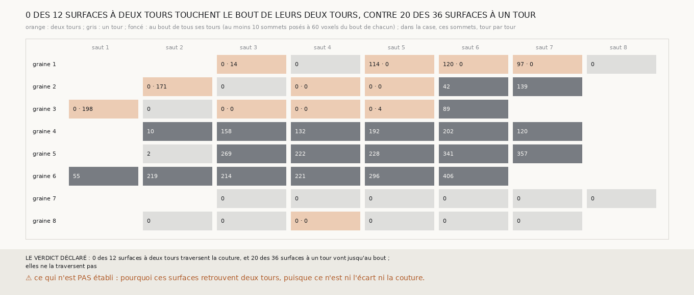

# `339` — Les sommets posés d'une surface à deux tours vont-ils jusqu'au bout de ses deux tours ? Aucune des douze : elles ne traversent pas la couture, et ce sont des surfaces à un tour qui vont jusqu'au bout

*`338` trouvait les surfaces à deux tours près du bout de leurs tours, comme les surfaces à un tour, sans pouvoir dire si elles traversent
la couture. Une surface qui la traverse est posée sur chacun de ses deux tours jusqu'au bout. Cette tranche refait la chaîne bornée, qui
redonne `335`, et compte, pour chaque tour qu'une surface comptée retrouve, ses sommets posés à au plus trois colonnes du bout de leur
rangée. Aucune des douze surfaces à deux tours n'a au moins dix sommets posés au bout de ses deux tours : sur la graine 1, trois d'entre
elles touchent le bout du tour extérieur et pas celui du tour intérieur ; sur les graines 2 et 3, la plupart ne touchent le bout d'aucun.
Au contraire, 20 des 36 surfaces à un tour vont jusqu'au bout de leur tour, toutes celles des graines 4 et 6 et cinq de la graine 5. Par
la règle déclarée, les surfaces à deux tours ne traversent pas la couture : elles retrouvent deux tours ailleurs qu'à la couture, sans que
ni l'écart entre tours ni la couture ne l'explique.*

## 0. Pourquoi cette tranche

C'est `R4-P135`. La distance médiane de `338` ne séparait rien ; la présence de sommets posés au bout même d'un tour est ce qui distingue
une surface qui traverse la couture d'une surface qui s'arrête avant.

## 1. Ce qui a été vu avant d'écrire

Tout ce que `296` à `338` publient, dont `R4-F524`. Aucun sommet posé n'avait été compté au bout de son tour.

## 2. Ce qui est fait

- **La chaîne, les surfaces comptées et les sommets posés** : ceux de `338`, sans rien y changer ; la chaîne redonne `335`.
- **Au bout** : un sommet posé est au bout de son tour s'il est à au plus 60 voxels, trois colonnes, de la première ou de la dernière
  colonne posée de sa rangée ; une surface touche un tour jusqu'au bout si au moins 10 de ses sommets posés y sont.
- **La règle** : une surface à deux tours traverse la couture si elle touche ses deux tours jusqu'au bout ; les surfaces à deux tours
  traversent la couture si c'est le cas de plus de la moitié d'entre elles et de moins de la moitié des surfaces à un tour ; elles ne la
  traversent pas si c'est le cas de moins de la moitié d'entre elles.

`m7` a été lu en 7763 chunks, sans panne.

## 3. Ce que disent les surfaces

| graine | saut | les deux tours | sommets posés au bout du premier | au bout du second |
|---|---|---|---|---|
| 1 | 3 | `5753_0` et `5753_-1` | 0 | 14 |
| 1 | 5 | `5753_-2` et `5753_-3` | 114 | 0 |
| 1 | 6 | `5753_-3` et `5753_-4` | 120 | 0 |
| 1 | 7 | `5753_-4` et `5753_-5` | 97 | 0 |
| 2 | 2 | `5753_0` et `5753_-1` | 0 | 171 |
| 2 | 4 | `5753_-2` et `5753_-3` | 0 | 0 |
| 2 | 5 | `5753_-3` et `5753_-4` | 0 | 0 |
| 3 | 1 | `5753_0` et `5753_-1` | 0 | 198 |
| 3 | 3 | `5753_-2` et `5753_-3` | 0 | 0 |
| 3 | 4 | `5753_-3` et `5753_-4` | 0 | 0 |
| 3 | 5 | `5753_-4` et `5753_-5` | 0 | 4 |
| 8 | 4 | `5753_-2` et `5753_-3` | 0 | 0 |

⭐⭐⭐⭐ **Aucune surface à deux tours ne touche le bout de ses deux tours** (`R4-F525`). Six d'entre elles touchent le bout d'un seul de
leurs deux tours, jamais des deux ; les six autres ne touchent le bout d'aucun. Une surface qui traverserait la couture serait posée
jusqu'au bout des deux.

⭐⭐⭐ **Ce sont des surfaces à un tour qui vont jusqu'au bout.** Vingt des trente-six surfaces à un tour ont au moins dix sommets posés au
bout de leur tour, jusqu'à 406 : toutes celles des graines 4 et 6, cinq des six de la graine 5, deux de la graine 2 et une de la graine 3.
Aucune de celles des graines 1, 7 et 8.

## 4. Le verdict

**0 DES 12 SURFACES À DEUX TOURS TRAVERSENT LA COUTURE, ET 20 DES 36 SURFACES À UN TOUR VONT JUSQU'AU BOUT ; ELLES NE LA TRAVERSENT PAS**

`R4-P135` est répondue : non. Les surfaces à deux tours ne sont pas des surfaces qui suivent la feuille à travers la couture ; ce qui leur
fait retrouver deux tours n'est ni l'écart entre tours (`R4-F523`) ni la couture. La compatibilité que `338` laissait ouverte est fermée.

## 5. Ce que cette tranche ne dit pas

- ⚠⚠ Si les surfaces à deux tours sont posées pour partie sur un tour et pour partie sur l'autre, à cheval sur deux tours, ce qui serait
  une faute que la descente de `330` compte juste.
- ⚠ Jusqu'où descendrait la chaîne bornée si une surface n'était juste qu'en retrouvant le seul tour attendu : c'est `R4-P136`.

## 6. Les sondes

Une batterie de **10** contrôles et une figure de **11**. Six règles cassées exprès ont fait échouer la batterie : le bout pris à la
dernière colonne de la grille au lieu de celle de la rangée, plus de dix sommets exigés au lieu d'au moins dix, un seul des deux tours
touché suffisant, les surfaces à un tour ignorées par la règle, la reproduction de `335` ignorée, et un seuil de 100 voxels au lieu de 60.
Quatre sondes de la figure ont été posées : trois l'ont fait échouer, les genres permutés, les sauts repliés sur une même case, et les
sommets posés écrits dans les cases au lieu de ceux du bout, vu seulement quand l'attendu du contrôle a cessé de passer par la fonction
qu'il vérifie ; la quatrième, le pas de rangée du premier rendu, passe, parce que ce pas seul tient dans le cadre.

## 7. Ce qui reste

`R4-P136` s'ouvre : jugée strictement, une surface n'étant juste que si elle retrouve le seul tour attendu, jusqu'où la chaîne bornée
descend-elle ?
