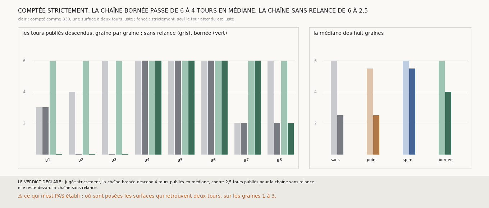

# `340` — Jugée strictement, jusqu'où la chaîne bornée descend-elle ? Quatre tours publiés en médiane et non six ; elle reste devant la chaîne sans relance, qui tombe à 2,5

*`335` comptait la chaîne bornée six tours publiés sur les huit graines, avec la descente de `330`, qui compte juste une surface retrouvant
le tour attendu même avec un autre. `339` a montré que les douze surfaces à deux tours de cette descente ne traversent pas la couture. Cette
tranche ne remesure rien : elle relit les lectures publiées de quatre chaînes, sans relance (`330`), relancée depuis un point (`331`),
relancée depuis la spire (`333`) et bornée (`336`, qui redonne `335`), et recompte chaque descente strictement : une surface n'est juste
que si elle retrouve le seul tour attendu. La descente de `330` recomptée redonne celle que chaque tranche publie. Strictement, la chaîne
bornée descend 4 tours en médiane, six sur les graines 4 à 7, deux sur la graine 8 et aucun sur les graines 1 à 3 ; la chaîne sans relance
descend 2,5 tours en médiane. Par la règle déclarée, la chaîne bornée reste devant la chaîne sans relance.*

## 0. Pourquoi cette tranche

C'est `R4-P136`. Une surface qui retrouve deux tours sans traverser la couture n'est pas là où un seul tour publié est (`R4-F525`) ; la
compter juste peut gonfler une descente.

## 1. Ce qui a été vu avant d'écrire

Tout ce que `296` à `339` publient, dont `R4-F521`, `R4-F523` et `R4-F525`. Aucune descente n'avait été recomptée strictement.

## 2. Ce qui est fait

- **Les lectures** : pour chaque graine de PHercParis4 et chaque côté, la lecture de la nappe, publiée par `330` et identique à celle que
  `336` a relue, puis celles des surfaces publiées par `330`, `331`, `333` et `336` ; une relance absente est lue « non lue ».
- **La descente stricte** : celle de `330`, partie de la première surface qui retrouve un seul tour, où une surface n'est juste que si elle
  retrouve le tour attendu et lui seul ; une surface qui retrouve le tour attendu et un autre l'arrête sur « deux tours ». La descente de
  `330` recomptée sur les mêmes lectures redonne, côté par côté, la descente et l'arrêt que chaque tranche publie.
- **La règle** : la chaîne bornée garde ses six tours si sa descente stricte médiane est d'au moins six ; elle reste devant la chaîne sans
  relance si elle est en dessous de six et au-dessus de celle de la chaîne sans relance ; sinon elle ne descend pas plus loin qu'elle.

## 3. Ce que disent les lectures

| graine | sans relance, comme `330` | sans relance, strictement | bornée, comme `330` | bornée, strictement | ce qui arrête la bornée strictement |
|---|---|---|---|---|---|
| 1 | 3 | 3 | 6 | 0 | deux tours |
| 2 | 4 | 0 | 6 | 0 | deux tours |
| 3 | 6 | 0 | 6 | 0 | un tour manqué |
| 4 | 6 | 6 | 6 | 6 | un tour manqué |
| 5 | 6 | 6 | 6 | 6 | un tour manqué |
| 6 | 6 | 6 | 6 | 6 | un tour manqué |
| 7 | 2 | 2 | 6 | 6 | le bout de la chaîne |
| 8 | 6 | 2 | 6 | 2 | deux tours |

| chaîne | médiane comme `330` | médiane stricte |
|---|---|---|
| sans relance | 6 | 2,5 |
| relancée depuis un point | 5,5 | 2,5 |
| relancée depuis la spire | 6 | 5,5 |
| bornée | 6 | 4 |

⭐⭐⭐⭐⭐ **Jugée strictement, la chaîne bornée descend quatre tours en médiane, et six sur les graines 4 à 7** (`R4-F526`). Sur ces quatre
graines, chaque surface comptée retrouve le seul tour attendu, de `5753_0` à `5753_-6`. Sur la graine 8, la descente s'arrête après deux
tours sur une surface qui en retrouve deux. Sur les graines 1, 2 et 3, elle ne descend aucun tour strictement.

⭐⭐⭐⭐ **Les graines 1 à 3 échouent strictement quelle que soit la chaîne.** Sans relance, relancée depuis un point, depuis la spire ou
bornée, aucune chaîne ne descend strictement un seul tour sur les graines 2 et 3, et au plus trois sur la graine 1. Ce qui fait retrouver
deux tours aux surfaces y tient à l'endroit, pas à la façon de relancer.

⭐⭐⭐ **La chaîne relancée depuis la spire sans borne descend plus loin strictement, 5,5 tours en médiane**, rapporté à côté : ses trois sauts
faux tombent tous après `5753_-6` (`R4-F519`), et sur la graine 8 elle descend cinq tours strictement, contre deux pour la chaîne bornée.

## 4. Le verdict

**JUGÉE STRICTEMENT, LA CHAÎNE BORNÉE DESCEND 4 TOURS PUBLIÉS EN MÉDIANE, CONTRE 2,5 TOURS PUBLIÉS POUR LA CHAÎNE SANS RELANCE ; ELLE RESTE DEVANT LA CHAÎNE SANS RELANCE**

`R4-P136` est répondue : quatre tours en médiane, et non six. Les six tours de `335` comptaient justes des surfaces à deux tours ;
strictement, la chaîne bornée descend six tours sur quatre graines sur huit, et la relance, bornée ou non, reste devant la chaîne sans
relance.

## 5. Ce que cette tranche ne dit pas

- ⚠⚠ Ce qui, autour des graines 1 à 3, fait retrouver deux tours aux surfaces de toutes les chaînes : si les tours publiés voisins s'y
  recouvrent par endroits, deux tours posés sur la même feuille, une surface posée sur cette feuille les retrouverait tous les deux.
  C'est `R4-P137`.
- ⚠ Où sont posées les surfaces à deux tours.

## 6. Les sondes

Une batterie de **14** contrôles et une figure de **11**. Cinq règles cassées exprès ont fait échouer la batterie, dont une seulement
après qu'un contrôle a été ajouté : la reproduction de la descente publiée jugée sans son arrêt (vue quand un arrêt différent à descente
égale a été mis en face). Les autres : la descente stricte remplacée par celle de `330`, un départ pris sur une surface à deux tours, une
égalité avec la chaîne sans relance comptée devant, et les relances absentes sautées au lieu d'être lues « non lue ». L'arrêt rapporté
pour une graine dont les deux côtés descendent de zéro tour venait du côté qui n'avait touché aucun tour ; il est pris du côté qui en a
touché un, avec son contrôle. Quatre sondes de la figure l'ont fait échouer : une échelle tronquée à cinq, l'espacement du premier rendu
dont la dernière barre sortait du cadre, la descente stricte lue dans la descente de `330`, et une médiane figée.

## 7. Ce qui reste

`R4-P137` s'ouvre : autour des graines 1 à 3, les tours publiés voisins se recouvrent-ils par endroits, deux tours posés sur la même
feuille ?
