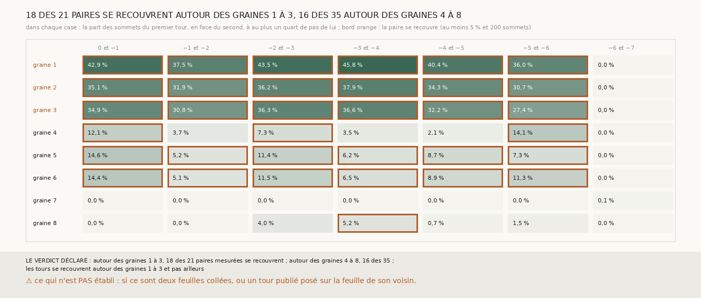

# `341` — Autour des graines 1 à 3, les tours publiés voisins se recouvrent-ils ? Oui : 27 à 46 % des sommets d'un tour y sont à un quart de pas du suivant, contre 0 à 15 % ailleurs

*`340` a montré que, jugée strictement, aucune chaîne ne descend un seul tour publié sur les graines 2 et 3, et au plus trois sur la graine
1, quelle que soit la relance ; ni l'écart médian entre tours voisins ni la couture ne l'expliquaient. Cette tranche mesure, dans les cubes
de `337` autour des huit graines, la part des sommets de chaque tour publié qui ont le tour suivant en face à au plus un quart de pas : là,
les deux tours sont sur la même feuille à la tolérance de la lecture. Autour des graines 1 à 3, de `5753_0` et `5753_-1` à `5753_-5` et
`5753_-6`, cette part va de 27 à 46 % ; autour des graines 4 à 6, de 2 à 15 % ; autour des graines 7 et 8, de 0 à 5 %. Par la règle
déclarée, les tours publiés se recouvrent autour des graines 1 à 3 et pas ailleurs, de peu pour la seconde moitié : seize des trente-cinq
paires des graines 4 à 8 passent aussi le seuil de 5 %.*

## 0. Pourquoi cette tranche

C'est `R4-P137`. Un écart médian de 0,6 pas nominal entre deux tours voisins n'interdit pas qu'ils soient confondus sur une partie de leur
surface ; une surface posée là retrouve les deux, et aucune chaîne ne peut y descendre strictement.

## 1. Ce qui a été vu avant d'écrire

Tout ce que `296` à `340` publient, dont `R4-F523`, `R4-F525` et `R4-F526`. Aucun recouvrement entre tours publiés n'avait été mesuré.

## 2. Ce qui est fait

- **Les boîtes et les paires** : celles de `337`, un cube de 1280 voxels de demi-côté autour de chaque graine, chaque paire de tours
  consécutifs, au plus 20 000 sommets du premier.
- **Le recouvrement** : la part des sommets du premier tour qui ont le second en face, par la comparaison de `321`, à au plus un quart du
  pas nominal, 18,02 voxels de 2,4 µm.
- **La règle** : deux tours se recouvrent autour d'une graine si au moins 5 % de ces sommets, et au moins 200, sont à un quart de pas ;
  les tours se recouvrent autour des graines 1 à 3 et pas ailleurs si c'est le cas de plus de la moitié des paires des graines 1 à 3 et de
  moins de la moitié des paires des graines 4 à 8.

## 3. Ce que disent les tours publiés

| graine | 0 et −1 | −1 et −2 | −2 et −3 | −3 et −4 | −4 et −5 | −5 et −6 | −6 et −7 |
|---|---|---|---|---|---|---|---|
| 1 | 42,9 % | 37,5 % | 43,5 % | 45,8 % | 40,4 % | 36,0 % | 0,0 % |
| 2 | 35,1 % | 31,9 % | 36,2 % | 37,9 % | 34,3 % | 30,7 % | 0,0 % |
| 3 | 34,9 % | 30,8 % | 36,3 % | 36,6 % | 32,2 % | 27,4 % | 0,0 % |
| 4 | 12,1 % | 3,7 % | 7,3 % | 3,5 % | 2,1 % | 14,1 % | 0,0 % |
| 5 | 14,6 % | 5,2 % | 11,4 % | 6,2 % | 8,7 % | 7,3 % | 0,0 % |
| 6 | 14,4 % | 5,1 % | 11,5 % | 6,5 % | 8,9 % | 11,3 % | 0,0 % |
| 7 | 0,0 % | 0,0 % | 0,0 % | 0,0 % | 0,0 % | 0,0 % | 0,1 % |
| 8 | 0,0 % | 0,0 % | 4,0 % | 5,2 % | 0,7 % | 1,5 % | 0,0 % |

⭐⭐⭐⭐⭐ **Autour des graines 1 à 3, deux tours publiés voisins sont sur la même feuille sur un tiers de leur surface** (`R4-F527`). De
`5753_0` à `5753_-6`, 27 à 46 % des sommets d'un tour qui ont le suivant en face en sont à moins d'un quart de pas. L'écart médian de ces
mêmes paires étant de 0,53 à 0,86 pas (`R4-F523`), les deux tours sont confondus sur une part de la boîte et séparés d'un pas sur le reste.
Une surface posée sur la part commune retrouve les deux : c'est là qu'aucune chaîne ne descend strictement.

⭐⭐⭐ **Ailleurs, le recouvrement est bien plus faible, sans être nul.** Autour des graines 4 à 6, où la chaîne bornée descend six tours
strictement, 2 à 15 % ; autour des graines 7 et 8, 0 à 5 %. `5753_-7` ne recouvre `5753_-6` nulle part, lui qui passe à plus de deux pas de
lui autour des graines 1 à 3 (`R4-F523`).

## 4. Le verdict

**AUTOUR DES GRAINES 1 À 3, 18 DES 21 PAIRES MESURÉES SE RECOUVRENT ; AUTOUR DES GRAINES 4 À 8, 16 DES 35 ; LES TOURS SE RECOUVRENT AUTOUR DES GRAINES 1 À 3 ET PAS AILLEURS**

`R4-P137` est répondue : oui. Le verdict est net pour les graines 1 à 3, et de peu pour les autres, dont seize paires sur trente-cinq
passent le seuil de 5 % ; c'est l'ampleur, un tiers de la surface contre au plus un septième, qui les sépare.

## 5. Ce que cette tranche ne dit pas

- ⚠⚠ Si, là où deux tours publiés se recouvrent, ce sont deux feuilles collées l'une à l'autre, le rouleau écrasé, ou un tour publié posé
  sur la feuille de son voisin. `m7` pourrait le dire : une plage deux fois plus épaisse qu'ailleurs sous deux feuilles collées, d'épaisseur
  simple sous un tour mal posé. C'est `R4-P138`.
- ⚠ Si les surfaces à deux tours de la descente sont posées sur la part commune.

## 6. Les sondes

Une batterie de **11** contrôles et une figure de **11**. Cinq règles cassées exprès ont fait échouer la batterie, dont deux seulement après
qu'un contrôle a été ajouté : un demi-pas au lieu d'un quart (vu quand un second tour a été posé à 25 voxels du premier), et l'écart pris
avec son signe (vu quand un second tour a été posé en dessous du premier). Les autres : le recouvrement compté sans minimum de sommets, les
graines 4 à 8 ignorées par la règle, et une graine du problème oubliée. Quatre sondes de la figure l'ont fait échouer : des cases trop
écartées qui sortaient du cadre, une teinte inversée, le compte de sommets écrit à la place de la part, et un titre figé.

## 7. Ce qui reste

`R4-P138` s'ouvre : là où deux tours publiés se recouvrent, la plage de `m7` sous eux est-elle deux fois plus épaisse qu'ailleurs, deux
feuilles collées, ou d'épaisseur simple, un tour posé sur la feuille de son voisin ?
