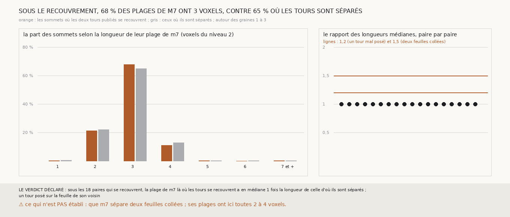

# `342` — Là où deux tours publiés se recouvrent, `m7` voit-il deux feuilles collées ? Non : la même plage de 3 voxels du niveau 2 qu'ailleurs ; par la règle, un tour posé sur la feuille de son voisin, mais `m7` ne montre pas qu'il saurait voir deux feuilles collées

*`341` a trouvé, autour des graines 1 à 3, deux tours publiés voisins à un quart de pas l'un de l'autre sur un tiers de leur surface. Deux
feuilles écrasées l'une contre l'autre feraient deux tours légitimes, et `m7` les verrait comme une plage plus épaisse qu'une feuille ; un
tour publié posé sur la feuille de son voisin n'y laisserait qu'une feuille, d'épaisseur simple. Cette tranche lit `m7` le long de la
normale de 600 sommets recouverts et de 600 sommets séparés pour chacune des 18 paires qui se recouvrent. Sous les deux, la plage a 3 voxels
du niveau 2 en médiane, sur les 18 paires ; 68 % des plages sous le recouvrement ont 3 voxels, contre 65 % là où les tours sont séparés, et
moins de 0,3 % en ont 5 ou plus. Par la règle déclarée, c'est un tour posé sur la feuille de son voisin. Mais toutes les plages de `m7` ont
ici 2 à 4 voxels : rien ne montre qu'il verrait deux feuilles collées autrement que comme une seule.*

## 0. Pourquoi cette tranche

C'est `R4-P138`. Si les tours publiés se recouvrent parce que le rouleau est écrasé, le référent est juste et la lecture doit l'accepter ;
si c'est un tour posé sur la feuille de son voisin, le référent y est faux.

## 1. Ce qui a été vu avant d'écrire

Tout ce que `296` à `341` publient, dont `R4-F527` et `R4-F518` ; `326` lisait une feuille de `m7` comme une plage de 0,15 à 0,25 pas.

## 2. Ce qui est fait

- **Les paires** : les 18 que `341` dit se recouvrir autour des graines 1 à 3, dans les mêmes cubes de 1280 voxels.
- **Les deux groupes** : parmi les sommets du premier tour qui ont le second en face, les recouverts, à au plus un quart de pas nominal de
  lui, et les séparés, à plus d'un demi-pas et au plus un pas et demi ; 600 de chaque, pris régulièrement.
- **La plage** : `m7` au niveau 2 le long de la normale du sommet, sur un pas de chaque côté ; la longueur de la plage qui le contient, ou
  de la plus proche, comme `326`.
- **La règle** : la médiane, sur les paires, du rapport des longueurs médianes des deux groupes dit deux feuilles collées si elle est d'au
  moins 1,5, un tour posé sur la feuille de son voisin si elle est d'au plus 1,2, et ne tranche pas entre les deux.

`m7` a été lu en 749 chunks, sans panne. La répartition des longueurs, ajoutée à la mesure après coup pour la figure, a été relevée par une
seconde exécution, identique à la première sur tout ce qui décide.

## 3. Ce que voit `m7`

| longueur de la plage (voxels du niveau 2) | 1 | 2 | 3 | 4 | 5 et plus |
|---|---|---|---|---|---|
| sous le recouvrement | 0,3 % | 21,1 % | 67,7 % | 10,8 % | 0,2 % |
| là où les tours sont séparés | 0,3 % | 22,0 % | 64,9 % | 12,7 % | 0,2 % |

⭐⭐⭐⭐ **Sous le recouvrement, `m7` voit la même plage mince qu'ailleurs** (`R4-F528`). Sur les 18 paires, la longueur médiane est de 3
voxels du niveau 2 dans les deux groupes, et leur rapport vaut 1 partout ; il y a une seule plage à moins d'un demi-pas du sommet, en
médiane, dans les deux groupes. Là où deux tours publiés sont posés à un quart de pas l'un de l'autre, `m7` ne voit qu'une feuille.

⚠⚠ **Mais `m7` dessine ici toutes ses feuilles avec la même épaisseur**, 2 à 4 voxels, et moins de 0,3 % de ses plages en ont 5 ou plus.
Deux feuilles collées pourraient y être dessinées comme une seule plage de la même épaisseur ; la mesure ne peut donc pas dire que ce ne
sont pas deux feuilles collées. Cette limite est lue après coup, sur la mesure ; elle ne change pas le verdict déclaré.

## 4. Le verdict

**SOUS LES 18 PAIRES QUI SE RECOUVRENT, LA PLAGE DE M7 LÀ OÙ LES TOURS SE RECOUVRENT A EN MÉDIANE 1 FOIS LA LONGUEUR DE CELLE D'OÙ ILS SONT SÉPARÉS ; UN TOUR POSÉ SUR LA FEUILLE DE SON VOISIN**

`R4-P138` est répondue par la règle, pas établie par la mesure : `m7` ne voit qu'une feuille sous deux tours publiés recouverts, mais son
épaisseur constante ne lui permet pas de distinguer une feuille de deux feuilles collées.

## 5. Ce que cette tranche ne dit pas

- ⚠⚠ Ce que montre la matière du scan, et non `m7`, sous le recouvrement : une bande de papyrus deux fois plus épaisse, ou simple. C'est
  `R4-P139`.
- ⚠ Lequel des deux tours serait mal posé.

## 6. Les sondes

Une batterie de **10** contrôles et une figure de **14**. Six règles cassées exprès ont fait échouer la batterie : les recouverts pris à
un demi-pas, les séparés pris sans borne, un rayon trop court pour voir une plage épaisse, le rapport inversé, la zone où la plage ne
tranche pas supprimée, et le minimum de sommets ôté. Une attente de la batterie était fausse et a été corrigée avant la mesure : à la
frontière d'un recouvrement, un sommet peut avoir en face le voisin à 20 voxels de côté, et être recouvert sans être sous la région
construite. Trois sondes de la figure l'ont fait échouer, dont une seulement après qu'un contrôle a été ajouté : les plages de 7 voxels et
plus rangées dans la barre de 6 (vu quand la dernière barre a été comparée à un compte fait à part). Les autres : une échelle tronquée, et
des points trop écartés qui sortaient du cadre. Le premier titre de la figure débordait de la toile ; il a été raccourci.

## 7. Ce qui reste

`R4-P139` s'ouvre : là où deux tours publiés se recouvrent, la matière du scan montre-t-elle une bande de papyrus deux fois plus épaisse
qu'ailleurs ?
