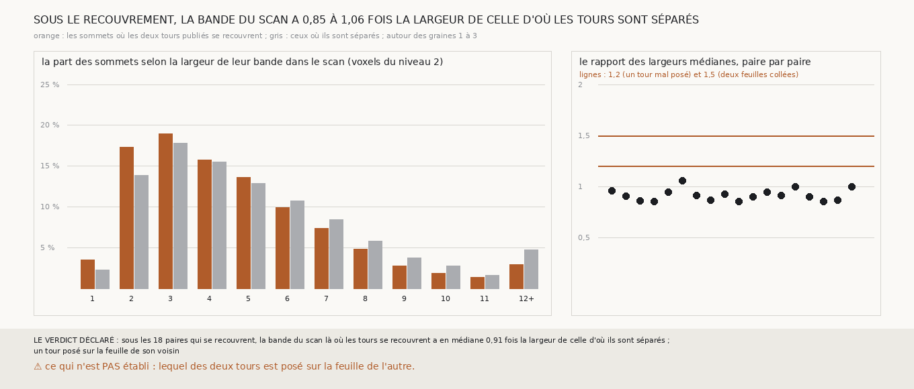

# `343` — Là où deux tours publiés se recouvrent, le scan montre-t-il deux feuilles collées ? Non : une bande de papyrus un peu plus mince qu'ailleurs ; un tour publié y est posé sur la feuille de son voisin

*`341` a trouvé, autour des graines 1 à 3, deux tours publiés voisins à un quart de pas l'un de l'autre sur un tiers de leur surface, et
`342` n'a pas pu dire, avec `m7`, si ce sont deux feuilles collées ou un tour posé sur la feuille de son voisin : `m7` y dessine toutes
ses feuilles avec la même épaisseur. Cette tranche lit le scan lui-même, le volume de PHercParis4 au niveau 2 (9,6 µm), le long de la
normale des mêmes 600 sommets recouverts et 600 séparés pour chacune des 18 paires, et mesure la largeur de la bande claire du papyrus à
mi-hauteur. Là où les tours se recouvrent, la bande a 4 à 5,25 voxels de large en médiane, contre 4,25 à 5,75 là où ils sont séparés :
0,91 fois la largeur en médiane des paires, de 0,85 à 1,06, jamais le double. Par la règle déclarée, c'est un tour publié posé sur la
feuille de son voisin : autour des graines 1 à 3, le référent se trompe de feuille sur une part de sa surface.*

## 0. Pourquoi cette tranche

C'est `R4-P139`. Le scan porte l'épaisseur réelle du papyrus : deux feuilles écrasées l'une contre l'autre y font une bande deux fois plus
large qu'une feuille ; un tour publié posé sur la feuille de son voisin n'y laisse qu'une bande simple.

## 1. Ce qui a été vu avant d'écrire

Tout ce que `296` à `342` publient, dont `R4-F527` et `R4-F528`, et le volume de PHercParis4 que `298` a lu.

## 2. Ce qui est fait

- **Les paires et les sommets** : ceux de `342`, sans rien y changer.
- **Le profil** : le scan au niveau 2, en trilinéaire comme `298`, le long de la normale de chaque sommet, sur un pas de chaque côté, au
  quart de voxel.
- **La bande** : le maximum du profil à au plus un quart de pas du sommet ; le fond, le minimum sur le pas de chaque côté ; la largeur d'un
  seul tenant autour du maximum au-dessus de la mi-hauteur entre le fond et le maximum.
- **La règle** : la médiane, sur les paires, du rapport des largeurs médianes des sommets recouverts et séparés dit deux feuilles collées
  si elle est d'au moins 1,5, un tour posé sur la feuille de son voisin si elle est d'au plus 1,2, et ne tranche pas entre les deux.

Il a fallu 107 morceaux du scan de 128 voxels de côté ; 60 étaient déjà rangés par `298`, les 47 autres, 99 Mo décompressés, ont été tirés
pour cette tranche. 10 681 profils recouverts et 10 661 séparés, sur 10 800 de chaque, ont une bande mesurable.

## 3. Ce que montre le scan

| paire autour de la graine | largeur médiane, recouverts | largeur médiane, séparés | rapport |
|---|---|---|---|
| 1, `5753_0` et `5753_-1` | 5,25 | 5,5 | 0,955 |
| 1, `5753_-1` et `5753_-2` | 4,75 | 5,25 | 0,905 |
| 1, `5753_-2` et `5753_-3` | 4,5 | 5,25 | 0,857 |
| 1, `5753_-3` et `5753_-4` | 4,25 | 5 | 0,85 |
| 1, `5753_-4` et `5753_-5` | 4,25 | 4,5 | 0,944 |
| 1, `5753_-5` et `5753_-6` | 4,5 | 4,25 | 1,059 |
| 2, `5753_0` et `5753_-1` | 5 | 5,5 | 0,909 |
| 2, `5753_-1` et `5753_-2` | 4,75 | 5,5 | 0,864 |
| 2, `5753_-2` et `5753_-3` | 4,5 | 4,875 | 0,923 |
| 2, `5753_-3` et `5753_-4` | 4,25 | 5 | 0,85 |
| 2, `5753_-4` et `5753_-5` | 4,25 | 4,75 | 0,895 |
| 2, `5753_-5` et `5753_-6` | 4,25 | 4,5 | 0,944 |
| 3, `5753_0` et `5753_-1` | 5,25 | 5,75 | 0,913 |
| 3, `5753_-1` et `5753_-2` | 4,75 | 4,75 | 1 |
| 3, `5753_-2` et `5753_-3` | 4,5 | 5 | 0,9 |
| 3, `5753_-3` et `5753_-4` | 4,25 | 5 | 0,85 |
| 3, `5753_-4` et `5753_-5` | 4 | 4,625 | 0,865 |
| 3, `5753_-5` et `5753_-6` | 4,25 | 4,25 | 1 |

⭐⭐⭐⭐⭐ **Sous le recouvrement, la bande du papyrus est simple, et même un peu plus mince qu'ailleurs** (`R4-F529`). Une feuille fait
ici 4 à 6 voxels du niveau 2, 40 à 55 µm, à mi-hauteur ; deux feuilles collées en feraient le double. Sur les 18 paires, la bande sous le
recouvrement n'est jamais plus large de plus de 6 % que là où les tours sont séparés, et 13,6 % de ses profils dépassent 8 voxels, contre
18,5 % ailleurs. Deux tours publiés y sont posés sur une seule feuille : l'un des deux est sur la feuille de l'autre.

⭐⭐⭐ **Le scan, contrairement à `m7`, aurait pu montrer deux feuilles collées.** Ses largeurs vont de moins d'un voxel à plus de douze,
avec un quartile haut de 7,75 à 8,5 voxels selon le groupe : une bande deux fois plus large se verrait. Le nombre médian de maxima
au-dessus de la mi-hauteur à moins d'un demi-pas est de 2 à 3 dans les deux groupes, le grain du scan à ce niveau.

## 4. Le verdict

**SOUS LES 18 PAIRES QUI SE RECOUVRENT, LA BANDE DU SCAN LÀ OÙ LES TOURS SE RECOUVRENT A EN MÉDIANE 0,91 FOIS LA LARGEUR DE CELLE D'OÙ ILS SONT SÉPARÉS ; UN TOUR POSÉ SUR LA FEUILLE DE SON VOISIN**

`R4-P139` est répondue : autour des graines 1 à 3, les tours publiés `5753_0` à `5753_-6` se trompent de feuille sur une part de leur
surface. Ce que `340` voyait, aucune chaîne ne descendant strictement autour de ces graines, tient au référent et non aux chaînes.

## 5. Ce que cette tranche ne dit pas

- ⚠⚠ Lequel des deux tours est posé sur la feuille de l'autre ; ni ce que le scan montrerait au niveau 0, 2,4 µm.
- ⚠ Si, là où le référent est propre, un critère sans référent dirait juste là où la lecture stricte dit juste. C'est `R4-P140`.

## 6. Les sondes

Une batterie de **13** contrôles et une figure de **14**. Cinq règles cassées exprès ont fait échouer la batterie, dont une seulement après
qu'un contrôle a été ajouté : la mi-hauteur prise sans le fond (vue quand une cloche posée sur un fond a été mesurée). Les autres : la bande
la plus forte cherchée sur tout le profil au lieu d'un quart de pas du sommet, une bande qui touche le bord du profil mesurée, le rapport
inversé, et des morceaux du scan manquants ignorés. Trois sondes de la figure l'ont fait échouer : les largeurs arrondies au lieu d'être
rangées à l'entier inférieur, une échelle tronquée, et des barres trop écartées.

## 7. Ce qui reste

`R4-P140` s'ouvre : sur les graines 4 à 8, où les tours publiés ne se recouvrent presque pas, le critère sans référent de `328` sépare-t-il
les sauts que la lecture stricte dit justes de ceux qu'elle dit faux ?
