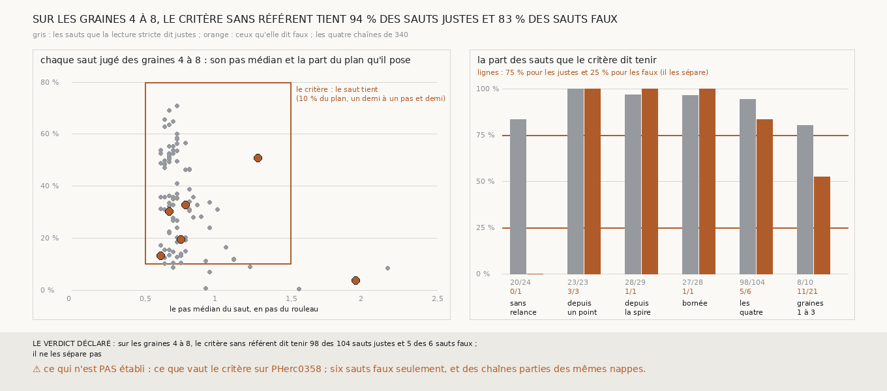

# `344` — Sur les graines 4 à 8, le critère sans référent de 328 sépare-t-il les sauts justes des faux ? Non : il tient 98 des 104 sauts justes et 5 des 6 faux, et ne fait guère mieux que de tout accepter

*Sur PHerc0358, qui n'a pas de tracé, une chaîne ne se juge que par un critère qui se passe de référent : celui de `328`, un saut qui pose
au pas et dont la surface n'est pas dans un bloc de `m7`. Cette tranche l'étalonne là où le référent de PHercParis4 est propre, sur les
graines 4 à 8. Elle rejoue les quatre chaînes que `340` a jugées strictement, lit le critère à chaque saut, et le met en face de la lecture
stricte du même saut. Sur les 110 sauts que le référent juge, 104 sont justes et 6 faux ; le critère dit tenir 98 des justes et 5 des
faux. Par la règle déclarée, il ne les sépare pas : les sauts qu'il dit tenir sont justes à 95,15 %, contre 94,55 % pour tous les sauts
jugés.*

## 0. Pourquoi cette tranche

C'est `R4-P140`, la question de `#5`. Si le critère de `328` dit tenir, sur PHercParis4, les sauts que le référent dit justes et pas les
autres, il vaut pour PHerc0358 ; sinon, les sauts que la chaîne bornée y tient (`R4-F521`) ne sont validés par rien.

## 1. Ce qui a été vu avant d'écrire

Tout ce que `296` à `343` publient, dont `R4-F513`, `R4-F522`, `R4-F526`, `R4-F527` et `R4-F529`, et les lectures que `330`, `331`, `333`
et `336` publient pour chaque surface. Le critère n'avait été lu sur aucun saut d'une chaîne relancée de PHercParis4.

## 2. Ce qui est fait

- **Les chaînes** : les quatre de `340`, rejouées sans en changer une règle : sans relance (`330`), relancée depuis un point (`331`),
  relancée depuis la spire (`333`), bornée (`335`).
- **Le critère sans référent**, à chaque saut : le saut pose au pas (au moins 10 % du plan, pas médian entre un demi-pas et un pas et demi)
  et sa surface, la spire sans relance, la nappe relancée sinon, n'est pas dans un bloc de `m7`. La règle que `331` appliquait sur
  PHerc0358 est sortie en une fonction, sans en changer une ligne, pour être appliquée ici.
- **La lecture stricte d'un saut** : si la surface d'avant retrouve un seul tour w, le saut est juste si la sienne retrouve le seul voisin
  de w du côté du saut ; faux si elle le retrouve avec un autre, en retrouve un autre, ou ne retrouve rien alors que le voisin est lu en
  face d'elle ; non jugé sinon, et quand le voisin est `5753_-7`, décalé (`R4-F522`).
- **La règle** : sur les sauts jugés des graines 4 à 8, le critère sépare les justes des faux s'il tient au moins 75 % des premiers et au
  plus 25 % des seconds ; il ne les sépare pas si l'écart entre les deux parts est sous 25 points ; il ne les sépare qu'en partie sinon.

**La reproduction est vérifiée** : les quatre chaînes rejouées redonnent, surface par surface, les lectures et les parts posées que chaque
tranche publie, et la chaîne sans relance redonne, saut par saut, la tenue que `328` publie sur ses 14 côtés. `m7` a été lu en 36 837
chunks, sans panne.

## 3. Ce que disent les sauts

| chaîne | sauts justes tenus | sauts faux tenus |
|---|---|---|
| sans relance | 20 sur 24 | 0 sur 1 |
| relancée depuis un point | 23 sur 23 | 3 sur 3 |
| relancée depuis la spire | 28 sur 29 | 1 sur 1 |
| bornée | 27 sur 28 | 1 sur 1 |
| **les quatre** | **98 sur 104** | **5 sur 6** |

*Sur les graines 1 à 3, où le référent se trompe de feuille, rapporté à côté : 8 sauts justes tenus sur 10 et 11 faux sur 21.*

⭐⭐⭐⭐⭐ **Le critère sans référent ne sépare pas les sauts justes des faux** (`R4-F530`). Il tient 94,23 % des sauts justes et 83,33 % des
sauts faux. Les cinq sauts faux qu'il tient posent 13 à 51 % du plan à 0,61 à 1,28 pas ; les justes posent au pas médian de 0,71 pas, de
0,61 à 2,16. Quatre de ces cinq faux retrouvent deux tours, le cinquième saute `5753_-5` et retombe sur `5753_-6`. Le seul faux qu'il
refuse pose 3,57 % du plan à 1,94 pas.

⭐⭐⭐⭐ **Ce que le critère tient n'est pas plus juste que ce que la chaîne donne.** Les sauts qu'il dit tenir sont justes à 95,15 % ; tous
les sauts jugés le sont à 94,55 %. Les six sauts justes qu'il refuse posent moins de 10 % du plan.

⭐⭐⭐ **Le bloc n'y est pour rien.** Sous chaque surface, la plage de `m7` fait 0,166 ou 0,222 pas : aucune n'est dans un bloc, et sur
PHercParis4 le critère se réduit à poser au pas. Lu après coup, sur la mesure : les tours publiés consécutifs sont ici à 0,53 à 0,93 pas
nominal l'un de l'autre (`R4-F523`), et la fenêtre d'un demi-pas à un pas et demi contient jusqu'à deux tours.

## 4. Le verdict

**SUR LES GRAINES 4 À 8, LE CRITÈRE SANS RÉFÉRENT DIT TENIR 98 DES 104 SAUTS JUSTES ET 5 DES 6 SAUTS FAUX ; IL NE LES SÉPARE PAS**

`R4-P140` est répondue : non. Sur PHerc0358, un saut que la chaîne tient par ce critère n'est pas pour autant sur la bonne feuille : le
critère écarte un saut qui pose peu ou trop loin, il ne valide pas une surface.

## 5. Ce que cette tranche ne dit pas

- ⚠⚠ Ce que vaut le critère sur PHerc0358, où ni la matière ni `m7` ne sont celles de PHercParis4.
- ⚠⚠ Six sauts faux seulement, et les quatre chaînes partent des mêmes nappes : leurs sauts ne sont pas indépendants d'une chaîne à
  l'autre.
- ⚠ Si les sauts faux qui retrouvent deux tours sont faux par la surface ou par un recouvrement local des tours publiés, qui touche 2 à
  15 % de leurs sommets autour des graines 4 à 6 (`R4-F527`).

## 6. Les sondes

Une batterie de **18** contrôles et une figure de **14** ; la batterie de `331` gagne **2** contrôles pour la règle sortie en fonction, et
deux règles cassées exprès l'ont fait échouer : le bloc ignoré, et un saut sans nappe relancée compté comme tenu. Treize règles cassées
exprès ont fait échouer la batterie de cette tranche, dont une seulement après qu'une attente a été changée : chaque saut jugé depuis la
nappe au lieu de la surface d'avant (vu quand une suite de surfaces où les deux lectures diffèrent a été mise en face). Les autres : le
côté du saut ignoré, `5753_-7` jugé, deux tours comptés justes, un tour manqué compté sans être lu, les graines 1 à 3 comptées, les sauts
non jugés comptés faux, les bornes prises strictes, une chaîne qui ne redonne pas ses lectures acceptée, la spire d'avant lue au lieu de
celle du saut, le minimum ôté, la tenue du premier saut prêtée à tous, et le saut jugé contre la surface d'après. Huit sondes de la figure
l'ont fait échouer, dont deux seulement après qu'un contrôle a été ajouté : les barres des graines 1 à 3 prises dans celles des quatre
chaînes (vu quand chaque barre a été recomptée à part), et les points orange posés sous les gris (vu quand l'ordre des points a été
contrôlé). Les autres : une échelle tronquée à 2 pas, les graines 1 à 3 posées dans le nuage, les sauts non jugés posés aussi, qui
faisait lever le rendu et compte désormais comme un échec, des barres trop écartées, les chaînes interverties, et un titre figé.

## 7. Ce qui reste

`R4-P141` s'ouvre : sur les graines 4 à 8, un critère sans référent qui compte, point par point, les feuilles de `m7` qu'un saut franchit,
au lieu de mesurer son pas en pas nominal, sépare-t-il les sauts justes des faux ?
