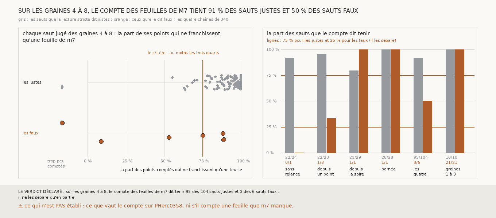

# `345` — Le compte des feuilles de m7 qu'un saut franchit sépare-t-il les sauts justes des faux ? En partie : il refuse le saut qui passe par-dessus un tour, et tient 95 des 104 justes et 3 des 6 faux

*`344` a montré que le critère de `328`, qui mesure un saut en pas nominal, accepte presque tout : la fenêtre d'un demi-pas à un pas et
demi contient jusqu'à deux tours publiés. Cette tranche compte autrement, sans référent ni pas nominal : pour chaque point de la surface
que donne le saut, les feuilles de `m7` passées le long de sa normale jusqu'à la surface d'où il part. Un saut ne franchit qu'une feuille
si les trois quarts de ses points comptés n'en passent qu'une. Sur les graines 4 à 8, le compte tient 95 des 104 sauts justes et 3 des 6
faux. Il refuse le saut qui passe par-dessus `5753_-5`, que `328` tenait. Par la règle déclarée, il ne sépare les sauts qu'en partie ; ce
qu'il tient est juste à 96,94 %, contre 94,55 % pour tous les sauts jugés.*

## 0. Pourquoi cette tranche

C'est `R4-P141`, toujours la question de `#5`. Un rouleau sans tracé ne peut juger un saut que par ce qu'il voit ; compter les feuilles
de `m7` qu'il passe dit s'il en a franchi une ou deux, là où le pas nominal ne le dit pas.

## 1. Ce qui a été vu avant d'écrire

Tout ce que `296` à `344` publient, dont `R4-F523` et `R4-F530`. Aucune feuille de `m7` n'avait été comptée entre deux surfaces d'une
chaîne.

## 2. Ce qui est fait

- **Les chaînes et la lecture stricte** : celles de `344`, rejouées par sa mesure, qui gagne pour cela de quoi porter une mesure de plus à
  chaque saut ; `331` fait porter à chaque saut la surface d'où il part. Les batteries des deux passent, avec trois contrôles de plus.
- **Le compte** : pour au plus 1200 points de la surface que donne le saut, l'écart le long de sa normale à la surface d'où il part (un
  point en face à au plus 10 voxels du niveau 2 de côté), puis `m7` sur ce rayon ; le nombre de plages passées de celle qui porte le
  point à celle qui porte la surface de départ, chacune à au plus un quart de pas de son bout.
- **Le critère** : au moins 50 points comptés, et au moins les trois quarts d'entre eux qui ne franchissent qu'une feuille.
- **La règle** : celle de `344`, sur les sauts jugés des graines 4 à 8.

**La reproduction est vérifiée** : les chaînes rejouées redonnent, saut par saut, les lectures, la tenue de `328` et le verdict que `344`
publie. `m7` a été lu en 45 528 chunks, sans panne.

## 3. Ce que dit le compte

| chaîne | sauts justes tenus | sauts faux tenus |
|---|---|---|
| sans relance | 22 sur 24 | 0 sur 1 |
| relancée depuis un point | 22 sur 23 | 1 sur 3 |
| relancée depuis la spire | 23 sur 29 | 1 sur 1 |
| bornée | 28 sur 28 | 1 sur 1 |
| **les quatre** | **95 sur 104** | **3 sur 6** |

*Sur les graines 1 à 3, où le référent se trompe de feuille, rapporté à côté : 10 sauts justes tenus sur 10 et 21 faux sur 21.*

⭐⭐⭐⭐⭐ **Le compte voit un saut qui passe par-dessus un tour, là où le pas nominal ne le voit pas** (`R4-F531`). Sur la chaîne relancée
depuis un point, le sixième saut de la graine 5 va de `5753_-4` à `5753_-6` : 859 de ses 1029 points comptés passent deux feuilles, et
9 % seulement n'en passent qu'une ; `328` le tenait, à 1,28 pas. Le compte refuse aussi le sixième saut de la graine 7 sur la même chaîne,
dont 188 des 481 points restent sur la feuille de départ, et le quatrième saut sans relance de la graine 8, où 26 points seulement sont
comptés.

⭐⭐⭐⭐ **Il tient trois des quatre sauts qui retrouvent deux tours.** Ils ne passent qu'une feuille sur 75 à 89 % de leurs points : en
`m7`, ils sont sur la feuille suivante. Les sauts justes n'en passent qu'une sur 96 % de leurs points en médiane, de 55 % à 100 %.

⭐⭐⭐ **Les neuf sauts justes qu'il refuse** sont deux spires presque vides, de 11 points et d'un point, et sept nappes relancées, dont six
de la chaîne relancée depuis la spire, où 22 à 36 % des points restent sur la feuille de départ.

⭐⭐⭐ Lu après coup, sur la mesure : **sur les graines 1 à 3, les 21 sauts faux ne franchissent qu'une feuille**, la plupart sur tous
leurs points. C'est ce que `R4-F529` attend : les surfaces y passent à la feuille suivante et retrouvent deux tours publiés posés sur la
même.

*Rapporté à côté : au seuil de la moitié, le compte tient 102 des 104 justes et 4 des 6 faux ; à neuf dixièmes, 70 et aucun. Avec le
critère de `328` en plus, 92 et 3.*

## 4. Le verdict

**SUR LES GRAINES 4 À 8, LE COMPTE DES FEUILLES DE M7 DIT TENIR 95 DES 104 SAUTS JUSTES ET 3 DES 6 SAUTS FAUX ; IL NE LES SÉPARE QU'EN PARTIE**

`R4-P141` est répondue : en partie. Le compte refuse le saut qui passe par-dessus un tour, ce que ne fait pas le pas nominal, mais les
surfaces qui retrouvent deux tours passent pour lui à la feuille suivante.

## 5. Ce que cette tranche ne dit pas

- ⚠⚠ Si les trois sauts à deux tours qu'il tient sont faux par la surface, ou posés là où les deux tours publiés qu'ils retrouvent se
  recouvrent, comme autour des graines 1 à 3.
- ⚠⚠ Ce que vaut le compte sur PHerc0358 ; et là où `m7` manque une feuille, un saut qui en franchit deux y est compté comme n'en
  franchissant qu'une.
- ⚠ Six sauts faux seulement, et des chaînes parties des mêmes nappes.

## 6. Les sondes

Une batterie de **19** contrôles et une figure de **15**. Dix règles cassées exprès ont fait échouer la batterie : un écart d'indices
remplacé par au moins une feuille, la tolérance d'un bout ignorée, la première plage prise au lieu de la plus proche, un point de côté
compté sans borne, le seuil pris strict, le minimum de points ôté, la tenue de `328` gardée au lieu du compte, des chaînes qui ne
redonnent pas `344` acceptées, le critère de `328` oublié quand les deux sont demandés, et un point sur la même plage que la surface de
départ compté comme franchissant une feuille. Une onzième passait : la fenêtre qui bornait le rayon aux deux bouts ne changeait aucun
compte, puisque les plages au-delà ne sont jamais entre les deux ; elle a été retirée. La batterie de `344` gagne deux contrôles, celle de
`331` un ; une sonde fait échouer chacune. Dix sondes de la figure l'ont fait échouer : le seuil déplacé, les sauts trop peu comptés posés
à leur part, les graines 1 à 3 posées, les sauts non jugés posés, les points orange sous les gris, des barres trop écartées, les chaînes
interverties, les barres des graines 1 à 3 prises dans celles des quatre, un titre figé, et une échelle étirée.

## 7. Ce qui reste

`R4-P142` s'ouvre : les trois sauts à deux tours que le compte tient sur les graines 4 à 8 sont-ils posés là où les deux tours publiés
qu'ils retrouvent se recouvrent ?
