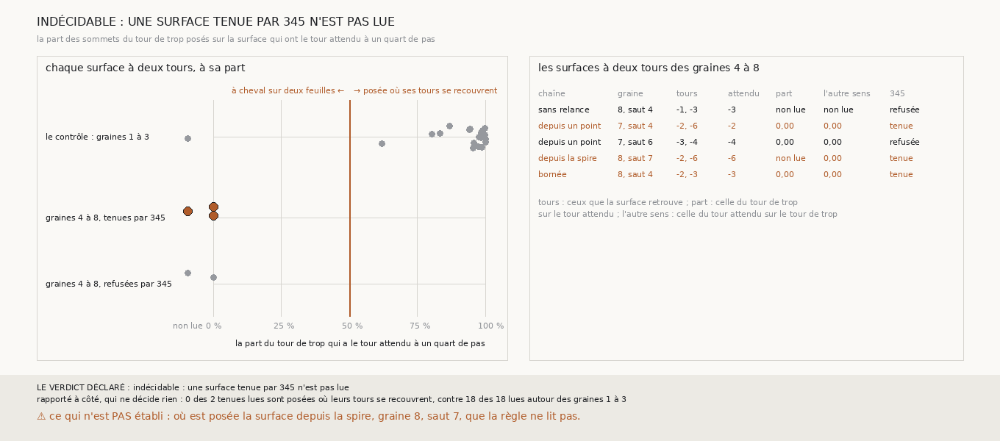

# `346` — Les surfaces à deux tours que le compte tient sur les graines 4 à 8 sont-elles posées là où leurs tours se recouvrent ? Indécidable : l'une n'est pas lue, et les deux autres sont à cheval sur deux feuilles

*`345` tient trois sauts faux sur les graines 4 à 8, et chacun donne une surface qui retrouve deux tours publiés. Ou bien la surface est
posée là où ces deux tours sont sur la même feuille, et c'est le référent qui la dit fausse à tort ; ou bien elle est à cheval sur deux
feuilles, et c'est elle qui a tort. Sous chaque surface, cette tranche lit la part des sommets du tour de trop posés sur elle qui ont le
tour attendu à un quart de pas. Autour des graines 1 à 3, le contrôle voit le recouvrement sous les 18 surfaces qu'il lit. Sur les
graines 4 à 8, deux des trois surfaces tenues sont à cheval, à une part nulle, et la troisième n'est pas lue : 39 seulement de ses
sommets ont le tour attendu en face. Par la règle déclarée, la tranche est indécidable.*

## 0. Pourquoi cette tranche

C'est `R4-P142`, toujours la question de `#5`. Si les trois sauts que le compte de `345` tient à tort sont posés là où le référent met
deux tours sur une feuille, comme autour des graines 1 à 3 (`R4-F529`), le compte ne manque que des sauts que le référent dit faux à tort,
et il vaut pour un rouleau sans tracé. Sinon, une surface peut passer à la feuille suivante sur une partie d'elle seulement, et le compte
ne suffit pas.

## 1. Ce qui a été vu avant d'écrire

Tout ce que `296` à `345` publient, dont `R4-F527`, `R4-F529` et `R4-F531`. Les lectures publiées disaient déjà que deux des trois
surfaces retrouvent `5753_-2` et `5753_-6`, deux tours qui ne sont pas voisins, et la troisième `5753_-2` et `5753_-3`. Aucun recouvrement
n'avait été lu sous une surface d'une chaîne.

## 2. Ce qui est fait

- **Les chaînes** : celles de `344`, rejouées par sa mesure, qui garde chaque surface retrouvant au moins deux tours le temps d'une lecture.
- **Les surfaces** : celles des sauts que `344` dit faux parce qu'ils retrouvent deux tours. Leur tour attendu est le voisin, du côté du
  saut, du seul tour que retrouve la surface d'avant ; leur tour de trop est l'autre.
- **Le recouvrement sous la surface** : parmi les sommets du tour de trop qui ont la surface en face à au plus un quart de pas, la part
  qui a le tour attendu en face à au plus un quart de pas, par la comparaison de `321`. Une surface est **posée où ses tours se
  recouvrent** si cette part est d'au moins la moitié, **à cheval sur deux feuilles** sinon ; elle n'est pas lue si moins de 50 de ces
  sommets ont le tour attendu en face.
- **Le contrôle** : la mesure doit voir le recouvrement sous au moins la moitié des surfaces à deux tours des graines 1 à 3.
- **La règle** : sur les trois surfaces que `345` tient aux graines 4 à 8, les trois posées où leurs tours se recouvrent, **c'est le
  référent** ; aucune, **c'est la surface** ; sinon, **l'un et l'autre**. Indécidable si l'une n'est pas lue.

**La reproduction est vérifiée** : les chaînes rejouées redonnent ce que `344` publie, et les tours que chaque surface retrouve sont ceux
que publie `340`. `m7` a été lu en 36 837 chunks, sans panne.

⚠ Un premier calcul est tombé au bout de vingt minutes, sur un défaut de `344` : dès qu'une spire de la chaîne sans relance ne portait
pas de surface, sa mesure laissait tomber ce que portaient toutes les spires du côté. Il est corrigé, avec un contrôle de plus.

## 3. Ce que dit la lecture

Les cinq surfaces à deux tours des graines 4 à 8 ; les trois premières sont celles que `345` tient.

| chaîne | graine, saut | tours retrouvés | attendu | sommets du tour de trop posés | ayant l'attendu en face | à un quart de pas |
|---|---|---|---|---|---|---|
| relancée depuis un point | 7, saut 4 | -2, -6 | -2 | 1842 | 170 | 0 |
| relancée depuis la spire | 8, saut 7 | -2, -6 | -6 | 1572 | 39 | 0 |
| bornée | 8, saut 4 | -2, -3 | -3 | 2046 | 1579 | 0 |
| sans relance | 8, saut 4 | -1, -3 | -3 | 70 | 0 | 0 |
| relancée depuis un point | 7, saut 6 | -3, -4 | -4 | 5839 | 5293 | 0 |

⭐⭐⭐⭐⭐ **Sur les graines 4 à 8, aucun sommet d'un tour publié sous une surface à deux tours n'a l'autre tour à un quart de pas**
(`R4-F532`). Dans les deux sens, 16 963 sommets ont l'autre tour en face, et aucun ne l'a à un quart de pas. Autour des graines 1 à 3, 18
des 18 surfaces lues sont posées où leurs tours se recouvrent, à des parts de 0,62 à 1,00, 0,98 en médiane.

⭐⭐⭐⭐ **Les deux surfaces tenues qui sont lues sont à cheval sur deux feuilles.** Celle de la chaîne bornée retrouve deux tours voisins,
`5753_-2` et `5753_-3`, là où ils sont sur deux feuilles : la surface est sur l'une ici et sur l'autre là. Celle relancée depuis un point
retrouve `5753_-2` et `5753_-6`.

⭐⭐⭐ **La troisième n'est pas lue.** Des 1572 sommets de `5753_-2` posés sur la surface relancée depuis la spire, 39 seulement ont
`5753_-6` en face, sous le minimum de 50. *Rapporté à côté : dans l'autre sens, 1167 des 2219 sommets de `5753_-6` posés sur elle ont
`5753_-2` en face, et aucun à un quart de pas.*

*Rapporté à côté : le contrôle ne lit pas une surface sur 19, celle relancée depuis un point, graine 3, sixième saut, dont aucun sommet de
`5753_0` posé sur elle n'a `5753_-5` en face ; les deux surfaces que `345` refuse sont, l'une non lue, l'autre à cheval.*

## 4. Le verdict

**INDÉCIDABLE : UNE SURFACE TENUE PAR 345 N'EST PAS LUE**

`R4-P142` est répondue : indécidable, par la règle déclarée. Rapporté à côté, qui ne décide rien : aucune des deux surfaces tenues qui sont
lues n'est posée où ses tours se recouvrent, contre 18 des 18 autour des graines 1 à 3. Ce qu'elles disent va vers la surface, et non vers
le référent.

## 5. Ce que cette tranche ne dit pas

- ⚠⚠ Où est posée la surface relancée depuis la spire, graine 8, septième saut, que la règle ne lit pas.
- ⚠⚠ Si le compte de `345`, point par point, voit l'endroit où une surface à cheval change de feuille.
- ⚠ Autour des graines 1 à 3, lequel des deux tours publiés est à la mauvaise place là où ils se recouvrent ; et ce que vaut tout ceci sur
  PHerc0358. Trois surfaces tenues seulement.

## 6. Les sondes

Une batterie de **18** contrôles et une figure de **20**. Douze règles cassées exprès ont fait échouer la batterie : tout sommet du tour de
trop qui a la surface en face compté, qu'il y soit posé ou non, le quart de pas doublé pour l'autre tour, le minimum de sommets ôté, le
sens du saut ignoré, la plus grande part prise au lieu de la plus petite, le seuil pris strict, la part lue dans l'autre sens, les surfaces
refusées par `345` comptées, une tenue non lue qui ne rend pas la tranche indécidable, le contrôle ôté, des chaînes qui ne redonnent pas
`344` acceptées, et une surface d'avant à deux tours acceptée. Trois d'entre elles passaient d'abord, tout sommet en face compté, le sens
ignoré et le seuil strict ; la batterie a gagné de quoi les voir. La batterie de `344` gagne un contrôle, qu'une sonde fait échouer. Six
sondes de la figure l'ont fait échouer : les points non lus posés sous les noms des rangées, les comptes rapportés à côté faussés, la tenue
non lue tue, un titre indécidable qui se répète, la colonne de l'autre sens qui recopie la part, et le contrôle mal recompté.

## 7. Ce qui reste

`R4-P143` s'ouvre : là où une surface tenue à tort sur les graines 4 à 8 est posée sur son tour de trop, les points du compte de `345`
y franchissent-ils autre chose qu'une feuille ? Si oui, un rouleau sans tracé voit l'endroit où une surface change de feuille.
