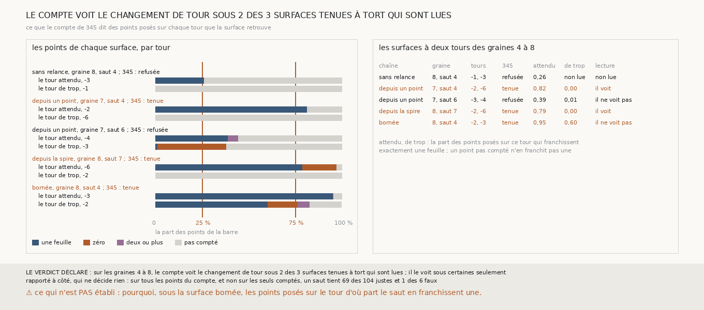

# `347` — Là où une surface tenue à tort est posée sur son tour de trop, le compte de 345 y franchit-il autre chose qu'une feuille ? Sous deux des trois, en ne les comptant pas ; sous la troisième, non

*`346` a montré que les surfaces à deux tours tenues à tort sur les graines 4 à 8 sont à cheval sur deux feuilles. Cette tranche rapporte
chaque point du compte de `345` au tour publié sur lequel il est posé, et demande si les points du tour de trop passent, pour le compte,
autre chose qu'une feuille. Sous deux des trois surfaces tenues, aucun point posé sur le tour de trop n'est compté : ce tour est à
plusieurs tours de celui d'où part le saut. Sous la troisième, le tour de trop est celui même d'où part le saut,
et 165 des 273 points posés dessus franchissent pourtant une feuille. Par la règle déclarée, le compte le voit sous certaines seulement.*

## 0. Pourquoi cette tranche

C'est `R4-P143`, toujours la question de `#5`. Une surface à cheval est sur la feuille suivante ici et sur une autre là. Si le compte
voit, point par point, l'endroit où elle change de feuille, un critère sans référent qui exige une feuille partout sur la surface peut
refuser ces sauts, et un rouleau sans tracé peut le faire.

## 1. Ce qui a été vu avant d'écrire

Tout ce que `296` à `346` publient, dont `R4-F531` et `R4-F532`. Aucun point du compte de `345` n'avait été rapporté au tour publié sur
lequel il est posé.

## 2. Ce qui est fait

- **Les chaînes** : celles de `344`, rejouées par sa mesure ; `345` est découpé pour rendre ses comptes point par point, sans changer ce
  qu'il publie, et gagne un contrôle qui vérifie que chaque compte reste attaché à son point.
- **Les points** : ceux du compte de `345`, au plus 1200 points posés de la surface que donne le saut. Un point est posé sur un tour que
  la surface retrouve si le sommet de ce tour le plus proche est en face de lui, le long de sa normale, à au plus un quart de pas.
- **La lecture sous une surface** : parmi les points posés sur le tour de trop, la part qui franchit exactement une feuille, un point non
  compté n'en franchissant pas une ; de même sur le tour attendu. Le compte **voit le changement** si la première part est d'au plus un
  quart et la seconde d'au moins les trois quarts. Non lue sous 50 points de l'un ou l'autre côté.
- **Le contrôle** : sous chaque surface à deux tours des graines 4 à 8 que `345` refuse et qui est lue, les points du tour de trop doivent
  franchir une feuille moins souvent que ceux du tour attendu.
- **La règle** : sur les surfaces que `345` tient à tort et qui sont lues, au moins deux ; le compte voit le changement sous toutes,
  sous aucune, ou sous certaines seulement.

**La reproduction est vérifiée** : les chaînes rejouées redonnent ce que `344` publie, le compte de chaque saut ce que `345` publie, et
les tours que chaque surface retrouve ceux que publie `340`. `m7` a été lu en 45 528 chunks, sans panne.

## 3. Ce que dit le compte

Les cinq surfaces à deux tours des graines 4 à 8 ; les trois premières sont celles que `345` tient.

| chaîne | graine, saut | tour attendu : points, une feuille | tour de trop : points, une feuille, pas comptés | lecture |
|---|---|---|---|---|
| relancée depuis un point | 7, saut 4 | -2 : 699, 570 | -6 : 191, 0, 191 | le compte voit le changement |
| relancée depuis la spire | 8, saut 7 | -6 : 364, 288 | -2 : 175, 0, 175 | le compte voit le changement |
| bornée | 8, saut 4 | -3 : 378, 361 | -2 : 273, 165, 47 | le compte ne le voit pas |
| sans relance | 8, saut 4 | -3 : 99, 26 | -1 : 2, 0, 2 | non lue |
| relancée depuis un point | 7, saut 6 | -4 : 560, 218 | -3 : 512, 7, 316 | le compte ne le voit pas |

⭐⭐⭐⭐⭐ **Sous deux des trois surfaces tenues, le compte ne voit le tour de trop qu'en ne le comptant pas** (`R4-F533`). Les 191 points
de la surface relancée depuis un point posés sur `5753_-6`, et les 175 de la surface relancée depuis la spire posés sur `5753_-2`, ne
sont pas comptés. `5753_-6` est à cinq tours de `5753_-1`, d'où part le premier saut, et `5753_-2` à trois tours de `5753_-5`, d'où part
le second. `345` ne juge un saut que sur ses points comptés : ces points ne pesaient rien.

⭐⭐⭐⭐ **Sous la troisième, le tour de trop est celui même d'où part le saut, et le compte ne le voit pas.** Des 273 points de la surface
bornée posés sur `5753_-2`, 165 franchissent une feuille, 44 aucune, 17 deux, et 47 ne sont pas comptés. Là où la surface est posée sur
le tour d'où part le saut, 60 % de ses points sont pourtant, pour `m7`, à une feuille de la surface de départ.

⭐⭐⭐ **Le contrôle tient** : sous la surface que `345` refuse à la graine 7, les points posés sur `5753_-3`, le tour d'où part le saut,
ne franchissent une feuille que pour 7 des 512, contre 218 des 560 sur le tour attendu ; 188 n'en franchissent aucune.

*Rapporté à côté, qui ne décide rien : autour des graines 1 à 3, les points sont posés sur les deux tours à la fois, et le compte ne voit
de changement sous aucune des 18 surfaces lues. Sur tous les points du compte, et non sur les seuls comptés, un saut qui tient si les trois
quarts franchissent une feuille tient 69 des 104 sauts justes et 1 des 6 faux sur les graines 4 à 8, justes à 98,57 % ; sur les graines
1 à 3, 4 des 10 justes et 7 des 21 faux.*

## 4. Le verdict

**SUR LES GRAINES 4 À 8, LE COMPTE VOIT LE CHANGEMENT DE TOUR SOUS 2 DES 3 SURFACES TENUES À TORT QUI SONT LUES ; IL LE VOIT SOUS CERTAINES SEULEMENT**

`R4-P143` est répondue : sous certaines seulement. Sous deux surfaces, le compte voit le tour de trop parce qu'il n'en compte aucun point ;
un critère qui compterait contre un saut ses points non comptés pourrait les refuser, et, rapporté à côté, il ne tient qu'un des six sauts
faux. Sous la troisième, le compte ne voit pas le tour de trop.

## 5. Ce que cette tranche ne dit pas

- ⚠⚠ Pourquoi, sous la surface bornée, les points posés sur le tour d'où part le saut sont à une feuille de la surface de départ : la
  surface de départ y est-elle posée sur ce tour ?
- ⚠⚠ Ce que vaut, décidé d'avance, un critère qui exige les trois quarts de tous les points du compte : ce qu'on en voit ici est lu après
  coup.
- ⚠ Ce que vaut tout ceci sur PHerc0358. Trois surfaces tenues seulement.

## 6. Les sondes

Une batterie de **24** contrôles et une figure de **18**. Seize règles cassées exprès ont fait échouer la batterie : un point posé sur un
tour qu'il a seulement en face, le quart de pas doublé, les points non comptés oubliés, le minimum de points ôté, le sens du saut ignoré,
un seul tour de trop pris au lieu de tous, les deux seuils pris stricts, le seuil du tour attendu ôté, la part sur tous les points prise
sur les seuls comptés, le contrôle non lu accepté, le contrôle qui ne sépare pas accepté, une seule surface lue acceptée, les surfaces
refusées comptées, les graines 1 à 3 comptées, et un compte qui ne redonne pas `345` accepté. La batterie de `345` gagne un contrôle ; la
sonde qui décale les comptes de leurs points la fait échouer. Huit sondes de la figure l'ont fait échouer : les genres de points
intervertis, des barres raccourcies, un titre figé, les comptes rapportés à côté faussés, les surfaces des graines 1 à 3 dessinées, des
rangées trop serrées, la colonne du tour de trop qui recopie celle du tour attendu, et deux barres d'une surface qui se chevauchent ; la
dernière passait d'abord, et la figure a gagné de quoi la voir.

## 7. Ce qui reste

`R4-P144` s'ouvre : là où les points de la surface bornée, graine 8, quatrième saut, posés sur `5753_-2` franchissent une feuille, la
surface d'où part le saut est-elle posée sur `5753_-2` ?
