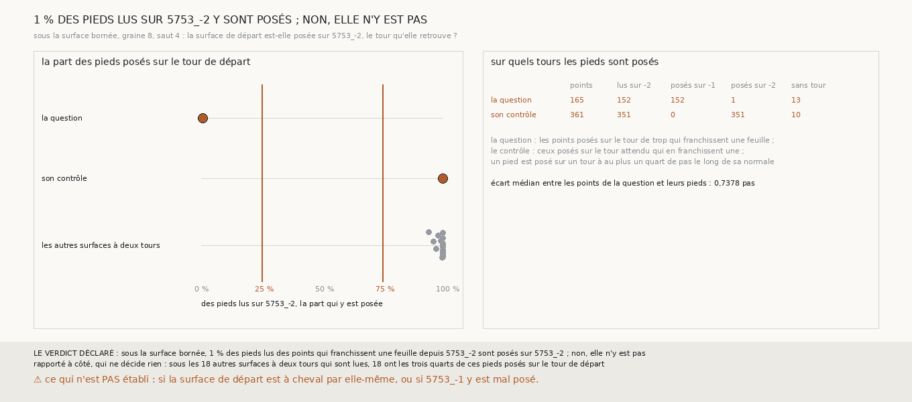

# `348` — Sous la surface bornée, la surface d'où part le saut est-elle posée sur 5753_-2 ? Non : elle y est sur 5753_-1, et l'erreur commence un saut plus tôt

*`347` a laissé un saut que le compte de `345` ne voit pas : sous la surface bornée, graine 8, quatrième saut, 165 points posés sur
`5753_-2`, le tour d'où part le saut, franchissent pourtant une feuille jusqu'à la surface de départ. Cette tranche regarde, pour chacun
de ces points, le point de la surface de départ que le compte prend pour elle, son pied, et le tour publié sur lequel ce pied est posé.
Des 152 pieds lus sur `5753_-2`, un seul y est posé ; 152 pieds sont posés sur `5753_-1`. Sous les points du tour attendu, les 351 pieds
lus sont tous posés sur `5753_-2`. La surface de départ, que la lecture stricte dit juste, est déjà à cheval sur deux tours.*

## 0. Pourquoi cette tranche

C'est `R4-P144`, toujours la question de `#5`. Un point posé sur le tour d'où part le saut devrait être sur la feuille de la surface de
départ. Si la surface de départ n'y est pas posée sur son tour, l'erreur du saut commence un saut plus tôt, et c'est la surface de départ
qu'il fallait refuser ; si elle l'est, `5753_-2` tient sur deux feuilles de `m7` à cet endroit.

## 1. Ce qui a été vu avant d'écrire

Tout ce que `296` à `347` publient, dont `R4-F529` et `R4-F533`. Aucun point d'une surface de départ n'avait été rapporté à un tour publié
sous un saut.

## 2. Ce qui est fait

- **Les chaînes et le compte** : ceux de `347`, rejoués par sa mesure, dont la boucle de rejeu est sortie en fonction pour servir ici ;
  `345` rend en plus l'écart de chaque point à la surface de départ.
- **Les pieds** : pour chaque point du compte, le point de la surface de départ le plus proche, celui que le compte prend pour elle, avec
  sa normale.
- **La pose d'un pied** : lu sur un tour publié si le sommet de ce tour le plus proche est en face de lui le long de sa normale, posé s'il
  l'est à au plus un quart de pas.
- **La question** : sous la surface bornée, graine 8, quatrième saut, les points posés sur le tour de trop que le compte dit franchir
  exactement une feuille ; parmi leurs pieds lus sur `5753_-2`, la part qui y est posée.
- **Le contrôle** : sous la même surface, les points posés sur le tour attendu qui franchissent une feuille ; au moins la moitié de leurs
  pieds lus sur `5753_-2` doivent y être posés.
- **La règle** : au moins 50 pieds lus de chaque côté ; les trois quarts posés, **oui** ; au plus un quart, **non** ; sinon, **en
  partie**.

**La reproduction est vérifiée** : les chaînes rejouées redonnent ce que `344` publie, le compte ce que `345` publie, et les tours que
chaque surface retrouve ceux que publie `340`. `m7` a été lu en 45 528 chunks, sans panne.

## 3. Ce que disent les pieds

| sous la surface bornée, graine 8, saut 4 | points | pieds lus sur `5753_-2` | posés sur `5753_-1` | posés sur `5753_-2` | sans tour |
|---|---|---|---|---|---|
| la question : points du tour de trop, une feuille | 165 | 152 | 152 | 1 | 13 |
| le contrôle : points du tour attendu, une feuille | 361 | 351 | 0 | 351 | 10 |

⭐⭐⭐⭐⭐ **La surface de départ n'est pas sur son tour là où la surface d'arrivée est sur `5753_-2`** (`R4-F534`). Des 152 pieds lus sur
`5753_-2`, un seul y est posé, soit 1 % ; 152 pieds sont posés sur `5753_-1`. Là où la surface d'arrivée est sur `5753_-3`, les 351 pieds
lus sont tous posés sur `5753_-2`. La surface de départ est donc sur `5753_-1` ici et sur `5753_-2` là, et les points du quatrième saut
qui franchissent une feuille vont bien, de part et d'autre, d'un tour au suivant.

⭐⭐⭐⭐ **Le saut qui a donné cette surface de départ est dit juste par tout ce qui juge.** Le troisième saut de la chaîne bornée, graine
8, retrouve le seul tour `5753_-2` ; la lecture stricte le dit juste, `328` et le compte de `345` le tiennent, ce dernier sur 91 % de ses
points comptés. Il est pourtant à cheval, et le quatrième saut hérite de son erreur : c'est lui que la lecture stricte dit faux.

*Rapporté à côté, qui ne décide rien : l'écart médian entre les points de la question et leurs pieds est de 0,7378 pas. Sous les 18 autres
surfaces à deux tours dont la question est lue, toutes aux graines 1 à 3, les trois quarts des pieds au moins sont posés sur le tour de
départ, souvent aussi sur son voisin, là où les deux tours publiés se recouvrent.*

## 4. Le verdict

**SOUS LA SURFACE BORNÉE, 1 % DES PIEDS LUS DES POINTS QUI FRANCHISSENT UNE FEUILLE DEPUIS 5753_-2 SONT POSÉS SUR 5753_-2 ; NON, ELLE N'Y EST PAS**

`R4-P144` est répondue : non. L'erreur que la lecture stricte met au quatrième saut commence au troisième, qu'elle dit juste.

## 5. Ce que cette tranche ne dit pas

- ⚠⚠ Si la surface de départ est à cheval par elle-même, ou si `5753_-1` est mal posé à cet endroit.
- ⚠⚠ Combien des sauts que la lecture stricte dit justes sont, comme celui-ci, à cheval sur deux tours voisins sans en retrouver qu'un.
- ⚠ Ce que vaut tout ceci sur PHerc0358 ; une seule surface.

## 6. Les sondes

Une batterie de **17** contrôles et une figure de **18**. Douze règles cassées exprès ont fait échouer la batterie : tout pied tenu pour
avoir une normale, le quart de pas doublé, un tour pas en face tenu pour lu, la part prise sur tous les pieds au lieu des pieds lus sur
le tour de départ, le minimum de pieds ôté, le sens du saut ignoré, les points qui ne franchissent pas une feuille gardés, une autre
surface de la chaîne bornée prise pour celle de la question, le seuil du contrôle ôté, les deux seuils pris stricts, et un compte qui ne
redonne pas `345` accepté. Le tour pas en face passait d'abord ; la batterie a gagné de quoi le voir. Les batteries de `347` et de `345`
passent inchangées. Six sondes de la figure l'ont fait échouer : la question posée à la part du contrôle, la question comptée parmi les
autres, un titre figé, le tableau qui compte les pieds posés au lieu des pieds lus, une rangée hors du graphe, et les autres surfaces
comptées toutes, au-dessus des trois quarts ou non ; ces deux dernières passaient d'abord, et la figure a gagné de quoi les voir.

## 7. Ce qui reste

`R4-P145` s'ouvre : parmi les sauts que la lecture stricte dit justes sur les graines 4 à 8, combien donnent une surface à cheval sur le
tour attendu et son voisin, et un compte sans référent le voit-il ?
