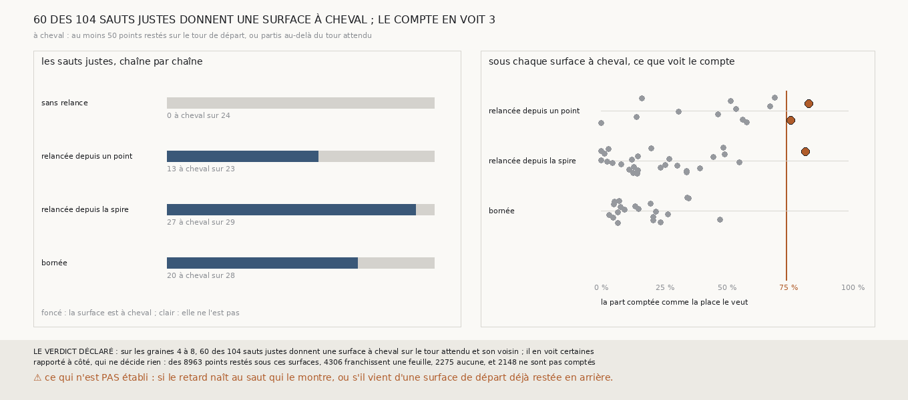

# `349` — Combien de sauts justes donnent une surface à cheval sur le tour attendu et son voisin ? 60 des 104, tous dans les chaînes relancées, et le compte n'en voit que 3

*`348` a trouvé une surface que la lecture stricte dit juste et qui est à cheval sur deux tours voisins sans en retrouver qu'un. Cette
tranche cherche les autres. Sous chaque surface que donne un saut juste des graines 4 à 8, elle rapporte chaque point du compte de `345`
au tour publié sur lequel il est posé : un point est resté s'il est sur le tour d'où part le saut et pas sur le tour attendu, parti
au-delà s'il est sur le tour suivant. Une surface est à cheval à partir de 50 points restés ou au-delà. 60 des 104 surfaces justes le
sont ; aucune de la chaîne sans relance, 27 des 29 de la chaîne relancée depuis la spire. Le compte ne voit le changement que sous 3 :
sous les autres, la plupart des points restés franchissent une feuille, comme les points bien placés.*

## 0. Pourquoi cette tranche

C'est `R4-P145`, toujours la question de `#5`. La lecture stricte ne voit une surface à cheval que lorsqu'elle retrouve les deux tours
(`R4-F534`). Si d'autres sauts justes sont à cheval sans le dire, les bilans de `344` et `345` comptent comme justes des sauts qui ne le
sont qu'en partie, et un critère pour un rouleau sans tracé doit voir cela d'abord.

## 1. Ce qui a été vu avant d'écrire

Tout ce que `296` à `348` publient, dont `R4-F533` et `R4-F534`. Aucun point d'une surface donnée par un saut juste n'avait été rapporté
aux tours voisins du tour attendu.

## 2. Ce qui est fait

- **Les chaînes et le compte** : ceux de `347`, rejoués par sa mesure, dont la fonction de rejeu choisit désormais quels sauts elle lit.
- **Les sauts** : ceux que `344` dit justes, sur les graines 4 à 8. Le tour de départ est le seul que retrouve la surface d'avant, le tour
  attendu son voisin du côté du saut, le tour d'au-delà le voisin suivant.
- **Les points** : ceux du compte de `345`, au plus 1200 par surface, chacun posé sur un tour publié s'il en a un sommet en face à au plus
  un quart de pas. **Resté** : posé sur le tour de départ et pas sur le tour attendu ; **au-delà** : posé sur le tour d'au-delà et pas sur
  le tour attendu.
- **Une surface à cheval** : au moins 50 points restés, ou au moins 50 au-delà.
- **Le compte le voit** sous une surface à cheval si, dans chaque groupe d'au moins 50 points, les trois quarts sont comptés comme la
  place le veut : aucune feuille pour un point resté, deux ou plus pour un point au-delà.
- **Le contrôle** : sous au moins les trois quarts des surfaces justes lues, au moins la moitié des points posés doivent l'être sur le tour
  attendu.
- **La règle** : aucune surface à cheval, **aucun saut juste ne l'est** ; sinon le compte **les voit toutes**, **n'en voit aucune**, ou
  **en voit certaines**.

**La reproduction est vérifiée** : les chaînes rejouées redonnent ce que `344` publie, le compte ce que `345` publie, et les tours que
chaque surface retrouve ceux que publie `340`. `m7` a été lu en 45 528 chunks, sans panne. **Le contrôle tient** : sous 94 des 102
surfaces justes lues, la moitié au moins des points posés le sont sur le tour attendu.

## 3. Ce que disent les surfaces

| chaîne | sauts justes | à cheval |
|---|---|---|
| sans relance | 24 | 0 |
| relancée depuis un point | 23 | 13 |
| relancée depuis la spire | 29 | 27 |
| bornée | 28 | 20 |

⭐⭐⭐⭐⭐ **60 des 104 sauts justes donnent une surface à cheval sur le tour attendu et son voisin, et tous sont dans les chaînes
relancées** (`R4-F535`). 56 le sont par des points restés sur le tour de départ, 13 par des points partis au-delà, 9 par les deux. La part
de leurs points posés hors du tour attendu va de 5 à 45 %, 17 % en médiane ; elle passe 10 % sous 44 surfaces et 25 % sous 18. La chaîne
sans relance, qui prend les nappes de `m7` telles qu'elles sont, n'en donne aucune.

⭐⭐⭐⭐ **Le compte de `345` ne voit le changement que sous 3 des 60.** Des 8963 points restés sous ces surfaces, 4306 franchissent une
feuille, 2275 aucune, 234 deux ou plus, et 2148 ne sont pas comptés. Pour le compte, un point resté sur le tour de départ est le plus
souvent à une feuille de la surface de départ, comme un point bien placé ; c'est ce que `348` a trouvé sous la surface bornée, où la
surface de départ était elle-même en arrière. `345` tient 53 des 60 sauts à cheval.

*Rapporté à côté, qui ne décide rien : la surface de `348`, que donne le troisième saut de la chaîne bornée, graine 8, a 210 points restés
sur 1104 posés, dont 17 comptés à zéro. Les trois surfaces que le compte voit sont celles relancées depuis un point, graine 6, sixième saut
et graine 8, septième saut, et celle relancée depuis la spire, graine 7, sixième saut. Sur les graines 1 à 3, 3 des 10 sauts justes
donnent une surface à cheval.*

## 4. Le verdict

**SUR LES GRAINES 4 À 8, 60 DES 104 SAUTS JUSTES DONNENT UNE SURFACE À CHEVAL SUR LE TOUR ATTENDU ET SON VOISIN ; IL EN VOIT CERTAINES**

`R4-P145` est répondue : 60 des 104, et le compte n'en voit que 3. Les bilans de `344` et `345` comptent comme justes des sauts dont une
partie de la surface est sur le tour voisin ; seule la chaîne sans relance en est exempte.

## 5. Ce que cette tranche ne dit pas

- ⚠⚠ Si le retard d'une surface à cheval naît au saut qui le montre, ou s'il vient d'une surface de départ déjà restée en arrière, comme
  sous la surface bornée de `348`.
- ⚠⚠ Si une surface à cheval l'est par elle-même ou parce qu'un tour publié est mal posé ; le seuil de 50 points compte à cheval une
  surface dont 5 % seulement des points sont hors du tour attendu.
- ⚠ Ce que vaut tout ceci sur PHerc0358.

## 6. Les sondes

Une batterie de **19** contrôles et une figure de **19**. Quinze règles cassées exprès ont fait échouer la batterie : la part vue prise
sur les seuls points comptés, le minimum de points ôté, le sens du saut ignoré, un point posé sur le tour de départ et sur le tour attendu
compté comme resté, un point resté qui franchit une feuille compté comme vu, un point au-delà qui n'en franchit qu'une compté comme vu, un
seul groupe vu suffisant, le seuil pris strict, les sauts des graines 1 à 3 comptés, les sauts faux comptés, le contrôle ôté, les surfaces
de moins de 50 points posés comptées au contrôle, son seuil pris strict, un point sans tour compté comme posé, et un compte qui ne redonne
pas `345` accepté ; deux passaient d'abord et la batterie a gagné de quoi les voir. Les batteries de `347` et `348` passent inchangées.
Sept sondes de la figure l'ont fait échouer : la plus grande part des groupes prise au lieu de la plus petite, qui passait d'abord, des
barres à une échelle fausse, un titre figé, aucune surface vue, les graines 1 à 3 comptées, les comptes rapportés à côté intervertis, et
des rangées hors du graphe.

## 7. Ce qui reste

`R4-P146` s'ouvre : sous les surfaces justes à cheval des graines 4 à 8, les points restés sur le tour de départ sont-ils au-dessus d'une
surface de départ déjà restée en arrière, ou le retard naît-il à ce saut ?
