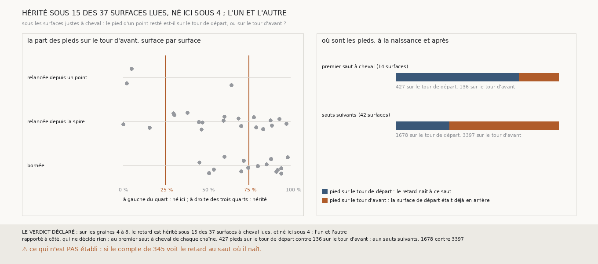

# `350` — Le retard des surfaces à cheval naît-il au saut qui le montre ? L'un et l'autre : il naît au premier saut à cheval de chaque chaîne, puis il s'hérite

*`349` a trouvé 60 surfaces justes à cheval sur les graines 4 à 8, dont 56 par des points restés sur le tour de départ. Sous chacune, cette
tranche regarde le pied de chaque point resté, le point de la surface de départ que le compte prend pour elle : sur le tour de départ, le
retard naît à ce saut ; sur le tour d'avant, la surface de départ était déjà en arrière. 37 surfaces sont lues. Le retard y est hérité sous
15, né ici sous 4, mêlé sous 18 : par la règle déclarée, l'un et l'autre. Lu à côté, le partage suit la chaîne : au premier saut à cheval
de chaque chaîne et de chaque graine, les pieds sont surtout sur le tour de départ ; aux sauts suivants, surtout sur le tour d'avant.*

## 0. Pourquoi cette tranche

C'est `R4-P146`, toujours la question de `#5`. Si le retard vient de plus haut, il naît quelque part et se propage de saut en saut, comme
sous la surface bornée de `348` ; un critère sans référent doit alors juger une surface là où le retard naît, et non saut par saut.

## 1. Ce qui a été vu avant d'écrire

Tout ce que `296` à `349` publient, dont `R4-F534` et `R4-F535`. Aucun pied d'un point resté n'avait été rapporté à un tour publié, hors de
la surface de `348`.

## 2. Ce qui est fait

- **Les chaînes et le compte** : ceux de `349`, rejoués par la mesure de `347`.
- **Les surfaces** : celles que `349` dit à cheval par des points restés, parmi les sauts justes des graines 4 à 8.
- **Les pieds** : pour chaque point resté, le point de la surface de départ que le compte prend pour elle, par `348`, et les tours publiés
  sur lesquels il est posé.
- **La lecture sous une surface** : parmi les pieds posés sur le tour de départ ou sur le tour d'avant, la part posée sur le tour d'avant
  et pas sur le tour de départ ; au moins les trois quarts, **hérité** ; au plus un quart, **né ici** ; sinon, **mêlé** ; non lue sous 50
  pieds.
- **Le contrôle** : sous au moins les trois quarts des surfaces lues, la moitié au moins des pieds des points du tour attendu doivent être
  posés sur le tour de départ.
- **La règle** : au moins la moitié des surfaces lues ; les trois quarts héritées, **le retard vient de plus haut** ; les trois quarts nées
  ici, **il naît au saut qui le montre** ; sinon, **l'un et l'autre**.

**La reproduction est vérifiée** : les chaînes rejouées redonnent ce que `344` publie, le compte ce que `345` publie, et les tours que
chaque surface retrouve ceux que publie `340`. `m7` a été lu en 45 528 chunks, sans panne. **Le contrôle tient** : sous les 37 surfaces
lues, la moitié au moins des pieds des points du tour attendu sont sur le tour de départ.

## 3. Ce que disent les pieds

| chaîne | à cheval par des points restés | lues | héritées | nées ici | mêlées |
|---|---|---|---|---|---|
| relancée depuis un point | 9 | 3 | 0 | 2 | 1 |
| relancée depuis la spire | 27 | 19 | 7 | 2 | 10 |
| bornée | 20 | 15 | 8 | 0 | 7 |

⭐⭐⭐⭐⭐ **Le retard naît au premier saut à cheval de chaque chaîne, puis il s'hérite** (`R4-F536`). Au premier saut à cheval de chaque
chaîne et de chaque graine, 14 surfaces, les pieds des points restés sont 427 sur le tour de départ contre 136 sur le tour d'avant : le
retard y naît. Aux 42 sauts suivants, ils sont 1678 contre 3397 : la surface de départ était déjà en arrière. Le premier saut à cheval est
le deuxième de la chaîne dans 6 des 14 cas, le troisième dans 4, le quatrième dans 2 et le septième dans 2.

⭐⭐⭐⭐ **Par la règle déclarée, l'un et l'autre.** Sous les 37 surfaces lues, le retard est hérité sous 15, né ici sous 4 et mêlé sous 18.
Un retard mêlé est celui d'une surface qui en hérite une partie et en ajoute une autre. La chaîne bornée n'a aucune surface où il naisse
seul : ses 15 surfaces lues sont héritées ou mêlées.

*Rapporté à côté, qui ne décide rien : 19 des 56 surfaces ne sont pas lues, faute de 50 pieds posés sur l'un des deux tours ; douze
d'entre elles sont des premiers sauts à cheval. Sur les graines 1 à 3, trois surfaces justes sont à cheval par des points restés : une
héritée, deux non lues.*

## 4. Le verdict

**SUR LES GRAINES 4 À 8, LE RETARD EST HÉRITÉ SOUS 15 DES 37 SURFACES À CHEVAL LUES, ET NÉ ICI SOUS 4 ; L'UN ET L'AUTRE**

`R4-P146` est répondue : l'un et l'autre. Le retard naît tôt dans la chaîne, le plus souvent au deuxième ou au troisième saut, puis les
sauts suivants l'héritent et en ajoutent.

## 5. Ce que cette tranche ne dit pas

- ⚠⚠ Si le compte de `345` voit le retard au saut où il naît : là, les points restés et leurs pieds sont sur le même tour publié.
- ⚠⚠ Ce qui, au deuxième ou au troisième saut, fait naître le retard : la relance elle-même ou la surface qu'elle a relancée.
- ⚠ Ce que vaut tout ceci sur PHerc0358 ; le partage entre premiers sauts et sauts suivants est lu après coup.

## 6. Les sondes

Une batterie de **18** contrôles et une figure de **19**. Treize règles cassées exprès ont fait échouer la batterie : le sens du saut
ignoré, un point posé sur le tour de départ et sur le tour attendu compté comme resté, un pied posé sur les deux tours compté comme hérité,
le minimum de pieds ôté, les seuils pris stricts, au contrôle un pied posé ailleurs que sur le tour de départ compté, une surface de moins
de 50 points restés comptée, les graines 1 à 3 comptées, la règle de la moitié des surfaces lues ôtée, le contrôle ôté, la majorité prise
au lieu des trois quarts, un compte qui ne redonne pas `345` accepté, et le dernier saut à cheval pris pour le premier. Deux passaient
d'abord, le pied posé ailleurs au contrôle et la majorité ; la batterie a gagné de quoi les voir. Sept sondes de la figure l'ont fait
échouer : les parts retournées, qui passait d'abord, les surfaces très héritées retirées, les premiers sauts pris au numéro du saut, la
barre à la part du tour d'avant, un titre figé, les comptes rapportés à côté intervertis, et des rangées hors du graphe.

## 7. Ce qui reste

`R4-P147` s'ouvre : au saut où le retard naît, le compte de `345` voit-il les points restés sur la feuille de départ, et un seuil de points
comptés à zéro refuse-t-il ces sauts sans refuser les autres ?
