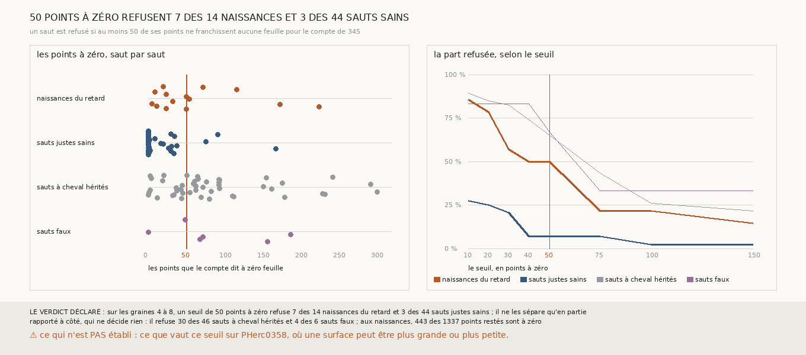

# `351` — Un seuil de points à zéro refuse-t-il les sauts où le retard naît ? En partie : 7 des 14 naissances, et 3 des 44 sauts sains seulement

*`350` a montré que le retard des surfaces à cheval naît au premier saut à cheval de chaque chaîne, puis qu'il s'hérite. Le critère de
`345` ne le voit pas : il demande que les trois quarts des points comptés franchissent une feuille, et un morceau resté en arrière n'en
fait qu'une petite part. Cette tranche essaie un seuil sur le nombre, et non sur la part : un saut est refusé si au moins 50 de ses points
ne franchissent aucune feuille pour le compte de `345`, le même nombre qui fait une surface à cheval dans `349`. Sans mesure neuve, sur ce
que `345`, `349` et `350` publient, il refuse 7 des 14 naissances du retard et 3 des 44 sauts justes sains : par la règle déclarée, il ne
les sépare qu'en partie. Il refuse aussi 30 des 46 sauts à cheval hérités.*

## 0. Pourquoi cette tranche

C'est `R4-P147`, toujours la question de `#5`. Là où le retard naît, un morceau de la surface reste sur la feuille de départ ; si le
compte le voit, un rouleau sans tracé peut refuser la surface au moment où elle se met à cheval, avant que les sauts suivants n'en héritent.

## 1. Ce qui a été vu avant d'écrire

Tout ce que `296` à `350` publient, dont `R4-F535` et `R4-F536`. Les comptes de `345` sont publiés saut par saut ; ceux de la chaîne bornée,
graine 8, avaient été lus en passant pour `348`. Le nombre de points à zéro n'avait jamais été rapproché de la naissance du retard.

## 2. Ce qui est fait

- **Aucune mesure neuve** : `345`, `349` et `350` rapprochés saut par saut par la chaîne, la graine, le côté et le numéro du saut.
- **Le critère** : un saut est refusé s'il a au moins 50 points que le compte de `345` dit à zéro feuille.
- **Les naissances** : le premier saut à cheval de chaque chaîne et de chaque graine des graines 4 à 8, selon `350`. **Les sauts sains** :
  les sauts justes des graines 4 à 8 que `349` lit et ne dit pas à cheval.
- **Le contrôle** : chaque saut cherché est dans `345`, et sous chaque surface de `349` les points restés à zéro ne dépassent jamais les
  points à zéro du saut. Il tient.
- **La règle** : celle de `344`, les naissances à la place des sauts faux : les trois quarts des naissances refusées et au plus un quart
  des sauts sains, **il les sépare** ; un écart sous 25 points, **il ne les sépare pas** ; sinon, **en partie**.

## 3. Ce que dit le seuil

| groupe | sauts | refusés à 50 points à zéro |
|---|---|---|
| naissances du retard | 14 | 7 |
| sauts justes sains | 44 | 3 |
| sauts justes à cheval hérités | 46 | 30 |
| sauts faux | 6 | 4 |

⭐⭐⭐⭐ **Le seuil refuse la moitié des naissances et presque aucun saut sain** (`R4-F537`). Les naissances ont de 5 à 225 points à zéro ;
les sept qu'il tient en ont de 5 à 32. Les sauts sains en ont aucun pour 25 des 44, et les trois qu'il refuse en ont 76, 92 et 168. Par la
règle déclarée, il ne les sépare qu'en partie : une naissance sur deux laisse moins de 50 points en arrière.

⭐⭐⭐⭐ **Il refuse mieux les sauts qui héritent du retard que ceux où il naît.** 30 des 46 sauts à cheval hérités sont refusés : le morceau
resté en arrière grandit en descendant la chaîne. Sur les 60 sauts justes à cheval, il en refuse 37 ; `345` en tenait 53.

*Rapporté à côté, qui ne décide rien : aux naissances, 443 des 1337 points restés sont comptés à zéro. À 40 points le seuil refuse 7
naissances et 3 sauts sains, à 30 points 8 et 9, à 75 points 3 et 3. À 20 points il en refuserait 11 et 11, juste à la limite de la règle ;
choisi après avoir vu les données, ce seuil-là ne prouve rien.*

## 4. Le verdict

**SUR LES GRAINES 4 À 8, UN SEUIL DE 50 POINTS À ZÉRO REFUSE 7 DES 14 NAISSANCES DU RETARD ET 3 DES 44 SAUTS JUSTES SAINS ; IL NE LES SÉPARE QU'EN PARTIE**

`R4-P147` est répondue : en partie. Un seuil sur le nombre de points à zéro voit une naissance sur deux sans refuser les sauts sains, et
les deux tiers des sauts qui héritent du retard.

## 5. Ce que cette tranche ne dit pas

- ⚠⚠ Ce que vaut le compte de `345` auquel s'ajoute ce seuil, sur tous les sauts jugés.
- ⚠⚠ Ce que vaut le seuil sur PHerc0358, où une surface peut être plus grande ou plus petite, et si un saut refusé à sa naissance aurait
  donné, relancé, une surface qui n'est pas à cheval.
- ⚠ Quatorze naissances seulement ; les autres seuils sont lus après coup.

## 6. Les sondes

Une batterie de **11** contrôles et une figure de **19**. Onze règles cassées exprès ont fait échouer la batterie : les points à une
feuille pris pour les points à zéro, les naissances des graines 1 à 3 comptées, les surfaces des graines 1 à 3 comptées, les naissances
comptées parmi les hérités, le seuil pris strict, un saut absent de `345` accepté, le contrôle des restés ôté, les deux bornes de la règle
prises strictes, l'écart minimal abaissé, le minimum de sauts ôté, et le contrôle tombé accepté. Sept sondes de la figure l'ont fait
échouer : une échelle tronquée, un saut oublié, la courbe d'un groupe tracée avec les parts d'un autre, qui passait d'abord, les parts d'un
groupe recopiées sur un autre, un titre figé, les comptes rapportés à côté faussés, et des rangées hors du graphe.

## 7. Ce qui reste

`R4-P148` s'ouvre : le compte de `345` auquel s'ajoute le seuil de 50 points à zéro sépare-t-il, sur les graines 4 à 8, les sauts justes
qui ne sont pas à cheval de tous les autres ?
