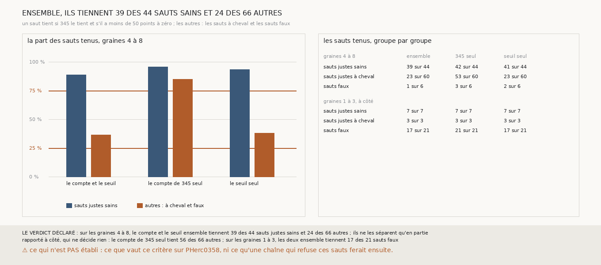

# `352` — Le compte de 345 et le seuil de points à zéro, ensemble, séparent-ils les sauts sains des autres ? En partie : 39 des 44 sauts sains, et encore 24 des 66 autres

*`345` refuse les sauts qui passent par-dessus un tour ; `351` refuse, avec un seuil de 50 points à zéro, une part des surfaces à cheval.
Cette tranche les prend ensemble, sans retoucher ni l'un ni l'autre : un saut tient si `345` le tient et s'il a moins de 50 points à
zéro. Sans mesure neuve, sur les graines 4 à 8, le critère tient 39 des 44 sauts justes sains et 24 des 66 autres, sauts à cheval et
sauts faux : par la règle déclarée, il ne les sépare qu'en partie. Le seuil fait presque tout le travail : seul, il tient 41 sains et 25
autres ; `345` seul tient 42 sains et 56 autres.*

## 0. Pourquoi cette tranche

C'est `R4-P148`, toujours la question de `#5`. Si les deux critères se complètent, leur conjonction est le critère sans référent à porter
sur PHerc0358.

## 1. Ce qui a été vu avant d'écrire

Tout ce que `296` à `351` publient, dont `R4-F531`, `R4-F535` et `R4-F537`. Ce qui n'était pas vu : combien de sauts les deux critères
refusent ensemble, puisque ceux que l'un refuse peuvent être ceux que l'autre refuse déjà.

## 2. Ce qui est fait

- **Aucune mesure neuve** : `345` et `349` rapprochés saut par saut.
- **Le critère** : un saut tient si `345` le tient et s'il a moins de 50 points que le compte dit à zéro feuille.
- **Les sauts sains** : les sauts justes des graines 4 à 8 que `349` lit et ne dit pas à cheval. **Les autres** : les sauts justes à cheval
  et les sauts faux des graines 4 à 8 que `349` lit.
- **Le contrôle** : chaque saut de `349` est dans `345`, avec la même justesse. Il tient.
- **La règle** : celle de `344`, les autres à la place des sauts faux.

## 3. Ce que disent les deux critères

| graines 4 à 8 | ensemble | `345` seul | seuil seul |
|---|---|---|---|
| sauts justes sains | 39 sur 44 | 42 sur 44 | 41 sur 44 |
| sauts justes à cheval | 23 sur 60 | 53 sur 60 | 23 sur 60 |
| sauts faux | 1 sur 6 | 3 sur 6 | 2 sur 6 |

⭐⭐⭐⭐ **Ensemble, ils tiennent 39 des 44 sauts sains et 24 des 66 autres** (`R4-F538`). Les sauts sains sont tenus à 89 %, au-delà des
trois quarts ; les autres à 36 %, au-dessus du quart. Ce que le critère tient est sain à 62 %, contre 43 % pour `345` seul.

⭐⭐⭐⭐ **Le seuil fait presque tout le travail.** Ajouter `345` au seuil retire deux sauts sains, un saut faux et aucun saut à cheval ; les
23 sauts à cheval que le critère tient encore ont moins de 50 points à zéro, et `345` les tient aussi.

*Rapporté à côté, qui ne décide rien : sur les graines 1 à 3, où le référent pose des tours sur la feuille de leur voisin, les deux
ensemble tiennent les 7 sauts sains, les 3 sauts à cheval et 17 des 21 sauts faux.*

## 4. Le verdict

**SUR LES GRAINES 4 À 8, LE COMPTE ET LE SEUIL ENSEMBLE TIENNENT 39 DES 44 SAUTS JUSTES SAINS ET 24 DES 66 AUTRES ; ILS NE LES SÉPARENT QU'EN PARTIE**

`R4-P148` est répondue : en partie. Le critère tient presque tous les sauts sains, mais plus d'un tiers des autres, presque tous des sauts
à cheval dont le retard est trop petit pour laisser 50 points à zéro.

## 5. Ce que cette tranche ne dit pas

- ⚠⚠ Si les surfaces à cheval que le critère tient sont presque entièrement sur le tour attendu : un saut à cheval l'est dès 50 points
  hors du tour attendu, soit 5 % de ses points.
- ⚠⚠ Ce que vaut ce critère sur PHerc0358, et ce qu'une chaîne qui refuse ces sauts ferait ensuite.
- ⚠ Six sauts faux seulement.

## 6. Les sondes

Une batterie de **12** contrôles et une figure de **16**. Onze règles cassées exprès ont fait échouer la batterie : le seuil pris large,
les deux critères pris l'un ou l'autre au lieu de l'un et l'autre, les graines 1 à 3 comptées, un seul genre de saut faux compté, les
sauts à cheval oubliés parmi les autres, la justesse non contrôlée, les deux bornes de la règle prises strictes, l'écart minimal abaissé, le
minimum de sauts ôté, le contrôle tombé accepté, et la tenue de `328` prise pour celle de `345`. Deux d'entre elles faisaient d'abord
tomber la batterie sur une exception plutôt que sur un contrôle ; elle a été rendue robuste. Quatre sondes de la figure l'ont fait
échouer : les barres d'un critère tracées avec les parts d'un autre, les colonnes du tableau interverties, un titre figé et les comptes
rapportés à côté faussés.

## 7. Ce qui reste

`R4-P149` s'ouvre : les surfaces à cheval que le compte et le seuil tiennent sur les graines 4 à 8 sont-elles presque entièrement sur le
tour attendu, et plus que celles qu'ils refusent ?
