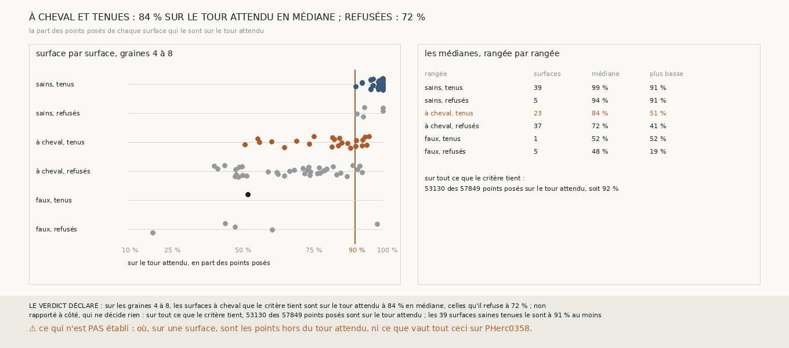

# `353` — Les surfaces à cheval que le critère tient sont-elles presque entièrement sur leur tour ? Non : 84 % en médiane, contre 72 % pour celles qu'il refuse ; mais ce qu'il tient est sur son tour à 92 %

*`352` a trouvé que le compte de `345` et le seuil de 50 points à zéro, ensemble, tiennent encore 23 des 60 sauts à cheval. Un saut est à
cheval dès 5 % de ses points hors du tour attendu : cette tranche lit, surface par surface, la part de ses points posés qui le sont sur le
tour attendu, sans mesure neuve. Les surfaces à cheval tenues le sont à 84 % en médiane, sous les 90 % déclarés : par la règle, non. Elles
le sont plus que les refusées, à 72 %. Et sur tout ce que le critère tient, 92 % des points posés sont sur le tour attendu ; les 39 surfaces
saines tenues le sont toutes à 91 % au moins.*

## 0. Pourquoi cette tranche

C'est `R4-P149`, toujours la question de `#5`. Si les surfaces à cheval que le critère tient le sont à peine, ce qu'il tient est plus sain
que ses 62 % ne le disent, et c'est la part de la surface sur son tour, et non un oui ou un non, qui dira ce que vaut une première surface.

## 1. Ce qui a été vu avant d'écrire

Tout ce que `296` à `352` publient, dont `R4-F535` (la part des points hors du tour attendu sous les 60 surfaces à cheval, de 5 à 45 %,
17 % en médiane) et `R4-F538`. Ce qui n'était pas vu : cette part pour les surfaces tenues et refusées séparément.

## 2. Ce qui est fait

- **Aucune mesure neuve** : `345` et `349` rapprochés par les fonctions de `352`.
- **La part sur le tour attendu** d'une surface : parmi ses points du compte posés sur un tour publié, la part posée sur le tour attendu.
- **La règle** : au moins 5 surfaces de chaque côté ; si la médiane des surfaces à cheval tenues est d'au moins 90 % et plus haute que
  celle des refusées, **oui** ; d'au moins 90 % sans être plus haute, **presque entièrement, mais pas plus que les refusées** ; sinon,
  **non**.

## 3. Ce que dit la part sur le tour attendu

| surfaces | nombre | médiane | plus basse |
|---|---|---|---|
| saines, tenues | 39 | 99 % | 91 % |
| saines, refusées | 5 | 94 % | 91 % |
| à cheval, tenues | 23 | 84 % | 51 % |
| à cheval, refusées | 37 | 72 % | 41 % |
| fausses, tenues | 1 | 52 % | 52 % |
| fausses, refusées | 5 | 48 % | 19 % |

⭐⭐⭐⭐ **Les surfaces à cheval que le critère tient sont sur leur tour à 84 % en médiane, celles qu'il refuse à 72 %** (`R4-F539`). Le
critère garde les surfaces à cheval les moins atteintes, mais elles ne le sont pas à peine : une sur deux a plus de 15 % de ses points hors
du tour attendu, et la plus atteinte près de la moitié.

⭐⭐⭐⭐ **Ce que le critère tient est sur son tour à 92 %.** Des 57849 points posés des 63 surfaces qu'il tient, 53130 le sont sur le tour
attendu. Les 39 surfaces saines tenues le sont toutes à 91 % au moins ; sous ce seuil, il n'y a que des surfaces à cheval et la seule
surface fausse tenue.

## 4. Le verdict

**SUR LES GRAINES 4 À 8, LES SURFACES À CHEVAL QUE LE CRITÈRE TIENT SONT SUR LE TOUR ATTENDU À 84 % EN MÉDIANE, CELLES QU'IL REFUSE À 72 % ; NON**

`R4-P149` est répondue : non. Ce que le critère tient est sur son tour à 92 %, mais plus d'un tiers des surfaces qu'il tient portent un
morceau d'un autre tour, parfois la moitié.

## 5. Ce que cette tranche ne dit pas

- ⚠⚠ Où, sur une surface, sont les points hors du tour attendu ; et si les découper suffirait.
- ⚠⚠ Ce que vaut tout ceci sur PHerc0358, où il n'y a pas de tour publié pour dire la part.
- ⚠ La part est lue sur au plus 1200 points par surface, ceux du compte de `345`.

## 6. Les sondes

Une batterie de **9** contrôles et une figure de **19**. Huit règles cassées exprès ont fait échouer la batterie : la part prise sur tous
les points au lieu des points posés, le critère réduit à `345` seul, les surfaces refusées sommées avec les tenues, la médiane des tenues
seule suffisante, la borne des 90 % prise stricte, qui passait d'abord, la moyenne au lieu de la médiane, le minimum de surfaces ôté, et le
contrôle tombé accepté. Cinq sondes de la figure l'ont fait échouer : les surfaces refusées dessinées avec les parts des tenues, des
points décalés, les moyennes au lieu des médianes, un titre figé, et la plus basse part des surfaces saines figée, qui passait d'abord.

## 7. Ce qui reste

`R4-P150` s'ouvre : sur PHerc0358, le compte de `345` et le seuil de 50 points à zéro tiennent-ils des sauts de la chaîne relancée, et
combien à la suite depuis la surface de départ ?
