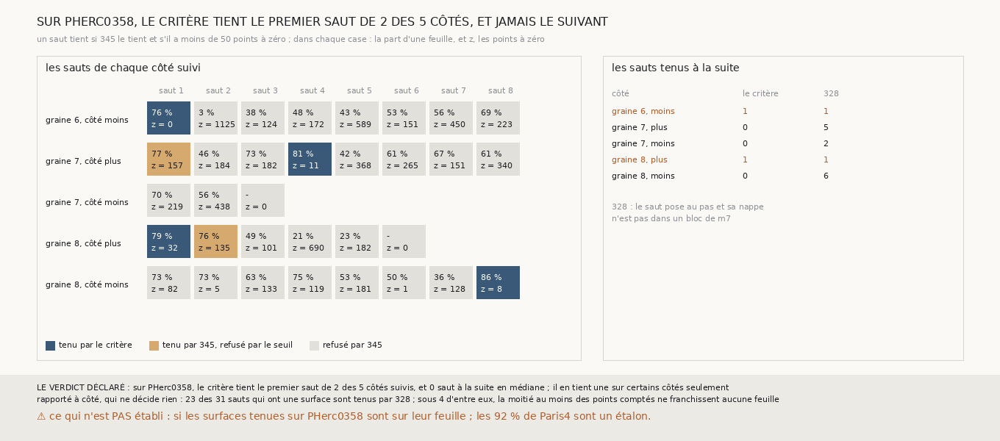

# `354` — Sur PHerc0358, le critère sans référent tient-il une première surface ? Sur deux des cinq côtés suivis, et jamais le saut suivant

*PHerc0358 n'a pas de tracé humain : c'est le rouleau de `#5`. Cette tranche y porte, sans rien y changer, le critère de `352` : un saut
tient si le compte de `345` le tient et s'il a moins de 50 points à zéro feuille. Sur Paris4, ce qu'il tient est sur son tour à 92 %. Sur
les cinq côtés de graines que `331` suit sur PHerc0358, il tient le premier saut de deux, ceux de la graine 6, côté moins, et de la graine
8, côté plus, et refuse le saut suivant de l'un et de l'autre. Par la règle déclarée, il tient une première surface sur certains côtés
seulement. Au passage, `328` tenait 23 des 31 sauts qui ont une surface, dont un où 1125 des 1157 points comptés restent sur la feuille de
départ.*

## 0. Pourquoi cette tranche

C'est `R4-P150`, et c'est `#5` : une surface que le critère tient sur PHerc0358 est la première que le projet peut proposer sur un rouleau
sans tracé avec une précision connue ailleurs.

## 1. Ce qui a été vu avant d'écrire

Tout ce que `296` à `353` publient, dont `R4-F538` et `R4-F539`. Sur PHerc0358, `331` suit cinq côtés et le critère de `328` y tient 1, 5,
2, 1 et 6 sauts à la suite. Le compte de `345` n'avait été porté sur aucune surface de PHerc0358.

## 2. Ce qui est fait

- **Les chaînes** : celles de PHerc0358 que `331` suit, par une fonction sortie de sa mesure pour cette tranche ; la tenue de `328`
  rejouée redonne, saut par saut, ce que `331` publie.
- **Le compte** : celui de `345`, au pas de PHerc0358, 20 voxels ; la portée latérale d'un point en face, 10 voxels du niveau 2 sur Paris4,
  est rapportée au pas, 0,555 pas, par un paramètre que `345` gagne sans changer ce qu'il publie.
- **Le critère** : celui de `352`, sans rien changer. **La suite** d'un côté : les sauts tenus à la suite depuis la surface de départ.
- **Le contrôle** : sous au moins la moitié des sauts qui ont une surface, le compte doit mesurer au moins 50 points. Il tient : il en
  mesure au moins 50 sous 30 des 31.
- **La règle** : aucun premier saut tenu, **aucune première surface** ; au moins la moitié des côtés, **une première surface sur au moins
  la moitié** ; sinon, **sur certains côtés seulement**.

`m7` a été lu en 3813 chunks, sans panne.

## 3. Ce que dit le critère

| côté | le premier saut | le saut suivant | suite du critère | suite de `328` |
|---|---|---|---|---|
| graine 6, moins | tenu : 76 % d'une feuille sur 1126 points, 0 à zéro | refusé : 1125 points à zéro sur 1157 | 1 | 1 |
| graine 7, plus | refusé par le seuil : 77 % d'une feuille, 157 à zéro | refusé | 0 | 5 |
| graine 7, moins | refusé : 70 % d'une feuille | refusé | 0 | 2 |
| graine 8, plus | tenu : 79 % d'une feuille sur 472 points, 32 à zéro | refusé par le seuil : 135 à zéro | 1 | 1 |
| graine 8, moins | refusé : 73 % d'une feuille | refusé | 0 | 6 |

⭐⭐⭐⭐⭐ **Le critère tient une première surface sur deux des cinq côtés de PHerc0358** (`R4-F540`) : celle de la graine 6, côté moins,
dont 855 des 1126 points comptés franchissent une feuille et aucun ne reste sur la feuille de départ, et celle de la graine 8, côté plus,
dont 374 des 472 points en franchissent une et 32 restent. Il refuse le saut suivant de l'une et de l'autre. Plus loin, il ne tient que
deux sauts isolés : le quatrième de la graine 7, côté plus, et le huitième de la graine 8, côté moins.

⭐⭐⭐⭐ **Sur PHerc0358, beaucoup de sauts que `328` tient ne quittent pas la feuille de départ.** `328` tient 23 des 31 sauts qui ont une
surface ; sous 4 des 31, la moitié au moins des points comptés ne franchissent aucune feuille, et sous le deuxième saut de la graine 6,
côté moins, 1125 des 1157. Le compte y voit aussi plus de feuilles franchies qu'une seule : sous le premier saut tenu de la graine 6, 271
points en franchissent deux.

## 4. Le verdict

**SUR PHERC0358, LE CRITÈRE TIENT LE PREMIER SAUT DE 2 DES 5 CÔTÉS SUIVIS, ET 0 SAUT À LA SUITE EN MÉDIANE ; IL EN TIENT UNE SUR CERTAINS CÔTÉS SEULEMENT**

`R4-P150` est répondue : sur certains côtés seulement. Deux surfaces de PHerc0358 sont tenues par un critère sans référent dont la
précision, sur Paris4, est de 92 % des points sur le bon tour ; aucune chaîne n'y va plus loin qu'un saut.

## 5. Ce que cette tranche ne dit pas

- ⚠⚠ Si ces deux surfaces sont sur leur feuille : les 92 % de Paris4 sont un étalon, pas une mesure de PHerc0358, où le compte voit plus
  souvent deux feuilles franchies.
- ⚠⚠ Pourquoi le saut suivant reste, sous la graine 6, presque entièrement sur la feuille de départ.
- ⚠ Cinq côtés seulement, choisis par `324` parce que leur premier saut pose au pas.

## 6. Les sondes

Une batterie de **15** contrôles et une figure de **16**. Dix règles cassées exprès ont fait échouer la batterie : le seuil ôté, `345` ôté,
la portée latérale de Paris4 gardée en voxels, la suite qui ne s'arrête pas au premier refus, des chaînes qui ne redonnent pas `331`
acceptées, le contrôle du compte ôté, les sauts sans surface comptés au contrôle, la borne de la moitié prise stricte, le contrôle de
`331` ôté, et un premier saut qui compte seulement s'il est suivi d'un autre. Les batteries de `331` et `345` passent inchangées. Quatre
sondes de la figure l'ont fait échouer : les sauts tenus par `345` seul peints comme tenus, les colonnes des suites interverties, un titre
figé, et les sauts à moitié à zéro comptés au seuil de 50 points.

## 7. Ce qui reste

`R4-P151` s'ouvre : sur PHerc0358, les deux premières surfaces que le critère tient portent-elles plus d'encre, au détecteur de `296`, que
les surfaces qu'il refuse ?
