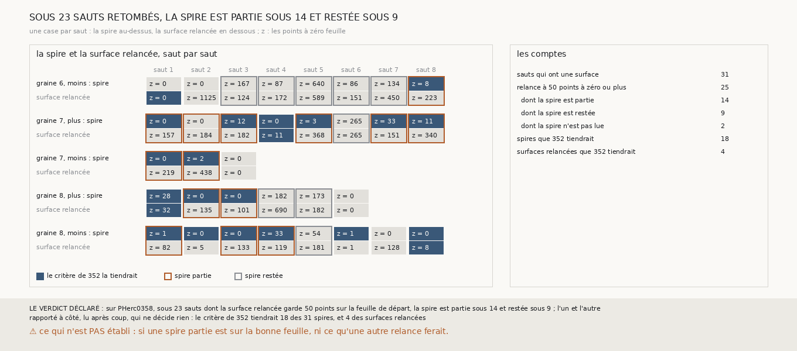

# `355` — Sur PHerc0358, est-ce le saut ou la relance qui reste sur la feuille de départ ? L'un et l'autre : sous 14 des 23 sauts jugés, la spire était partie et c'est la relance qui retombe

*`354` a trouvé que, sur PHerc0358, la chaîne ne va jamais au-delà d'un saut, et que beaucoup de surfaces relancées gardent des points sur
la feuille de départ. Un saut y cherche une spire à un pas, puis relance une nappe entière depuis un seul point de cette spire. Cette
tranche compte aussi la spire contre la surface de départ. Sous les 25 sauts dont la surface relancée garde au moins 50 points sur la feuille de
départ, la spire est lue sous 23 : elle était partie sous 14 et restée sous 9. Par la règle déclarée, l'un et l'autre. Sous le deuxième
saut de la graine 6, côté moins, la spire n'a que 2 points, et la nappe relancée depuis l'un d'eux s'étale sur la feuille de départ.*

## 0. Pourquoi cette tranche

C'est `R4-P152`, ouverte par cette tranche. `R4-P151`, l'encre des deux premières surfaces de PHerc0358, attend une décision de l'auteur :
le détecteur de `296` est étalonné à 2,4 µm, PHerc0358 est scanné à 9,362 µm, et la lire demande des lectures neuves. En attendant, la
question est celle qui borne la chaîne de PHerc0358 : si la spire est partie et que la relance retombe, c'est la relance qu'il faut changer.

## 1. Ce qui a été vu avant d'écrire

Tout ce que `296` à `354` publient, dont `R4-F540`. La spire que trouve chaque saut n'avait jamais été comptée.

## 2. Ce qui est fait

- **Les chaînes** : celles de PHerc0358 que `331` suit ; les points à zéro de chaque surface relancée redonnent ce que `354` publie.
- **Le compte** : celui de `345`, au pas et à la portée latérale de `354`, porté aussi sur la spire contre la surface d'où part le saut.
- **Les sauts jugés** : ceux dont la surface relancée garde au moins 50 points à zéro ; la spire est **restée** si elle en garde aussi au
  moins 50, **partie** sinon, non lue si le compte en mesure moins de 50 points.
- **Le contrôle** : le compte mesure au moins 50 points sous la moitié au moins des spires. Il tient.
- **La règle** : au moins 5 sauts jugés lus ; les trois quarts partis, **la relance retombe** ; les trois quarts restés, **le saut ne quitte
  pas la feuille** ; sinon, **l'un et l'autre**.

`m7` a été lu en 3533 chunks, sans panne.

## 3. Ce que dit la spire

| sous les 31 sauts qui ont une surface | nombre |
|---|---|
| la surface relancée garde 50 points à zéro ou plus | 25 |
| dont la spire est partie | 14 |
| dont la spire est restée | 9 |
| dont la spire n'est pas lue | 2 |

⭐⭐⭐⭐ **Sous 14 des 23 sauts jugés, la spire avait quitté la feuille de départ et c'est la nappe relancée qui y retombe** (`R4-F541`).
Sous les 9 autres, la spire elle-même garde au moins 50 points sur la feuille de départ. Par la règle déclarée, l'un et l'autre.

⭐⭐⭐⭐ **Le cas qui borne la graine 6 est une relance depuis presque rien.** Sous son deuxième saut, la spire n'a que 2 points ; la nappe
relancée depuis l'un d'eux en a 1200, dont 1125 des 1157 comptés restent sur la feuille de départ.

*Rapporté à côté, lu après coup, qui ne décide rien : le critère de `352` tiendrait 18 des 31 spires et 4 des 31 surfaces relancées ; sous
15 sauts, il tiendrait la spire et refuserait la surface relancée depuis elle. Une spire a 494 points en médiane, une surface relancée
1200, le plafond du compte.*

## 4. Le verdict

**SUR PHERC0358, SOUS 23 SAUTS DONT LA SURFACE RELANCÉE GARDE 50 POINTS SUR LA FEUILLE DE DÉPART, LA SPIRE EST PARTIE SOUS 14 ET RESTÉE SOUS 9 ; L'UN ET L'AUTRE**

`R4-P152` est répondue : l'un et l'autre, mais la relance est la plus souvent en cause. Sur PHerc0358, la spire est plus souvent une bonne
surface que la nappe qu'on relance depuis elle.

## 5. Ce que cette tranche ne dit pas

- ⚠⚠ Si une spire partie est sur la bonne feuille ; et ce qu'une chaîne qui garderait la spire ferait ensuite, puisqu'une spire est plus
  petite que la nappe relancée et que `328` a vu la chaîne sans relance rétrécir.
- ⚠ Cinq côtés seulement ; ce qui est dit des spires tenues est lu après coup.

## 6. Les sondes

Une batterie de **16** contrôles et une figure de **15**. Douze règles cassées exprès ont fait échouer la batterie : une relance à un point
à zéro jugée, la borne des 50 points prise stricte, une spire trop peu mesurée lue, la surface relancée comptée à la place de la spire, la
portée latérale de Paris4 gardée en voxels, qui passait d'abord, des chaînes qui ne redonnent pas `354` acceptées, le contrôle des spires
ôté, les sauts sans surface comptés au contrôle, les spires non lues jugées, la majorité prise au lieu des trois quarts, qui passait
d'abord, le minimum de sauts ôté, et le contrôle de `354` ôté. Cinq sondes de la figure l'ont fait échouer : la spire et la surface
relancée interverties, tous les liserés d'une seule couleur, qui passait d'abord, les spires non lues bordées, un titre figé et les comptes
rapportés à côté intervertis.

## 7. Ce qui reste

`R4-P153` s'ouvre : sur PHerc0358, une chaîne qui saute depuis la spire quand le critère de `352` la tient, et ne relance que sinon,
tient-elle plus de sauts à la suite que la chaîne relancée ? `R4-P151`, l'encre, reste ouverte, en attente de l'auteur.
