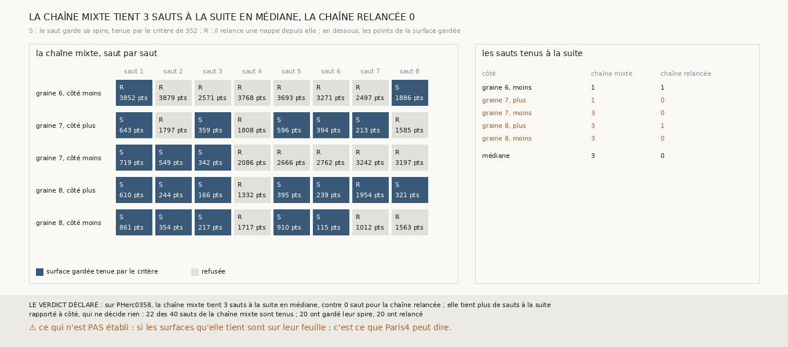

# `356` — Sur PHerc0358, une chaîne qui garde la spire quand le critère la tient va-t-elle plus loin ? Oui : trois sauts tenus à la suite en médiane, contre aucun pour la chaîne relancée

*`355` a montré que, sur PHerc0358, la spire que trouve un saut est plus souvent une bonne surface que la nappe relancée depuis un seul de
ses points, mais une chaîne qui ne relance jamais rétrécit. Cette tranche construit une chaîne mixte : à chaque saut, si le critère de
`352` tient la spire, elle devient la surface de départ du saut suivant ; sinon la nappe est relancée comme avant. Sur les cinq côtés, elle
tient 1, 1, 3, 3 et 3 sauts à la suite, 3 en médiane, contre 1, 0, 0, 1 et 0 pour la chaîne relancée : par la règle déclarée, elle tient
plus de sauts à la suite. Sur 40 sauts, elle en tient 22, dont 20 où elle a gardé sa spire.*

## 0. Pourquoi cette tranche

C'est `R4-P153`, et c'est `#5`. Une chaîne qui ne va pas au-delà d'un saut ne donne qu'une surface ; une chaîne qui en tient plusieurs à la
suite, par un critère sans référent, donne ce qu'un rouleau sans tracé peut proposer.

## 1. Ce qui a été vu avant d'écrire

Tout ce que `296` à `355` publient, dont `R4-F540`, `R4-F541` (lu après coup, le critère tiendrait 18 des 31 spires et 4 des 31 surfaces
relancées) et `R4-F513` (sur PHerc0358, une chaîne sans relance rétrécit). Aucune chaîne de ce genre n'avait été construite.

## 2. Ce qui est fait

- **Les graines, les nappes de départ, le saut et la relance** : ceux des chaînes de PHerc0358 que `331` suit, par sa fonction, qui gagne
  de quoi recevoir la chaîne de l'appelant.
- **La chaîne mixte** : à chaque saut, la spire est comptée contre la surface de départ par le compte de `345`, au pas et à la portée de
  `354` ; si le critère de `352` la tient, elle continue ; sinon la nappe est relancée depuis elle et c'est la nappe qui continue.
- **La suite** : les sauts à la suite dont la surface gardée est tenue par le critère.
- **Le contrôle** : le premier saut de chaque côté part de la même nappe que dans `355`, et le compte de sa spire redonne ce que `355`
  publie. Il tient.
- **La règle** : la médiane des suites des cinq côtés, contre celle de la chaîne relancée que `354` publie.

`m7` a été lu en 3047 chunks, sans panne.

## 3. Ce que fait la chaîne mixte

| côté | suite de la chaîne mixte | suite de la chaîne relancée | sauts tenus sur la chaîne mixte |
|---|---|---|---|
| graine 6, moins | 1 | 1 | 2 sur 8 |
| graine 7, plus | 1 | 0 | 5 sur 8 |
| graine 7, moins | 3 | 0 | 3 sur 8 |
| graine 8, plus | 3 | 1 | 7 sur 8 |
| graine 8, moins | 3 | 0 | 5 sur 8 |

⭐⭐⭐⭐⭐ **La chaîne mixte tient trois sauts à la suite en médiane sur PHerc0358, contre aucun pour la chaîne relancée** (`R4-F542`).
Sur trois côtés, elle tient les trois premiers sauts en gardant chaque fois sa spire ; sur la graine 8, côté plus, elle en tient 7 sur 8.

⭐⭐⭐⭐ **Elle tient parce qu'elle garde sa spire.** Sur 40 sauts, elle a gardé sa spire 20 fois et relancé 20 fois ; des 22 sauts qu'elle
tient, 20 sont des spires gardées et 2 seulement des nappes relancées. La spire gardée la plus petite a 115 points : la chaîne rétrécit
quand elle garde ses spires, et c'est la relance, là où la spire est refusée, qui lui rend de la surface.

## 4. Le verdict

**SUR PHERC0358, LA CHAÎNE MIXTE TIENT 3 SAUTS À LA SUITE EN MÉDIANE, CONTRE 0 SAUT POUR LA CHAÎNE RELANCÉE ; ELLE TIENT PLUS DE SAUTS À LA SUITE**

`R4-P153` est répondue : oui. Ne relancer que là où la spire est refusée fait passer la chaîne de PHerc0358 d'un saut à trois, par un
critère qui ne regarde aucun tracé.

## 5. Ce que cette tranche ne dit pas

- ⚠⚠ Si les surfaces que la chaîne mixte tient sont sur leur feuille : sur PHerc0358, rien ne le dit ; c'est sur Paris4, où les tours
  publiés le disent, que la chaîne mixte doit d'abord être jugée.
- ⚠ Cinq côtés seulement ; les spires gardées rétrécissent, jusqu'à 115 points.

## 6. Les sondes

Une batterie de **10** contrôles et une figure de **17**. Neuf règles cassées exprès ont fait échouer la batterie : toute spire gardée, la
spire tenue qui ne devient pas la surface de départ, qui passait d'abord, la nappe relancée comptée comme sa spire, la nappe relancée qui
ne continue pas, qui passait d'abord, la suite comptée sur la spire au lieu de la surface gardée, des premiers sauts qui ne redonnent pas
`355` acceptés, une médiane égale prise pour plus haute, la moyenne au lieu de la médiane, et le contrôle de `355` ôté. La batterie de `331`
passe inchangée. Quatre sondes de la figure l'ont fait échouer : les lettres S et R interverties, la couleur des cases prise sur la spire
gardée au lieu de la tenue, qui passait d'abord, la colonne de la chaîne relancée triée, et un titre figé.

## 7. Ce qui reste

`R4-P154` s'ouvre : sur PHercParis4, graines 4 à 8, la chaîne mixte tient-elle ses sauts justes, et donne-t-elle moins de surfaces à
cheval que les chaînes relancées ? `R4-P151`, l'encre, reste en attente de l'auteur.
