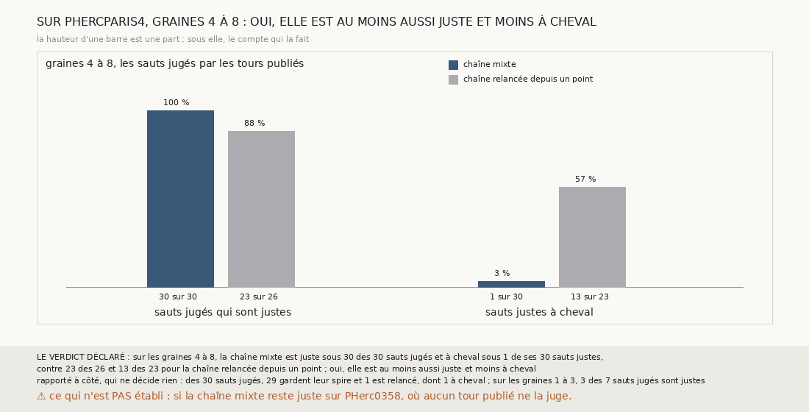

# `357` — Sur PHercParis4, la chaîne mixte tient-elle ses sauts justes, et donne-t-elle moins de surfaces à cheval ? Oui : 30 sauts justes sur 30, 1 à cheval, contre 23 sur 26 et 13 à cheval

*`356` a montré que, sur PHerc0358, une chaîne qui garde la spire quand le critère de `352` la tient va plus loin qu'une chaîne relancée,
mais rien, sur ce rouleau, ne dit si ses surfaces sont sur leur feuille. Cette tranche construit la même chaîne sur PHercParis4, où les
tours publiés le disent. Sur les graines 4 à 8, elle est juste sous les 30 sauts jugés et à cheval sous 1 de ses 30 sauts justes, contre
23 des 26 et 13 des 23 pour la chaîne relancée depuis un point : par la règle déclarée, elle est au moins aussi juste et moins à cheval.*

## 0. Pourquoi cette tranche

C'est `R4-P154`, et c'est `#5`. Une chaîne qui va plus loin sur un rouleau sans tracé ne vaut que si elle ne va pas plus loin sur la
mauvaise feuille : c'est sur PHercParis4, où chaque saut se lit contre les tours publiés, qu'elle doit être jugée avant d'être crue sur
PHerc0358.

## 1. Ce qui a été vu avant d'écrire

Tout ce que `296` à `356` publient, dont `R4-F535` (sur les graines 4 à 8, 13 des 23 sauts justes de la chaîne relancée depuis un point
donnent une surface à cheval) et `R4-F542` (sur PHerc0358, la chaîne mixte tient 3 sauts à la suite en médiane). La chaîne mixte n'avait
jamais tourné sur PHercParis4.

## 2. Ce qui est fait

- **La chaîne mixte** : celle de `356`, sur les nappes de départ, le saut et la relance depuis un point que `331` suit sur PHercParis4 ; le
  critère de `352` y est lu au pas et à la portée de PHercParis4.
- **La justesse** : la lecture stricte de `344` sur la suite des surfaces gardées, la nappe de départ en tête, lue par les tours publiés.
- **À cheval** : la définition de `349`, 50 points restés sur la feuille de départ ou passés au-delà du tour attendu.
- **Le témoin** : la chaîne relancée depuis un point, sur les mêmes graines, telle que `344` et `349` la publient.
- **Le contrôle** : la nappe de départ de chaque côté est celle que `340` publie, et chaque côté a au moins un saut. Il tient.
- **La règle** : j, la part des sauts jugés qui sont justes, et c, la part des sauts justes à cheval. Un j au moins aussi haut que celui du
  témoin et un c plus bas donnent **oui** ; un j plus bas et un c au moins aussi haut, **non** ; sinon, **en partie**.

`m7` a été lu en 8915 chunks, sans panne.

## 3. Ce que fait la chaîne mixte

Comme pour le témoin, seuls les sauts du côté moins sont jugés : les tours publiés ne lisent pas l'autre côté.

| graine | chaîne mixte : justes | à cheval | chaîne relancée : justes | à cheval |
|---|---|---|---|---|
| 4 | 6 sur 6 | 0 | 6 sur 6 | 4 |
| 5 | 6 sur 6 | 0 | 4 sur 5 | 2 |
| 6 | 6 sur 6 | 0 | 6 sur 6 | 3 |
| 7 | 6 sur 6 | 1 | 1 sur 3 | 0 |
| 8 | 6 sur 6 | 0 | 6 sur 6 | 4 |

⭐⭐⭐⭐⭐ **La chaîne mixte est juste sous ses 30 sauts jugés et à cheval sous 1 seul** (`R4-F543`). La chaîne relancée depuis un point est
juste sous 23 des 26 et à cheval sous 13 de ses 23 sauts justes.

⭐⭐⭐⭐ **Le seul saut à cheval est le seul qu'elle a relancé.** Des 30 sauts jugés, 29 gardent leur spire et 1 est relancé, celui de la
graine 7 au huitième saut : c'est lui qui est à cheval. Aucune des 29 spires gardées ne l'est. Sur les graines 1 à 3, 3 des 7 sauts jugés
sont justes.

⚠⚠ **Les spires gardées rétrécissent.** Les surfaces justes de la chaîne mixte ont moins de points posés que celles du témoin :
810 en médiane et 71 au moins, contre 1198 et 509 pour le témoin. Une surface plus petite passe moins souvent le seuil de 50 points,
mais le seuil n'explique pas l'écart : des 23 surfaces justes qui ont au moins 509 points posés, 1 seule est à cheval.

## 4. Le verdict

**SUR PHERCPARIS4, GRAINES 4 À 8 : OUI, ELLE EST AU MOINS AUSSI JUSTE ET MOINS À CHEVAL**

`R4-P154` est répondue : oui. Garder la spire que le critère tient, au lieu de relancer une nappe depuis un point, donne sur PHercParis4
des sauts justes qui restent sur leur feuille.

## 5. Ce que cette tranche ne dit pas

- ⚠⚠ Si la chaîne mixte reste juste sur PHerc0358 : aucun tour publié ne l'y juge, et PHercParis4 n'en est qu'un étalon.
- ⚠ Ce qu'elle vaut du côté plus, que les tours publiés ne lisent pas.
- ⚠ Une chaîne qui rétrécit ne couvre pas un rouleau : garder la spire la tient sur sa feuille, mais ne lui rend pas de surface.

## 6. Les sondes

Une batterie de **8** contrôles et une figure de **19**. Dix règles cassées exprès ont fait échouer la batterie : les sauts à cheval comptés
sur tous les sauts, c rapporté aux sauts jugés, les sauts non jugés comptés, les graines 1 à 3 comptées, le témoin pris sur toutes les
chaînes, le témoin pris sur toutes les graines, un c égal pris pour plus bas, un j égal refusé, le minimum ôté et le contrôle ôté. Les
batteries de `331` et de `356` passent inchangées. Dix sondes de la figure l'ont fait échouer : une hauteur fixe, un compte figé, les
spires gardées figées, un titre figé, un verdict tronqué, une barre hors cadre, la ligne de ce qui n'est pas établi ôtée, les couleurs
interverties, qui passait d'abord, c rapporté aux sauts jugés, qui passait d'abord, et les deux groupes intervertis.

## 7. Ce qui reste

`R4-P155` s'ouvre : sur PHercParis4, graines 4 à 8, une nappe relancée depuis toute la spire tenue, au lieu d'un seul de ses points,
rend-elle de la surface à la chaîne mixte sans la faire passer à cheval ? `R4-P151`, l'encre, reste en attente de l'auteur.
