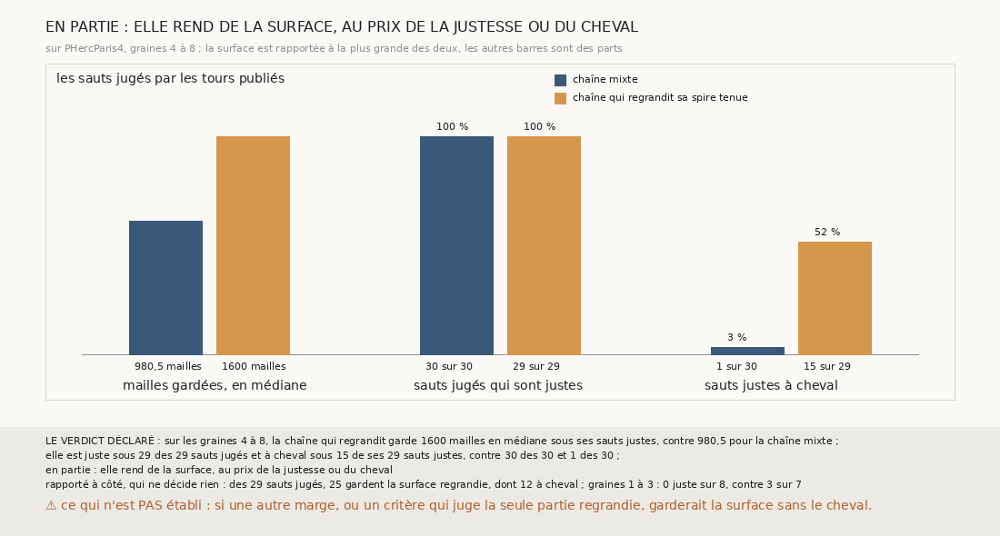

# `358` — Sur PHercParis4, regrandir la spire tenue rend-il de la surface sans passer à cheval ? En partie : 1600 mailles contre 980,5, mais 15 sauts justes à cheval sur 29, contre 1 sur 30

*`357` a montré que la chaîne mixte reste juste et ne passe presque jamais à cheval sur PHercParis4, mais que ses spires gardées
rétrécissent. Cette tranche regrandit chaque spire tenue par la croissance bornée de `335`, et garde la surface regrandie quand le critère
de `352` la tient elle aussi. Sur les graines 4 à 8, la surface regagne : 1600 mailles en médiane sous les sauts justes, contre 980,5. La
justesse tient : 29 sauts justes sur 29. Mais 15 de ces 29 sauts justes sont à cheval, contre 1 sur 30 : par la règle déclarée, elle rend de
la surface au prix du cheval, et le critère de `352` ne le voit pas.*

## 0. Pourquoi cette tranche

C'est `R4-P155`, et c'est `#5`. Une chaîne qui rétrécit ne couvre pas un rouleau : si la chaîne mixte ne peut pas regagner de surface sans
quitter sa feuille, c'est par le nombre des graines, et non par la longueur des chaînes, qu'un rouleau se couvrira.

## 1. Ce qui a été vu avant d'écrire

Tout ce que `296` à `357` publient, dont `R4-F543` (la chaîne mixte : 30 sauts justes sur 30, 1 à cheval, spires jusqu'à 71 points posés),
`R4-F535` (la chaîne relancée après chaque saut depuis sa spire, bornée à deux mailles, passe à cheval sous 20 de ses 28 sauts justes) et
`R4-F538` (le critère de `352` tient 23 des 60 surfaces à cheval). Ces faits laissaient attendre que le critère ne filtre qu'une partie des
surfaces regrandies à cheval ; la mesure le dit.

## 2. Ce qui est fait

- **La chaîne mixte** : celle de `357`, rejouée par sa fonction, qui gagne pour cela de quoi recevoir la chaîne de l'appelant.
- **La chaîne qui regrandit** : la même, sauf qu'une spire que le critère de `352` tient est regrandie par la croissance bornée de `335`,
  partie de tous ses points, à deux mailles au plus des mailles semées. La surface regrandie est comptée contre la surface de départ, et
  gardée à la place de la spire si le critère la tient elle aussi. `356` gagne pour cela de quoi regrandir la spire tenue.
- **La justesse, à cheval** : celles de `357`, saut par saut. **La surface** d'une chaîne : la médiane des mailles posées de la surface
  gardée, sous ses sauts justes.
- **Le contrôle** : la chaîne mixte rejouée redonne, côté par côté et saut par saut, ce que `357` publie, et les nappes de départ sont
  celles de `340`. Il tient.
- **La règle** : une surface plus grande, un j au moins aussi haut et un c au plus aussi haut donnent **oui** ; une surface plus grande
  avec un j plus bas ou un c plus haut, **en partie** ; sinon, **non**.

`m7` a été lu en 8915 chunks pour la chaîne mixte et en 14510 pour la chaîne qui regrandit, sans panne.

## 3. Ce que fait la chaîne qui regrandit

| | chaîne mixte | chaîne qui regrandit |
|---|---|---|
| mailles gardées, en médiane, sous les sauts justes | 980,5 | 1600 |
| sauts justes sur les sauts jugés | 30 sur 30 | 29 sur 29 |
| sauts justes à cheval | 1 sur 30 | 15 sur 29 |

⭐⭐⭐⭐⭐ **Regrandir la spire rend la surface et ramène le cheval** (`R4-F544`). La chaîne qui regrandit garde 1600 mailles en médiane
sous ses sauts justes, contre 980,5, et reste juste sous ses 29 sauts jugés ; mais 15 de ces 29 sont à cheval, presque autant que la chaîne
relancée depuis un point de `357`, 13 sur 23.

⭐⭐⭐⭐ **C'est la croissance qui passe à cheval, et le critère ne la voit pas.** Des 29 sauts jugés, 25 gardent la surface regrandie,
dont 12 sont à cheval, et une surface regrandie n'est gardée que si le critère de `352` la tient. Les 3 autres sauts à cheval suivent
chacun une surface regrandie déjà à cheval : 2 spires gardées et 1 relance.

⚠ Sur les graines 1 à 3, la chaîne qui regrandit est juste sous 0 des 8 sauts jugés, contre 3 des 7 pour la chaîne mixte.

## 4. Le verdict

**EN PARTIE : ELLE REND DE LA SURFACE, AU PRIX DE LA JUSTESSE OU DU CHEVAL**

`R4-P155` est répondue : en partie, et c'est le cheval qui coûte, pas la justesse. La croissance bornée de `335`, partie de toute la
spire tenue, pose des points sur le tour de départ ou au-delà du tour attendu, et le critère de `352`, calculé sur toute la surface, ne
le voit pas.

## 5. Ce que cette tranche ne dit pas

- ⚠⚠ Si un critère qui ne jugerait que la partie regrandie, hors des mailles de la spire, refuserait ces croissances : sur toute la
  surface, les points de la spire, sains, diluent ceux de la croissance.
- ⚠ Ce que ferait une autre marge, ni ce que vaut la chaîne qui regrandit sur PHerc0358.

## 6. Les sondes

Une batterie de **11** contrôles et une figure de **21**. Quatorze règles cassées exprès ont fait échouer la batterie : la surface prise
sur tous les sauts, la moyenne au lieu de la médiane, qui passait d'abord, une surface égale prise pour plus grande, un c plus haut
accepté, un j plus bas accepté, le contrôle de `357` ôté, ce contrôle réduit au nombre des côtés, le minimum ôté, la croissance sans le
compte de `357`, et, dans `356`, la croissance jamais gardée, gardée sans être comptée, partie de la seule graine, qui ne continue pas,
qui passait d'abord, et une spire refusée regrandie quand même. Les batteries de `356` et de `357` passent inchangées. Onze sondes de la
figure l'ont fait échouer, dont la part à cheval rapportée aux sauts jugés, qui passait d'abord, parce que les deux chaînes n'ont aucun
saut jugé faux.

## 7. Ce qui reste

`R4-P156` s'ouvre : sur PHercParis4, graines 4 à 8, le critère de `352` appliqué à la seule partie regrandie, hors des mailles de la
spire, refuse-t-il les croissances à cheval en gardant les saines ? `R4-P151`, l'encre, reste en attente de l'auteur.
