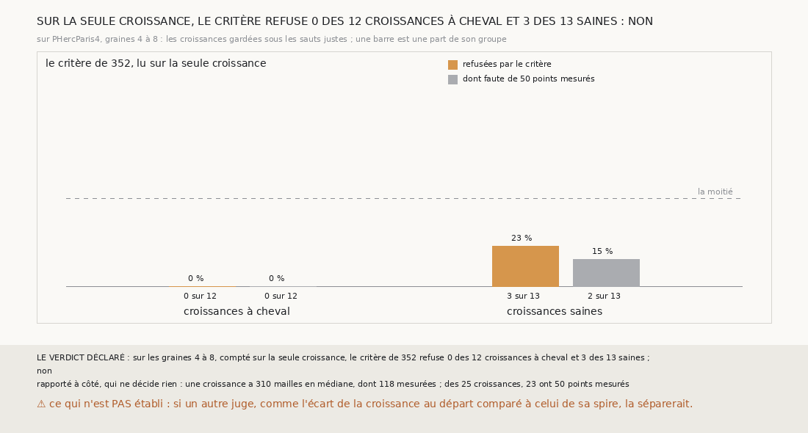

# `359` — Sur PHercParis4, le critère de 352 lu sur la seule croissance sépare-t-il les croissances à cheval ? Non : il n'en refuse aucune sur 12, et refuse 3 saines sur 13

*`358` a montré que regrandir la spire tenue ramène le cheval, et que le critère de `352`, compté sur toute la surface regrandie, ne le
voit pas. Cette tranche lit le même compte sur la seule partie regrandie, hors des mailles semées depuis la spire. Sur les graines 4 à 8, il
refuse 0 des 12 croissances à cheval et 3 des 13 saines : par la règle déclarée, il ne les sépare pas. Une première passe, qui comptait la
croissance comme une surface à part, ne mesurait pas ce qu'elle nommait ; elle est gardée et dite.*

## 0. Pourquoi cette tranche

C'est `R4-P156`, et c'est `#5`. Sur toute la surface regrandie, les points de la spire, sains, pouvaient diluer ceux de la croissance ;
si la croissance lue seule trahissait le cheval sans référent, la chaîne mixte regagnerait la surface que `358` lui rend sans quitter sa
feuille.

## 1. Ce qui a été vu avant d'écrire

Tout ce que `296` à `358` publient, dont `R4-F544` (25 surfaces regrandies gardées sous les sauts jugés des graines 4 à 8, dont 12 à
cheval, toutes tenues par le critère) et `R4-F538` (le critère de `352` tient 23 des 60 surfaces à cheval).

## 2. Ce qui est fait

- **La chaîne qui regrandit** : celle de `358`, rejouée par la fonction de `357`, qui gagne pour cela de quoi garder une observation de
  plus sur chaque saut.
- **La croissance seule** : sous chaque saut qui garde une surface regrandie, toute la surface est comptée contre la surface de départ
  par le compte de `345`, et ce compte n'est lu que sur ses mailles hors des mailles semées depuis la spire. Le compte de `345` rend pour
  cela la maille de chaque point qu'il prend.
- **Le contrôle** : la chaîne rejouée redonne, côté par côté et saut par saut, ce que `358` publie. Il tient.
- **La règle** : r, la part des croissances à cheval refusées, et r', celle des saines. Si r > ½ et r' < ½, **oui** ; si r ≤ r',
  **non** ; sinon, **en partie**.

`m7` a été lu en 15962 chunks, sans panne.

## 3. La première passe, et ce qu'elle ne mesurait pas

⚠⚠ **La première passe comptait la croissance comme une surface à part.** Une normale ne se calcule qu'en une maille dont les quatre
voisines sont posées, et une croissance de deux mailles de large n'en a presque pas : 53 points de normale pour 310 mailles, en médiane.
Le critère refusait alors 11 des 12 croissances à cheval et 13 des 13 saines, dont 8 et 12 faute de 50 points mesurés : il ne jugeait
pas la croissance, il manquait de points. La batterie ne l'a pas vu, parce que ses fausses surfaces n'avaient pas de normales à perdre ;
c'est la sortie qui l'a montré. La passe est gardée dans `docs/mesures/…_premiere_passe.json`, et la règle n'a pas changé.

## 4. Ce que fait le critère sur la seule croissance

Lue sur toute la surface, une croissance a 143 points de normale pour 310 mailles, et 23 des 25 croissances ont 50 points mesurés.

| croissances | refusées | dont faute de 50 points mesurés |
|---|---|---|
| à cheval | 0 sur 12 | 0 |
| saines | 3 sur 13 | 2 |

⭐⭐⭐⭐⭐ **Lu sur la seule croissance, le critère de `352` ne voit pas le cheval** (`R4-F545`). Il n'en refuse aucune des 12 croissances à
cheval, et refuse 3 des 13 saines. Les croissances à cheval passent en médiane 0,835 de leurs points par une seule feuille, les saines
0,883 : compter les feuilles de `m7` jusqu'au départ ne les distingue pas.

⚠ Rapporté à côté, lu après coup, qui ne décide rien : les croissances à cheval ont 20 points à zéro en médiane, les saines 2 ; aucune
n'en a 50.

## 5. Le verdict

**SUR LA SEULE CROISSANCE, LE CRITÈRE REFUSE 0 DES 12 CROISSANCES À CHEVAL ET 3 DES 13 SAINES : NON**

`R4-P156` est répondue : non. Le critère de `352` ne sépare pas les croissances à cheval, qu'il soit compté sur toute la surface ou lu sur
la seule croissance.

## 6. Ce que cette tranche ne dit pas

- ⚠⚠ Si un autre juge sans référent sépare la croissance à cheval : l'écart de ses points à la surface de départ, comparé à celui des
  points de sa spire, ne demande pas à `m7` de voir une feuille.
- ⚠ Si un seuil de points à zéro plus bas les séparerait : l'écart de médianes est lu après coup, sur 25 croissances.

## 7. Les sondes

Une batterie de **11** contrôles et une figure de **21**. Seize règles cassées exprès ont fait échouer la batterie : le critère réduit au
compte de `345`, la croissance comptée à part, le compte lu sur toute la surface, puis sur les seules mailles semées, une spire gardée
lue comme une croissance, les sauts faux jugés, les graines 1 à 3 jugées, les refus faute de mesures oubliés, un r égal pris pour une
séparation, une moitié exacte acceptée, les saines non bornées, le minimum ôté, le contrôle de `358` ôté, puis réduit sans la taille, et,
dans `345`, les mailles non échantillonnées avec leurs points, puis prises sur toute la grille. Les batteries de `345` et de `357` passent
inchangées. Dix sondes de la figure l'ont fait échouer, dont les deux groupes intervertis, qui passait d'abord.

## 8. Ce qui reste

`R4-P157` s'ouvre : sur PHercParis4, graines 4 à 8, les points d'une croissance à cheval s'écartent-ils de la surface de départ autrement
que les points de sa spire, et cet écart, sans référent, les sépare-t-il des saines ? `R4-P151`, l'encre, reste en attente de l'auteur.
