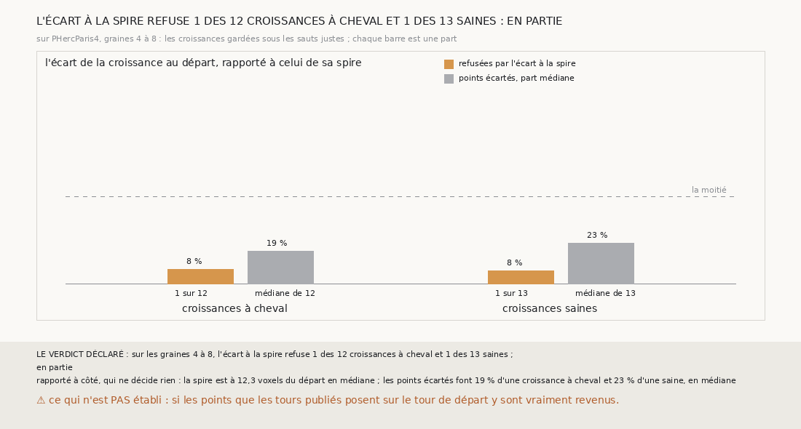

# `360` — Sur PHercParis4, l'écart de la croissance au départ, rapporté à celui de sa spire, sépare-t-il les croissances à cheval ? En partie par la règle, non en substance : 1 refusée sur 12, contre 1 sur 13

*`359` a montré que compter les feuilles de `m7` jusqu'au départ ne voit pas la croissance à cheval. Cette tranche mesure autre chose,
sans `m7` et sans tracé : l'écart signé de chaque point de la croissance à la surface de départ, rapporté à l'écart de sa propre spire. Sur
les graines 4 à 8, il refuse 1 des 12 croissances à cheval et 1 des 13 saines. La règle déclarée dit **en partie**, parce que 1 sur 12 est
une part plus haute que 1 sur 13 ; en substance, l'écart ne les sépare pas, et les saines ont même plus de points écartés.*

## 0. Pourquoi cette tranche

C'est `R4-P157`, et c'est `#5`. Une croissance à cheval pose des points sur le tour de départ, ou au-delà du tour attendu ; sa spire est à
un tour du départ. Un point revenu sur le tour de départ devrait donc être près de la surface de départ, un point passé au-delà deux fois
plus loin, et cet écart ne demande à `m7` de voir aucune feuille.

## 1. Ce qui a été vu avant d'écrire

Tout ce que `296` à `359` publient, dont `R4-F545` (le critère de `352` lu sur la seule croissance refuse 0 des 12 croissances à cheval et
3 des 13 saines) et `R4-F523` (les tours publiés consécutifs sont à 0,70 pas nominal l'un de l'autre en médiane autour des graines).

## 2. Ce qui est fait

- **La chaîne qui regrandit** : celle de `358`, rejouée par la fonction de `357`, comme dans `359`.
- **L'écart** : sous chaque saut qui garde une surface regrandie, le compte de `345` de toute la surface rend, pour chaque point pris qui a
  le départ en face, son écart signé au départ le long de sa normale. L'écart de la spire est la médiane des écarts de ses points semés ;
  un point de la croissance est écarté s'il s'éloigne de cet écart de plus de sa moitié.
- **Le critère** : une croissance est refusée si 50 de ses points au moins sont écartés.
- **Le contrôle** : la chaîne rejouée redonne, côté par côté et saut par saut, ce que `358` publie. Il tient.
- **La règle** : celle de `359`.

`m7` a été lu en 15962 chunks, sans panne.

## 3. Ce que fait l'écart

| croissances | refusées | points écartés, part médiane |
|---|---|---|
| à cheval | 1 sur 12 | 19 % |
| saines | 1 sur 13 | 23 % |

⭐⭐⭐⭐ **L'écart à la spire ne sépare pas les croissances à cheval** (`R4-F546`). Il n'en refuse qu'une sur 12, et une saine sur 13 ; les
points écartés font 19 % d'une croissance à cheval et 23 % d'une saine, en médiane. Aucune croissance n'est restée sans lecture.

⭐⭐⭐ **La spire est à 12,3 voxels du départ en médiane**, soit 0,68 du pas nominal de 18,02 voxels : c'est l'écart entre tours publiés
consécutifs que `337` mesurait déjà, 0,70 pas.

## 4. Le verdict

**L'ÉCART À LA SPIRE REFUSE 1 DES 12 CROISSANCES À CHEVAL ET 1 DES 13 SAINES : EN PARTIE**

`R4-P157` est répondue : en partie, par la lettre de la règle, et c'est une faiblesse de la règle qu'il faut dire. Sa branche « en partie »
couvre tout ce qui n'est ni une séparation nette ni un refus plus fréquent chez les saines ; ici elle tient à une croissance de chaque
côté. En substance, l'écart ne sépare pas plus que le compte des feuilles.

## 5. Ce que cette tranche ne dit pas

- ⚠⚠ Où sont, par leur écart, les points que les tours publiés posent sur le tour de départ : le cheval de `349` se lit sur toute la
  surface gardée, et l'écart ne se lit ici que sur la croissance. Si ces points sont à l'écart de la spire, c'est le tour publié qui les
  place mal ; s'ils sont près du départ, c'est la croissance qui y est revenue.
- ⚠ Ce que ferait une autre tolérance que la moitié de l'écart.

## 6. Les sondes

Une batterie de **12** contrôles et une figure de **21**. Quatorze règles cassées exprès ont fait échouer la batterie : l'écart pris sans
son signe, la moyenne de la spire au lieu de la médiane, qui passait d'abord, une tolérance large ou égale, une tolérance fixe, un seuil à
49, l'écart de la spire pris sur toute la surface, la croissance prise sur toute la surface, les points hors de face comptés, les écarts
inconnus comptés, une spire sans point en face refusée, une spire gardée lue comme une croissance, un r égal pris pour une séparation, le
contrôle de `358` ôté et le minimum ôté. Dix sondes de la figure l'ont fait échouer.

## 7. Ce qui reste

`R4-P158` s'ouvre : sur PHercParis4, graines 4 à 8, sous les croissances à cheval, les points que les tours publiés posent sur le tour de
départ sont-ils près de la surface de départ, ou à l'écart de leur spire ? `R4-P151`, l'encre, reste en attente de l'auteur.
