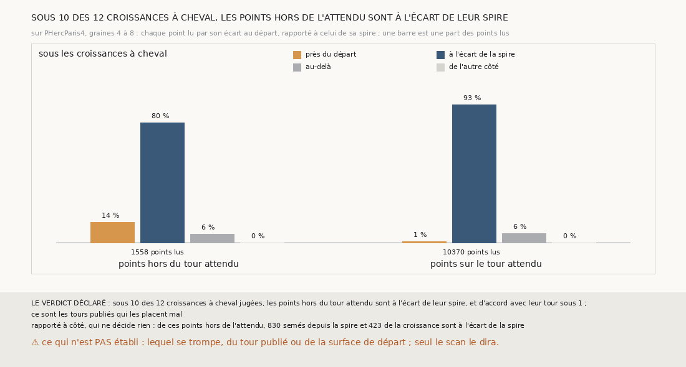

# `361` — Sur PHercParis4, sous les croissances à cheval, les points hors du tour attendu sont-ils à l'écart de leur spire ? Oui, sous 10 des 12 : la surface et les tours publiés se contredisent là

*`359` et `360` ont montré que ni le compte des feuilles de `m7` ni l'écart à la spire ne voient le cheval que les tours publiés disent
sous les croissances de `358`. Cette tranche lit chaque point des deux façons à la fois. Sous 10 des 12 croissances à cheval jugées, les
points que les tours publiés posent hors du tour attendu sont à l'écart de leur spire, là où sont 93 % des points posés sur l'attendu ; ils
ne sont d'accord avec leur tour que sous 1. La règle déclarée conclut que ce sont les tours publiés qui les placent mal ; ce que la mesure
établit est plus étroit, et le dire est l'objet de la section 5.*

## 0. Pourquoi cette tranche

C'est `R4-P158`, et c'est `#5`. Deux juges sans référent ne voient pas le cheval des croissances. Ou bien le cheval est là et les deux
juges sont aveugles, ou bien la surface et les tours publiés se contredisent sur ces points. Un point revenu sur le tour de départ doit être
près de la surface de départ ; un point parti au-delà, deux fois plus loin que sa spire.

## 1. Ce qui a été vu avant d'écrire

Tout ce que `296` à `360` publient, dont `R4-F545`, `R4-F546`, `R4-F529` (autour des graines 1 à 3, un tour publié est posé sur la feuille
de son voisin) et `R4-F536` (le cheval naît à un saut et s'hérite aux suivants).

## 2. Ce qui est fait

- **La chaîne qui regrandit** : celle de `358`, rejouée par la fonction de `357`, qui gagne pour cela le tour de départ de chaque saut.
- **Chaque point, par son écart et par son tour** : l'écart signé de `345` au départ, rapporté à celui de la spire, et les tours publiés où
  la pose de `347` le met, à un quart de pas. Un rapport sous ½ est près du départ, de ½ à 1,5 à l'écart de la spire, au-delà de 1,5
  au-delà, négatif de l'autre côté.
- **Les croissances jugées** : les croissances à cheval des graines 4 à 8 qui ont au moins 10 points hors du tour attendu lus par leur
  écart ; chacune va du côté de la majorité de ces points.
- **Le contrôle** : sous ces croissances, plus de la moitié des points posés sur le tour attendu sont à l'écart de leur spire. Il tient :
  93 % de 10370 points lus. Et la chaîne rejouée redonne `358`.

`m7` a été lu en 15962 chunks, sans panne.

## 3. Ce que disent les points

| sous les croissances à cheval | lus | près du départ | à l'écart de la spire | au-delà |
|---|---|---|---|---|
| points hors du tour attendu | 1558 | 14 % | 80 % | 6 % |
| points sur le tour attendu | 10370 | 1 % | 93 % | 6 % |

⭐⭐⭐⭐⭐ **Les points que les tours publiés posent hors du tour attendu sont où sont ceux de l'attendu** (`R4-F547`). Sous 10 des 12
croissances à cheval jugées, la majorité de ces points sont à l'écart de leur spire ; sous 1, ils sont d'accord avec leur tour ; sous 1,
ni l'un ni l'autre. Le cheval que `349` compte sous ces croissances n'est pas une croissance revenue vers le départ : c'est une
contradiction entre la surface et les tours publiés.

⭐⭐⭐⭐ **Et elle est surtout dans la part semée depuis la spire.** Des points hors de l'attendu à l'écart de la spire, 830 sont semés
depuis la spire et 423 viennent de la croissance. Lue sur la seule croissance, la majorité est à l'écart de la spire sous 8 des 12
croissances et d'accord avec son tour sous 3.

⚠ Rapporté à côté : sous les croissances saines, les points hors de l'attendu, trop peu pour faire un cheval, vont à la spire sous 4 et au
tour sous 4 des croissances qui en ont 10.

## 4. Le verdict

**SOUS 10 DES 12 CROISSANCES À CHEVAL, LES POINTS HORS DE L'ATTENDU SONT À L'ÉCART DE LEUR SPIRE**

`R4-P158` est répondue : par la règle déclarée, **ce sont les tours publiés qui les placent mal**.

## 5. Ce que la mesure établit, et ce que la règle dit de trop

⚠⚠ **La règle a confondu deux explications.** Un point à l'écart de sa spire, un tour de la surface de départ, que la pose met sur le tour
de départ, dit que la surface et les tours publiés se contredisent là. La règle en concluait que le tour publié se trompe ; mais c'est aussi
ce qu'on verrait si la surface de départ était elle-même, sous ces points, déjà un tour en arrière de son tour, et que son retard s'héritait
comme `350` l'a montré. L'écart au départ ne sépare pas ces deux cas : il mesure la surface contre elle-même.

Ce qui est établi : sous ces croissances, la chaîne est cohérente avec elle-même, chaque surface à l'écart d'une spire de la précédente,
et c'est contre les tours publiés qu'elle est à cheval. Ce qui ne l'est pas : lequel des deux, du tour publié ou de la surface de départ,
est à la mauvaise place.

## 6. Les sondes

Une batterie de **16** contrôles et une figure de **19**. Seize règles cassées exprès ont fait échouer la batterie : l'autre côté pris
symétrique, la tolérance haute élargie, les points hors de face lus, l'écart de la spire pris sur tous les points, qui passait d'abord,
les points posés sans le facteur de niveau, qui passait d'abord, sur d'autres tours, l'attendu non prioritaire, le sens ignoré, un point
resté à la spire compté d'accord, les inconnus comptés, une moitié exacte prise pour une majorité, qui passait d'abord, les saines
comptées, le minimum de points ôté, le contrôle ôté, puis rendu toujours vrai, et les graines 1 à 3 comptées. Onze sondes de la figure l'ont
fait échouer, dont les croissances à moins de 10 points lues quand même, qui passait d'abord.

## 7. Ce qui reste

`R4-P159` s'ouvre : sur PHercParis4, graines 4 à 8, sous les croissances à cheval, le pied de chaque point hors du tour attendu sur la
surface de départ est-il posé sur le tour de départ, ou déjà sur un autre ? Le premier cas désigne le tour publié, le second un retard de la
surface qui s'hérite. `R4-P151`, l'encre, reste en attente de l'auteur.
