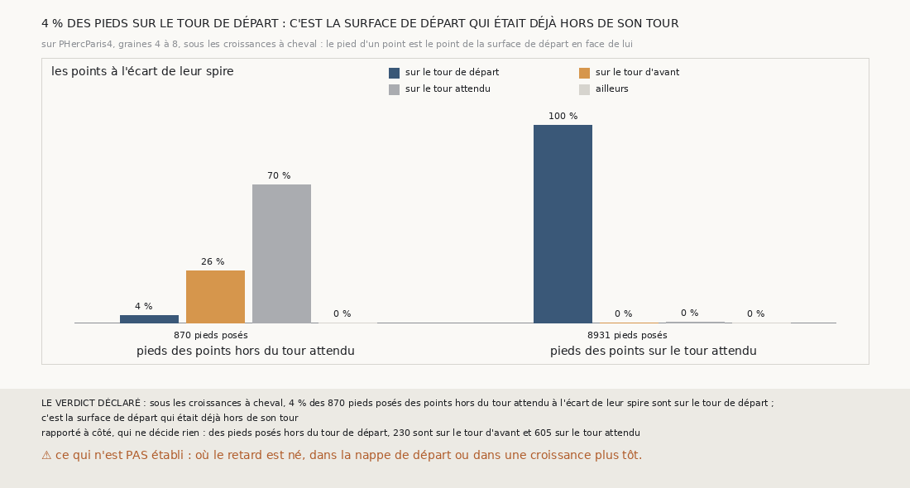

# `362` — Sur PHercParis4, sous les croissances à cheval, le pied des points hors du tour attendu est-il sur le tour de départ ? Non : 4 % seulement, la surface de départ était déjà hors de son tour

*`361` a montré que, sous les croissances à cheval de la chaîne qui regrandit, les points que les tours publiés posent hors du tour attendu
sont à l'écart de leur spire, comme ceux de l'attendu ; il laissait ouvert lequel se trompe, du tour publié ou de la surface de départ.
Cette tranche lit le pied de chacun de ces points sur la surface de départ. Sur 870 pieds posés, 34 seulement, 4 %, sont sur le tour de
départ ; 605 sont déjà sur le tour attendu, 230 sur le tour d'avant. Par la règle déclarée, c'est la surface de départ qui était déjà hors
de son tour : le cheval s'hérite.*

## 0. Pourquoi cette tranche

C'est `R4-P159`, et c'est `#5`. Un point à une spire de la surface de départ, que la pose met sur le tour de départ, contredit le tour
publié ou la surface de départ. Son pied tranche : sur le tour de départ, il met deux points à une spire l'un de l'autre sur le même tour
publié ; sur un autre tour, c'est la surface de départ qui était déjà ailleurs.

## 1. Ce qui a été vu avant d'écrire

Tout ce que `296` à `361` publient, dont `R4-F547`, `R4-F534` (sous la surface bornée de la graine 8, les pieds des points posés sur le
tour de trop étaient sur le tour d'avant) et `R4-F536` (le cheval naît à un saut et s'hérite aux suivants).

## 2. Ce qui est fait

- **La chaîne qui regrandit** : celle de `358`, rejouée par la fonction de `357`, comme dans `361`, dont la lecture gagne de quoi porter
  le pied de chaque point.
- **Le pied** : pour chaque point du compte de `345`, le point de la surface de départ le plus proche, avec sa normale, et les tours
  publiés où il est posé à un quart de pas, par les fonctions de `348`.
- **La question** : sous les croissances à cheval jugées de `361`, les points hors du tour attendu à l'écart de leur spire, et parmi leurs
  pieds posés sur un tour, la part posée sur le tour de départ.
- **Le contrôle** : les pieds des points posés sur le tour attendu sont, pour plus de la moitié, sur le tour de départ. Il tient : 8906 des
  8931. Et la chaîne rejouée redonne `358`.

`m7` a été lu en 15962 chunks, sans panne.

## 3. Où sont les pieds

| pieds posés | sur le tour de départ | sur le tour d'avant | sur le tour attendu |
|---|---|---|---|
| des points hors du tour attendu, 870 | 34 | 230 | 605 |
| des points sur le tour attendu, 8931 | 8906 | 6 | 19 |

⭐⭐⭐⭐⭐ **La surface de départ était déjà hors de son tour** (`R4-F548`). Des 870 pieds posés des points hors du tour attendu, 34 sont
sur le tour de départ ; les autres sont sur un tour voisin, en avant sur le tour attendu ou en arrière sur le tour d'avant. Chaque point
est donc à une spire de son pied : la chaîne fait son saut juste là où elle est, mais elle y est déjà décalée d'un tour. Des 611 pieds des
points partis au-delà, 605 sont sur le tour attendu ; des 259 pieds des points restés sur le tour de départ, 230 sont sur le tour d'avant.

⭐⭐⭐⭐ **Et le décalage grandit de saut en saut.** Rapporté à côté : sur la graine 6, côté moins, les points restés sur le tour de départ
sont 17, 31, 50, 89 puis 106 aux cinq premiers sauts ; sur la graine 5, 0, 0, 0, 15, 32 puis 78. La croissance étend à chaque saut une
surface qui porte déjà son décalage.

## 4. Le verdict

**4 % DES PIEDS SUR LE TOUR DE DÉPART : C'EST LA SURFACE DE DÉPART QUI ÉTAIT DÉJÀ HORS DE SON TOUR**

`R4-P159` est répondue, et avec elle le doute que `361` laissait : sous ces croissances, ce ne sont pas les tours publiés qui se
contredisent, c'est la chaîne qui hérite d'un décalage d'un tour, en avant ou en arrière, et le propage. Chaque saut, pris seul, est juste ;
c'est pourquoi aucun juge local, ni le compte des feuilles de `359` ni l'écart de `360`, ne le voyait.

## 5. Ce que cette tranche ne dit pas

- ⚠⚠ Où le décalage est né : dans la nappe de départ, ou dans une croissance d'un saut où il restait sous les 50 points qui font un cheval.
- ⚠ Si un juge qui compare une surface non à la précédente mais à une plus ancienne verrait le décalage.

## 6. Les sondes

Une batterie de **11** contrôles et une figure de **20**. Quatorze règles cassées exprès ont fait échouer la batterie : les pieds posés
sans le facteur de niveau, qui passait d'abord, les pieds lus au lieu de posés, qui passait d'abord, un pied sans normale posé, toutes les
zones comptées, l'au-delà oublié, qui passait d'abord, un pied sans normale compté posé, et un pied posé nulle part, qui levaient au lieu
d'échouer, les saines comptées, les trois quarts stricts, le quart élargi, le contrôle ôté, le minimum ôté, le contrôle de `358` ôté et
les autres pieds rangés sans leur écart au tour de départ, qui passait d'abord. La batterie de `361` passe inchangée, sa lecture acceptant
désormais une clé qui porte le pied. Onze sondes de la figure l'ont fait échouer, dont les croissances à moins de 10 points lues quand
même, qui passait d'abord. Le vérificateur de chiffres a attrapé une ligne du tableau recopiée depuis les parts arrondies de la figure :
0 et 0 au lieu de 6 et 19.

## 7. Ce qui reste

`R4-P160` s'ouvre : sur PHercParis4, graines 4 à 8, le décalage dont la chaîne qui regrandit hérite est-il déjà dans sa nappe de départ,
ou naît-il dans une croissance, et à quel saut ? `R4-P151`, l'encre, reste en attente de l'auteur.
