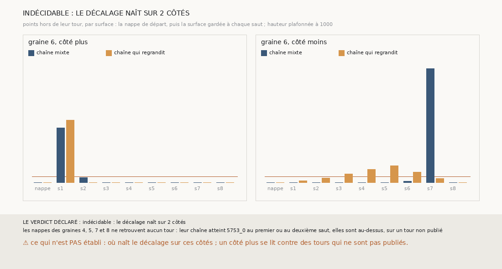

# `363` — Sur PHercParis4, où naît le décalage dont la chaîne qui regrandit hérite ? Indécidable par la règle : 2 côtés jugés, dont un qui ne pouvait pas l'être

*`362` a montré que la surface de départ des croissances à cheval était déjà hors de son tour, et que le décalage grandit de saut en saut.
Cette tranche lit chaque surface des deux chaînes, nappe de départ comprise, point par point contre son propre tour, pour trouver où il
naît. La règle déclarée ne jugeait que les côtés dont la nappe retrouve un seul tour publié : il n'y en a que deux, ceux de la graine 6,
et le côté plus se lit contre des tours qui ne sont pas publiés. Elle rend **indécidable**. Sur le seul côté lisible, graine 6, côté moins,
la nappe est sur son tour et le décalage naît dans la croissance : 17, 40, 74 points hors de leur tour aux trois premiers sauts.*

## 0. Pourquoi cette tranche

C'est `R4-P160`, et c'est `#5`. Chaque saut est juste là où la chaîne est ; savoir où le décalage naît dit où un juge doit regarder.

## 1. Ce qui a été vu avant d'écrire

Tout ce que `296` à `362` publient, dont `R4-F548` et `R4-F543`, et, publiée par `340`, la part des sommets de chaque tour à un quart de pas
de chaque nappe de départ.

## 2. Ce qui est fait

- **Les deux chaînes** : la chaîne mixte de `357` et la chaîne qui regrandit de `358`, rejouées par la fonction de `357`, qui lit pour
  cela la surface de départ et la surface gardée de chaque saut.
- **Chaque surface, point par point** : au plus 1200 points à normale connue, pris comme le compte de `345` les prend, et les tours publiés
  où la pose de `347` les met. Un point est hors de son tour s'il est posé sur un tour et pas sur le sien.
- **Son propre tour** : pour la nappe, le tour qu'elle retrouve seule ; pour la surface du saut h, ce tour décalé de h dans le sens du
  côté.
- **La naissance** : la première surface, nappe comprise, qui a 50 points hors de son tour.
- **Le contrôle** : les deux chaînes rejouées redonnent, saut par saut, ce que `357` et `358` publient. Il tient.

`m7` a été lu en 8915 chunks pour la chaîne mixte et en 14510 pour la chaîne qui regrandit, sans panne.

## 3. Pourquoi deux côtés seulement

⚠⚠ **La règle a pris ses côtés là où ils ne pouvaient pas être.** Des nappes des graines 4 à 8, seule celle de la graine 6 retrouve un seul
tour publié, `5753_0`. Les nappes des graines 4, 5, 7 et 8 n'en retrouvent aucun : leur chaîne atteint `5753_0` au premier ou au deuxième
saut, elles sont donc au-dessus, sur un tour que PHercParis4 ne publie pas. Et le côté plus de la graine 6 se lit contre `5753_1` et
au-delà, qui ne sont pas publiés : tout point posé sur un tour publié y compte hors de son tour, d'où les 540 points de son premier saut,
qui ne disent rien du décalage.

## 4. Le seul côté lisible

| graine 6, côté moins | nappe | s1 | s2 | s3 | s4 | s5 | s6 | s7 |
|---|---|---|---|---|---|---|---|---|
| chaîne mixte | 0 | 0 | 0 | 0 | 0 | 0 | 10 | 984 |
| chaîne qui regrandit | 0 | 17 | 40 | 74 | 113 | 147 | 91 | 36 |

⭐⭐⭐⭐ **Sur ce côté, la nappe est sur son tour, et le décalage naît dans la croissance** (`R4-F549`). La chaîne qui regrandit a 17 points
hors de leur tour dès le premier saut, 74 au troisième, 147 au cinquième. La chaîne mixte, qui ne regrandit pas, n'en a aucun jusqu'à son
sixième saut ; les 984 de son septième saut sont ceux d'une nappe relancée depuis un point, un saut que les tours ne jugent pas.

## 5. Le verdict

**INDÉCIDABLE : LE DÉCALAGE NAÎT SUR 2 CÔTÉS**

`R4-P160` reste ouverte par la lettre de la règle, qui voulait au moins 3 côtés où il naît. Ce qu'on en garde : là où la nappe se lit, elle
est propre, et c'est la croissance qui fait naître le décalage.

## 6. Ce que cette tranche ne dit pas

- ⚠⚠ Où naît le décalage sur les graines 4, 5, 7 et 8, dont la nappe n'est pas lisible : dans la nappe elle-même, sur son tour non publié,
  ou au premier saut.
- ⚠ Pourquoi la croissance passe sur le tour voisin.

## 7. Les sondes

Une batterie de **14** contrôles et une figure de **16**. Quatorze règles cassées exprès ont fait échouer la batterie : tous les points
pris, sans normale, qui passait d'abord, sans plafond, sans le facteur de niveau, les points posés nulle part comptés hors, un point posé
sur deux tours compté hors, le sens ignoré, le tour figé, la nappe oubliée, un seuil élargi, la suite sans arrêt, les graines 1 à 3
comptées, une moitié exacte prise pour une majorité, le minimum ôté et le contrôle ôté. Huit sondes de la figure l'ont fait échouer, dont
une barre sans plafond, qui passait d'abord. Aucune sonde n'a visé la règle des côtés jugés, et c'est elle qui était fausse : une batterie
ne voit que les règles qu'on lui a données.

## 8. Ce qui reste

`R4-P161` s'ouvre : sur PHercParis4, graines 4 à 8, côtés moins seulement, si l'on prend pour référence la première surface de chaque
côté qui retrouve un seul tour, le décalage y est-il déjà, ou naît-il dans une croissance après elle ? Les lectures de `363` suffisent à y
répondre, sans mesure neuve. `R4-P151`, l'encre, reste en attente de l'auteur.
