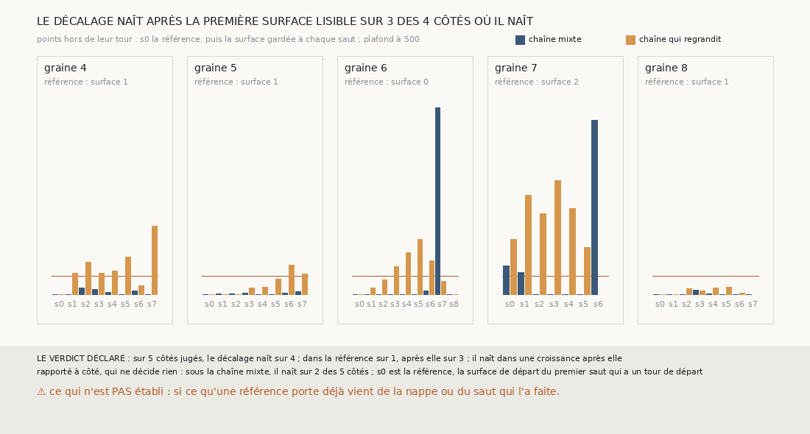

# `364` — Sur PHercParis4, le décalage naît-il après la première surface lisible ? Oui, sur 3 des 4 côtés où il naît : c'est la croissance qui le fait naître

*`363` n'a pu lire qu'un côté, parce qu'il prenait la nappe pour référence et que quatre nappes sur cinq sont sur un tour non publié. Cette
tranche relit les mêmes lectures, sans mesure neuve, en prenant pour référence la première surface de chaque côté qui retrouve un seul
tour. Sur les cinq côtés moins des graines 4 à 8, le décalage de la chaîne qui regrandit naît sur quatre : sur trois, la référence est
propre et il naît dans une croissance après elle ; sur un, la graine 7, la référence le porte déjà. Par la règle déclarée, il naît dans
une croissance.*

## 0. Pourquoi cette tranche

C'est `R4-P161`, et c'est `#5`. Savoir où le décalage naît dit où un juge doit regarder ; `363` n'avait pas de référence lisible.

## 1. Ce qui a été vu avant d'écrire

Tout ce que `296` à `363` publient, dont `R4-F549`. Les suites des côtés autres que la graine 6 n'avaient pas été regardées.

## 2. Ce qui est fait, sans mesure neuve

- **Les lectures** : celles de `363`. Le contrôle : les bilans que `363` publie se recalculent sur elles. Il tient.
- **La référence** d'un côté : la surface de départ du premier saut qui a un tour de départ ; son tour est ce tour.
- **La suite** : la référence puis chaque surface gardée après elle, contre son propre tour ; la naissance, la première qui a 50 points
  hors de son tour.
- **La règle** : parmi les côtés où le décalage naît, la majorité dans la référence ou après elle.

## 3. Ce que disent les côtés

| chaîne qui regrandit | référence | s0 | s1 | s2 | s3 | s4 | s5 | s6 | s7 |
|---|---|---|---|---|---|---|---|---|---|
| graine 4 | surface 1 | 0 | 57 | 87 | 57 | 63 | 100 | 24 | 183 |
| graine 5 | surface 1 | 0 | 0 | 0 | 17 | 19 | 41 | 79 | 56 |
| graine 6 | surface 0 | 0 | 17 | 40 | 74 | 113 | 147 | 91 | 36 |
| graine 7 | surface 2 | 147 | 266 | 216 | 305 | 230 | 125 | | |
| graine 8 | surface 1 | 0 | 0 | 15 | 10 | 17 | 20 | 4 | |

⭐⭐⭐⭐⭐ **Là où la référence est propre, c'est la croissance qui fait naître le décalage** (`R4-F550`). Sur les graines 4, 5, 6 et 8, la
première surface lisible n'a aucun point hors de son tour ; la chaîne qui regrandit en a ensuite, et en passe 50 au premier saut sur la
graine 4, au troisième sur la graine 6, au sixième sur la graine 5 ; la graine 8 reste sous 50. Seule la graine 7 porte déjà le décalage
dans sa référence, 147 points.

⭐⭐⭐⭐ **La chaîne mixte ne le fait pas naître.** Rapporté à côté : sous elle, il naît sur 2 des 5 côtés, et aucun par une croissance, qu'elle
n'a pas : sur la graine 7, sa référence en a déjà 76 ; sur la graine 6, c'est une nappe relancée depuis un point, au septième saut.

## 4. Le verdict

**LE DÉCALAGE NAÎT APRÈS LA PREMIÈRE SURFACE LISIBLE SUR 3 DES 4 CÔTÉS OÙ IL NAÎT**

`R4-P161` est répondue : il naît dans une croissance après elle. Le décalage que la chaîne de `358` propage, la croissance bornée de `335`
le fait naître, là où la surface de départ était propre.

## 5. Ce que cette tranche ne dit pas

- ⚠⚠ Sur la graine 7, si le décalage que la référence porte vient de la nappe ou des deux premiers sauts.
- ⚠ Pourquoi la croissance passe sur le tour voisin, et si une croissance plus courte le ferait moins.

## 6. Les sondes

Une batterie de **7** contrôles et une figure de **19**. Onze règles cassées exprès ont fait échouer la batterie : la référence prise à la
nappe, son tour décalé, le sens ignoré, les surfaces d'avant la référence lues, la suite sans arrêt, les côtés plus lus, les graines 1 à 3
lues, un seuil élargi, une moitié exacte prise pour une majorité, le contrôle ôté et le minimum ôté. Sept sondes de la figure l'ont fait
échouer, dont une référence figée, qui passait d'abord.

## 7. Ce qui reste

`R4-P162` s'ouvre : sur PHercParis4, graines 4 à 8, une chaîne qui regrandit sa spire tenue d'une seule maille au lieu de deux rend-elle
de la surface sans faire naître le décalage ? `R4-P151`, l'encre, reste en attente de l'auteur.
