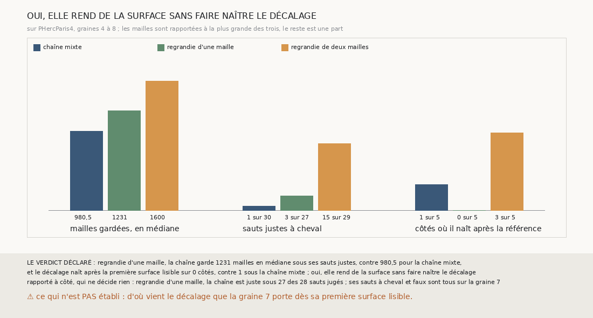

# `365` — Sur PHercParis4, regrandir la spire tenue d'une seule maille évite-t-il le décalage ? Oui : 1231 mailles en médiane, et le décalage ne naît sur aucun côté

*`364` a montré que la croissance bornée à deux mailles fait naître le décalage que la chaîne qui regrandit propage. Cette tranche arrête la
croissance à une maille des mailles semées. Sur les graines 4 à 8, la chaîne garde 1231 mailles en médiane sous ses sauts justes, contre
980,5 pour la chaîne mixte et 1600 pour celle de deux mailles, et le décalage ne naît après la première surface lisible sur aucun des cinq
côtés moins, contre 1 sous la chaîne mixte et 3 sous celle de deux mailles. Par la règle déclarée, elle rend de la surface sans faire
naître le décalage.*

## 0. Pourquoi cette tranche

C'est `R4-P162`, et c'est `#5`. La chaîne mixte reste sur sa feuille mais rétrécit ; regrandie de deux mailles, elle regagne sa surface et
fait naître le décalage. Une croissance plus courte dit si le décalage suit la marge.

## 1. Ce qui a été vu avant d'écrire

Tout ce que `296` à `364` publient, dont `R4-F544` et `R4-F550`.

## 2. Ce qui est fait

- **La chaîne** : celle de `358`, sa croissance bornée de `335` arrêtée à une maille des mailles semées, rejouée par la fonction de `357`
  avec les lectures de `363`.
- **La surface, la justesse, à cheval** : celles de `358` ; **la naissance** : celle de `364`, depuis la première surface lisible.
- **Les références** : la chaîne mixte et la chaîne de deux mailles, par les lectures de `363`.
- **Le contrôle** : les nappes de départ sont celles de `340`, et les bilans de `363` se recalculent sur ses lectures. Il tient.

`m7` a été lu en 13661 chunks, sans panne.

## 3. Ce que fait la chaîne d'une maille

| sur les graines 4 à 8 | chaîne mixte | une maille | deux mailles |
|---|---|---|---|
| mailles gardées, en médiane, sous les sauts justes | 980,5 | 1231 | 1600 |
| sauts justes sur les sauts jugés | 30 sur 30 | 27 sur 28 | 29 sur 29 |
| sauts justes à cheval | 1 sur 30 | 3 sur 27 | 15 sur 29 |
| côtés où le décalage naît après la première surface lisible | 1 sur 5 | 0 sur 5 | 3 sur 5 |

⭐⭐⭐⭐⭐ **Une maille rend un quart de surface sans faire naître le décalage** (`R4-F551`). La chaîne d'une maille garde 1231 mailles en
médiane sous ses sauts justes, 26 % de plus que la chaîne mixte ; sur les graines 4, 5, 6 et 8, ses points hors de leur tour ne dépassent
jamais 35, et ses 24 sauts jugés y sont justes, sans un seul à cheval.

⭐⭐⭐⭐ **Ce qu'elle perd, elle le perd sur la graine 7, qui portait déjà le décalage.** Ses 3 sauts à cheval et son saut faux sont tous sur
la graine 7, dont la première surface lisible a déjà 117 points hors de son tour ; le saut faux est une nappe relancée depuis un point, pas
une croissance.

## 4. Le verdict

**OUI, ELLE REND DE LA SURFACE SANS FAIRE NAÎTRE LE DÉCALAGE**

`R4-P162` est répondue : oui. Le décalage suit la marge : deux mailles le font naître sur 3 côtés, une maille sur aucun.

## 5. Ce que cette tranche ne dit pas

- ⚠⚠ D'où vient le décalage que la graine 7 porte dès sa première surface lisible.
- ⚠ Ce que vaut la chaîne d'une maille sur PHerc0358, où aucun tour ne la juge.

## 6. Les sondes

Une batterie de **7** contrôles et une figure de **19**. Sept règles cassées exprès ont fait échouer la batterie : une marge de deux, la
croissance sans le compte de `357`, la marge ignorée, des naissances égales refusées, une surface égale acceptée, le contrôle ôté, et les
naissances que la référence porte déjà comptées, qui levait au lieu d'échouer avant que ses contrôles ne soient différés. Onze sondes de
la figure l'ont fait échouer, dont un saut faux sans cheval oublié parmi les fautes, qui passait d'abord.

## 7. Ce qui reste

`R4-P163` s'ouvre : sur PHerc0358, la chaîne qui regrandit sa spire tenue d'une maille tient-elle plus de sauts à la suite que la chaîne
mixte, par le critère de `352` ? `R4-P151`, l'encre, reste en attente de l'auteur.
