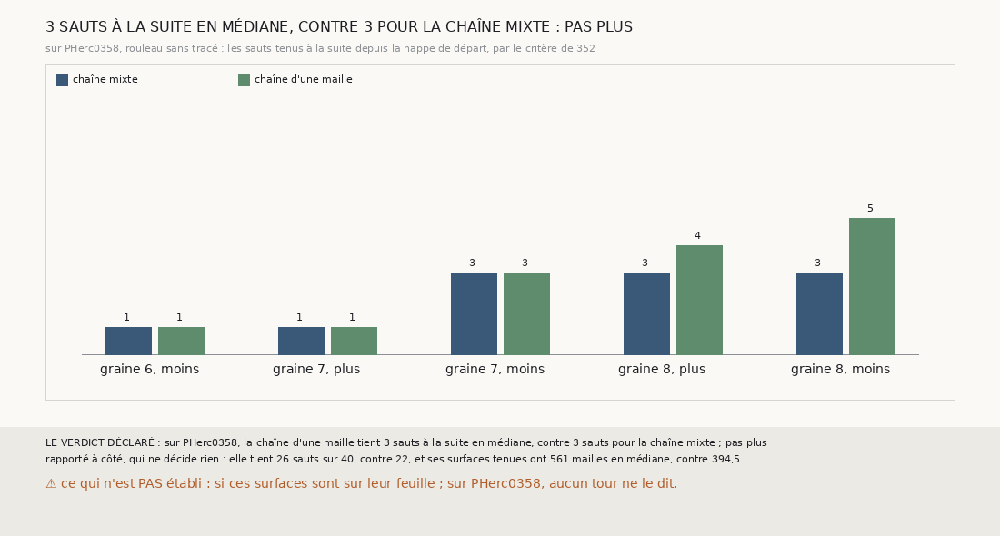

# `366` — Sur PHerc0358, la chaîne d'une maille va-t-elle plus loin que la chaîne mixte ? Pas plus, par la règle : 3 sauts à la suite en médiane de part et d'autre

*`365` a montré que, sur PHercParis4, regrandir la spire tenue d'une maille rend un quart de surface sans faire naître de décalage. Cette
tranche fait tourner cette chaîne sur PHerc0358, rouleau sans tracé, et compte, par le critère de `352`, les sauts qu'elle tient à la suite
depuis la nappe de départ. Sur les cinq côtés suivis, elle en tient 1, 1, 3, 4 et 5, 3 en médiane, contre 1, 1, 3, 3 et 3 pour la chaîne
mixte : par la règle déclarée, pas plus. Elle tient pourtant 26 sauts sur 40 contre 22, et des surfaces plus grandes.*

## 0. Pourquoi cette tranche

C'est `R4-P163`, et c'est `#5`. Sur PHerc0358, la chaîne mixte s'arrête souvent parce que sa spire rétrécit ; une chaîne étalonnée sur
PHercParis4 qui regagne de la surface devrait y aller plus loin.

## 1. Ce qui a été vu avant d'écrire

Tout ce que `296` à `365` publient, dont `R4-F551` et `R4-F542`.

## 2. Ce qui est fait

- **Les graines, les nappes, le saut et la relance** : ceux de PHerc0358 que `331` suit, comme dans `356`.
- **La chaîne d'une maille** : la chaîne mixte de `356`, chaque spire tenue regrandie à une maille des mailles semées, la surface regrandie
  gardée si le critère de `352` la tient aussi ; le compte au pas et à la portée de `354`.
- **La suite** : celle de `356`. **Le contrôle** : les premiers sauts redonnent ce que `355` publie. Il tient.

`m7` a été lu en 3872 chunks, sans panne.

## 3. Ce que fait la chaîne d'une maille

| côté | chaîne mixte | chaîne d'une maille |
|---|---|---|
| graine 6, moins | 1 | 1 |
| graine 7, plus | 1 | 1 |
| graine 7, moins | 3 | 3 |
| graine 8, plus | 3 | 4 |
| graine 8, moins | 3 | 5 |

⭐⭐⭐⭐ **La médiane ne bouge pas** (`R4-F552`). La chaîne d'une maille va plus loin sur les deux côtés de la graine 8, et aussi loin
ailleurs ; la médiane des cinq côtés reste à 3.

⭐⭐⭐⭐ **Mais elle tient plus, et plus grand.** Rapporté à côté, qui ne décide rien : elle tient 26 sauts sur 40, contre 22, dont 22
surfaces regrandies ; ses surfaces tenues ont 561 mailles en médiane, contre 394,5. Et ses plus longues suites, où qu'elles commencent,
sont de 1, 6, 3, 4 et 5 sauts, 4 en médiane, contre 1, 3, 3, 4 et 3 pour la chaîne mixte : sur la graine 7, côté plus, elle tient six sauts
à la suite après sa relance du deuxième.

## 4. Le verdict

**3 SAUTS À LA SUITE EN MÉDIANE, CONTRE 3 POUR LA CHAÎNE MIXTE : PAS PLUS**

`R4-P163` est répondue : pas plus, par la médiane que la règle déclarait. La chaîne d'une maille ne raccourcit aucun côté, en allonge deux,
tient plus de sauts et garde de plus grandes surfaces.

## 5. Ce que cette tranche ne dit pas

- ⚠⚠ Si ces surfaces sont sur leur feuille : sur PHerc0358, aucun tour ne le dit, et la chaîne n'est étalonnée que sur PHercParis4.
- ⚠ Cinq côtés seulement.

## 6. Les sondes

Une batterie de **6** contrôles et une figure de **16**. Sept règles cassées exprès ont fait échouer la batterie : une marge de deux, la
marge ignorée, le compte de PHercParis4, les sauts tenus sans le critère, la moyenne au lieu de la médiane, une médiane égale prise pour
plus haute et le contrôle ôté. Six sondes de la figure l'ont fait échouer.

## 7. Ce qui reste

`R4-P164` s'ouvre : sur PHercParis4, les surfaces tenues de deux chaînes d'une maille parties de graines différentes se recouvrent-elles,
et là où elles se recouvrent, sont-elles sur la même feuille exactement quand elles sont sur le même tour publié ? Un tel accord serait un
juge sans référent applicable à PHerc0358. `R4-P151`, l'encre, reste en attente de l'auteur.
