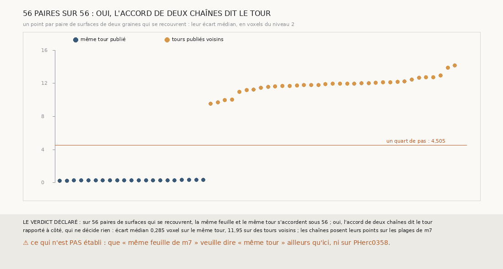

# `367` — Sur PHercParis4, l'accord de deux chaînes qui se croisent dit-il le tour ? Oui : 56 paires sur 56

*`366` a laissé ouvert ce qui, sur PHerc0358, dirait qu'une surface est sur sa feuille. Cette tranche cherche un juge qui ne demande aucun
tracé : l'accord de deux chaînes d'une maille parties de graines différentes, là où leurs surfaces se recouvrent. Sur PHercParis4, graines
4 à 8, 56 paires de surfaces justes se recouvrent ; sous les 21 paires sur le même tour publié, les deux surfaces sont à 0,285 voxel l'une
de l'autre en médiane, sous les 35 sur des tours voisins à 11,95. Au quart de pas, « même feuille » et « même tour » s'accordent sous les
56 : par la règle déclarée, l'accord de deux chaînes dit le tour.*

## 0. Pourquoi cette tranche

C'est `R4-P164`, et c'est `#5`. Deux chaînes indépendantes qui arrivent au même endroit ne se trompent pas ensemble par hasard ; si elles
tombent sur la même feuille là, et seulement là, où les tours publiés disent le même tour, leur accord est un juge applicable à un rouleau
que personne n'a tracé.

## 1. Ce qui a été vu avant d'écrire

Tout ce que `296` à `366` publient, dont `R4-F551` et `R4-F552`. Les graines de PHercParis4 vont par paquets : les graines 4, 5 et 6 sont à
51 à 169 voxels du niveau 2 les unes des autres, les graines 7 et 8 à 192, et un plan fait 650 voxels de côté.

## 2. Ce qui est fait

- **Les chaînes** : la chaîne d'une maille de `365`, graines 4 à 8, côtés moins, rejouée par la fonction de `357`, qui dit pour cela à
  chaque lecture quelle graine, quel côté et quel saut elle lit.
- **Les surfaces** : celles des sauts justes, au plus 1200 points à normale connue ; leur tour publié, le tour de départ du saut décalé
  d'un tour vers l'intérieur.
- **Les paires** : deux surfaces de deux graines différentes, sur le même tour ou sur des tours voisins, qui se recouvrent, c'est-à-dire
  dont au moins 50 points ont l'autre en face à un pas et demi au plus ; **même feuille** si la médiane de leurs écarts absolus est d'au
  plus un quart de pas nominal, 4,505 voxels.
- **Le contrôle** : les nappes de départ sont celles de `340`. Il tient.

`m7` a été lu en 13661 chunks, sans panne.

## 3. Ce que dit l'accord

| paires qui se recouvrent | même feuille | autre feuille |
|---|---|---|
| sur le même tour publié | 21 | 0 |
| sur des tours voisins | 0 | 35 |

⭐⭐⭐⭐⭐ **Deux chaînes qui se croisent sont sur la même feuille exactement quand elles sont sur le même tour** (`R4-F553`). Les 27
surfaces justes des graines 4 à 8 forment 56 paires qui se recouvrent, et aucune ne se trompe : sur le même tour, l'écart médian va de
0,244 à 0,317 voxel ; sur des tours voisins, de 9,551 à 14,201. Le quart de pas est loin des deux.

⚠ **Ce que « même feuille » veut dire ici.** Les chaînes posent leurs points sur les plages de `m7` ; deux surfaces sur la même feuille de
`m7` sont donc presque confondues, d'où le quart de voxel. Ce que la tranche établit, c'est que sous ces chaînes, sur PHercParis4, une
feuille de `m7` ne mêle jamais deux tours publiés.

## 4. Le verdict

**56 PAIRES SUR 56 : OUI, L'ACCORD DE DEUX CHAÎNES DIT LE TOUR**

`R4-P164` est répondue : oui. L'accord de deux chaînes qui se croisent est un juge sans référent, étalonné sur PHercParis4 sans une seule
erreur.

## 5. Ce que cette tranche ne dit pas

- ⚠⚠ Si cet accord tient sur PHerc0358, où `m7` peut mêler deux feuilles serrées, comme `304` l'a vu à 12 voxels.
- ⚠ Si l'accord tient là où deux chaînes héritent d'un même décalage : elles seraient d'accord entre elles et fausses ensemble.

## 6. Les sondes

Une batterie de **9** contrôles et une figure de **18**. Treize règles cassées exprès ont fait échouer la batterie : la portée ignorée, la
moyenne au lieu de la médiane, l'écart pris avec son signe et les tours lointains comparés, ces trois-là passant d'abord, deux surfaces
d'une même graine comparées, le minimum en face ôté, un demi-pas au lieu d'un quart, qui passait d'abord, le tour pris sans le sens, les
sauts faux gardés, les côtés plus lus, un seuil de 90 % strict, le minimum de paires ôté et le contrôle ôté. Six sondes de la figure l'ont
fait échouer, dont un écart sans plafond, qui passait d'abord.

## 7. Ce qui reste

`R4-P165` s'ouvre : sur PHerc0358, là où deux chaînes d'une maille de graines différentes se recouvrent, les surfaces que l'accord met
sur la même feuille ont-elles toutes le même décalage de sauts entre les deux graines ? Une chaîne qui compte ses tours sans se tromper le
fait.
`R4-P151`, l'encre, reste en attente de l'auteur.
