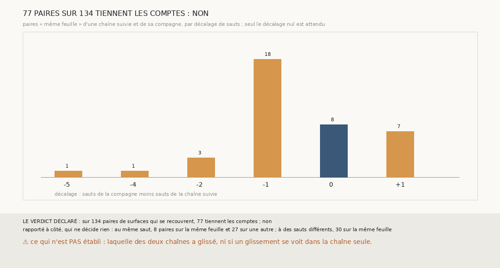

# `368` — Sur PHerc0358, deux chaînes voisines comptent-elles les mêmes tours ? Non : 77 paires sur 134 tiennent les comptes, et les chaînes se décalent d'un saut

*`367` a étalonné sur PHercParis4 un juge sans référent : deux chaînes qui se croisent sont sur la même feuille exactement quand elles sont
sur le même tour. Sur PHerc0358, les graines sont trop loin les unes des autres pour que deux chaînes se croisent ; cette tranche pose donc,
sur la nappe de départ de chaque côté suivi, une graine compagne à 150 voxels du centre, et fait partir d'elle la même chaîne. Les deux
nappes sont sur la même feuille : partout où leurs surfaces se recouvrent, elles devraient être sur la même feuille au même saut. Sur 134
paires qui se recouvrent, 77 tiennent les comptes : par la règle déclarée, non. Sur quatre côtés sur cinq, l'une des deux chaînes prend un
saut d'avance ou de retard, et le garde.*

## 0. Pourquoi cette tranche

C'est `R4-P165`, et c'est `#5`. Deux chaînes qui comptent leurs sauts sans se tromper se retrouvent sur la même feuille toujours au même
décalage ; sur un rouleau sans tracé, c'est une vérification qui ne demande que les chaînes.

## 1. Ce qui a été vu avant d'écrire

Tout ce que `296` à `367` publient, dont `R4-F553` et `R4-F552`. Et, lu dans ce que `301` publie : les graines de PHerc0358 sont à 1985
voxels du niveau 0 au moins les unes des autres, pour un plan de 650 ; aucune paire de chaînes existante ne se recouvre.

## 2. Ce qui est fait

- **Les chaînes suivies** : la chaîne d'une maille de `366`, sur les cinq côtés que `331` suit.
- **La chaîne compagne** : une graine posée sur la nappe de départ à 15 mailles de son centre, avec la normale de la nappe en ce point, et
  la même chaîne partie d'elle, du même côté.
- **Les paires** : une surface de chacune qui se recouvrent, au moins 50 points en face à un pas et demi ; **même feuille** au quart de pas,
  cinq voxels. Une paire **tient les comptes** si « même feuille » et « même saut » disent la même chose.

`m7` a été lu en 7696 chunks, sans panne.

## 3. Ce que disent les paires

| côté | paires | « même feuille » au même saut | « même feuille » en tout | décalages des paires « même feuille » |
|---|---|---|---|---|
| graine 6, moins | 41 | 2 | 9 | −1 : 6, 0 : 2, +1 : 1 |
| graine 7, plus | 22 | 1 | 7 | +1 : 6, 0 : 1 |
| graine 7, moins | 10 | 3 | 3 | 0 : 3 |
| graine 8, plus | 35 | 2 | 10 | −1 : 5, 0 : 2, −2 : 1, −4 : 1, −5 : 1 |
| graine 8, moins | 26 | 0 | 9 | −1 : 7, −2 : 2 |

⭐⭐⭐⭐⭐ **Deux chaînes voisines ne comptent pas les mêmes tours sur PHerc0358** (`R4-F554`). Sur 134 paires qui se recouvrent, 77 tiennent
les comptes ; sur les 38 paires « même feuille », 8 seulement sont au même saut. Sur les graines 6, côté moins, 7, côté plus, et 8, côté
moins, l'une des deux chaînes prend un saut d'avance ou de retard dès les premiers sauts, et les deux restent ensuite décalées d'un saut :
la même feuille se retrouve, mais un saut plus tôt dans l'une que dans l'autre. Seule la graine 7, côté moins, tient les comptes sur ses
trois premiers sauts.

⚠ Ce que dit ce décalage : l'une des deux chaînes, au moins, a fait un saut qui ne change pas de feuille, ou qui en saute une. La tranche ne
dit pas laquelle.

## 4. Le verdict

**77 PAIRES SUR 134 TIENNENT LES COMPTES : NON**

`R4-P165` est répondue : non. Le juge étalonné par `367` montre, sur PHerc0358 et sans aucun tracé, que la chaîne d'une maille y fait des
erreurs de compte que ses sauts, jugés un à un, ne montrent pas.

## 5. Ce que cette tranche ne dit pas

- ⚠⚠ Laquelle des deux chaînes a glissé, ni si un glissement se voit dans la chaîne seule, par deux surfaces successives sur la même
  feuille ou à deux tours l'une de l'autre.
- ⚠ Si ces glissements existent aussi sur PHercParis4, où les tours publiés les compteraient comme des sauts faux.

## 6. Les sondes

Une batterie de **10** contrôles et une figure de **16**. Dix règles cassées exprès ont fait échouer la batterie : la graine compagne au
centre, prise sans normale, la chaîne compagne partie de la nappe suivie, le quart de pas de PHercParis4, la portée latérale de
PHercParis4, qui passait d'abord, le minimum en face ôté, les comptes tenus sans la feuille, un seuil de 90 % strict, le minimum de paires
ôté et l'exigence d'une paire « même feuille » ôtée. Six sondes de la figure l'ont fait échouer.

## 7. Ce qui reste

`R4-P166` s'ouvre : sur PHerc0358, un glissement se voit-il dans la chaîne seule, comme un saut qui garde la même feuille ou qui en saute
une, et là où l'accord place le décalage ? `R4-P151`, l'encre, reste en attente de l'auteur.
