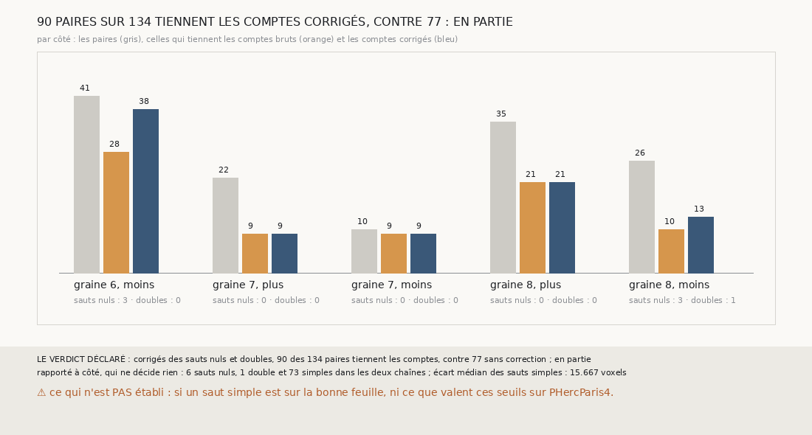

# `369` — Sur PHerc0358, un glissement se voit-il dans la chaîne seule ? En partie : corrigés des sauts nuls et doubles, 90 paires sur 134 tiennent les comptes, contre 77

*`368` a montré, par l'accord d'une chaîne suivie et de sa compagne, que la chaîne d'une maille glisse d'un saut sur PHerc0358 sans que ses
sauts, jugés un à un, le montrent. Cette tranche compare chaque saut à la surface d'où il part : un saut qui en reste à un quart de pas est
nul, un saut qui s'en écarte de plus d'un pas et demi est double, et le compte de chaque surface est corrigé en conséquence. Corrigées, 90
des 134 paires tiennent les comptes, contre 77 : par la règle déclarée, en partie. La correction explique le glissement de la graine 6,
côté moins, et une part de celui de la graine 8, côté moins ; sur les graines 7 et 8, côté plus, aucun saut n'est nul ni double.*

## 0. Pourquoi cette tranche

C'est `R4-P166`, et c'est `#5`. Si le glissement vient de sauts qui gardent la même feuille ou en sautent une, et que ces sauts se voient
en comparant une surface à celle d'où elle part, une chaîne peut compter juste seule, sans compagne ni tracé.

## 1. Ce qui a été vu avant d'écrire

Tout ce que `296` à `368` publient, dont `R4-F554`. Et, lu dans les paires de `368` : sur la graine 6, côté moins, la surface du premier
saut de chaque chaîne est sur la même feuille que celle du deuxième saut de l'autre ; un saut qui ne change pas de feuille existe.

## 2. Ce qui est fait

- **Les chaînes** : celles de `368`, la suivie et la compagne sur les cinq côtés, rejouées ; leurs paires doivent redonner celles de
  `368`, et les redonnent.
- **Chaque saut** : sa surface comparée à la surface d'où il part, la nappe pour le premier ; la médiane des écarts absolus de ses points
  en face, à trois pas au plus. **Nul** au plus à un quart de pas, 5 voxels ; **double** au-delà d'un pas et demi, 30 voxels ; **simple**
  entre les deux, et sans 50 points en face.
- **Le compte corrigé** d'une surface : 0 par saut nul, 1 par saut simple et 2 par saut double, jusqu'à elle. Une paire **tient les
  comptes corrigés** si « même feuille » et « même compte corrigé » disent la même chose.

`m7` a été lu en 7864 chunks, sans panne.

## 3. Ce que dit la correction

| côté | paires | tiennent les comptes bruts | tiennent les comptes corrigés | sauts nuls | sauts doubles |
|---|---|---|---|---|---|
| graine 6, moins | 41 | 28 | 38 | 3 | 0 |
| graine 7, plus | 22 | 9 | 9 | 0 | 0 |
| graine 7, moins | 10 | 9 | 9 | 0 | 0 |
| graine 8, plus | 35 | 21 | 21 | 0 | 0 |
| graine 8, moins | 26 | 10 | 13 | 3 | 1 |

⭐⭐⭐⭐⭐ **Le glissement ne se voit qu'en partie dans la chaîne seule** (`R4-F555`). Corrigées des sauts nuls et doubles, 90 des 134
paires tiennent les comptes, contre 77 sans correction. Sur la graine 6, côté moins, les deux chaînes font chacune un deuxième saut nul, à
0,345 et 0,851 voxel de la surface d'où il part, et la suivie un cinquième, à 4,48 : corrigées, 38 paires sur 41 tiennent les comptes.
Sur la graine 8, côté moins, la compagne fait deux sauts nuls et un double, à 32,052 voxels, et la suivie un nul : 13 paires sur 26.

⚠ Sur les graines 7 et 8, côté plus, les chaînes restent décalées d'un saut, et aucun de leurs sauts n'est nul ni double. Sur la graine
7, côté plus, le glissement tombe au deuxième saut de la suivie, dont l'écart, 23,438 voxels, est le plus grand du côté, mais sous le pas
et demi. Sur la graine 8, côté plus, la suivie fait deux sauts, de 15,58 et 11,277 voxels, là où la compagne en fait un, de 14,57 : l'une
a trouvé une feuille que l'autre a sautée, et rien dans les écarts ne dit laquelle. Les sauts simples s'écartent de 15,667 voxels en
médiane, moins d'un pas : un saut qui franchit deux feuilles minces peut rester sous 30 voxels.

## 4. Le verdict

**90 PAIRES SUR 134 TIENNENT LES COMPTES CORRIGÉS, CONTRE 77 : EN PARTIE**

`R4-P166` est répondue : en partie. Un saut nul se voit dans la chaîne seule, et le compter pour rien rend presque tous les comptes de la
graine 6, côté moins ; un saut qui franchit deux feuilles ne se voit pas au seuil d'un pas et demi.

## 5. Ce que cette tranche ne dit pas

- ⚠⚠ Si un saut compté simple est sur la bonne feuille, ni laquelle des deux chaînes de la graine 8, côté plus, a trouvé ou sauté une
  feuille.
- ⚠ Ce que valent ces seuils sur PHercParis4, où les tours publiés disent quels sauts sont faux.
- Le premier saut de la compagne de la graine 8, côté moins, n'a que 32 points en face : il est compté simple.

## 6. Les sondes

Une batterie de **7** contrôles et une figure de **18**. Neuf règles cassées exprès ont fait échouer la batterie : un saut nul au quart
de pas strict, un double à un pas et demi large, le minimum en face ôté, un saut double compté un, chaque saut comparé à la nappe, les
comptes bruts à la place des corrigés, « en partie » à gain nul, la redite de `368` ôtée et la portée d'un pas et demi. Le saut comparé à
la nappe faisait d'abord lever la batterie hors d'un contrôle ; ce contrôle l'enveloppe désormais. Sept sondes de la figure l'ont fait
échouer ; son contrôle des couleurs relisait la table des couleurs du dessin, et a été remplacé par les couleurs écrites avant de sonder.

## 7. Ce qui reste

`R4-P167` s'ouvre : sur PHercParis4, où les tours publiés disent quels sauts gardent le tour ou en sautent un, l'écart d'un saut à la
surface d'où il part les sépare-t-il des sauts justes, et à quel seuil ? `R4-P151`, l'encre, reste en attente de l'auteur.
