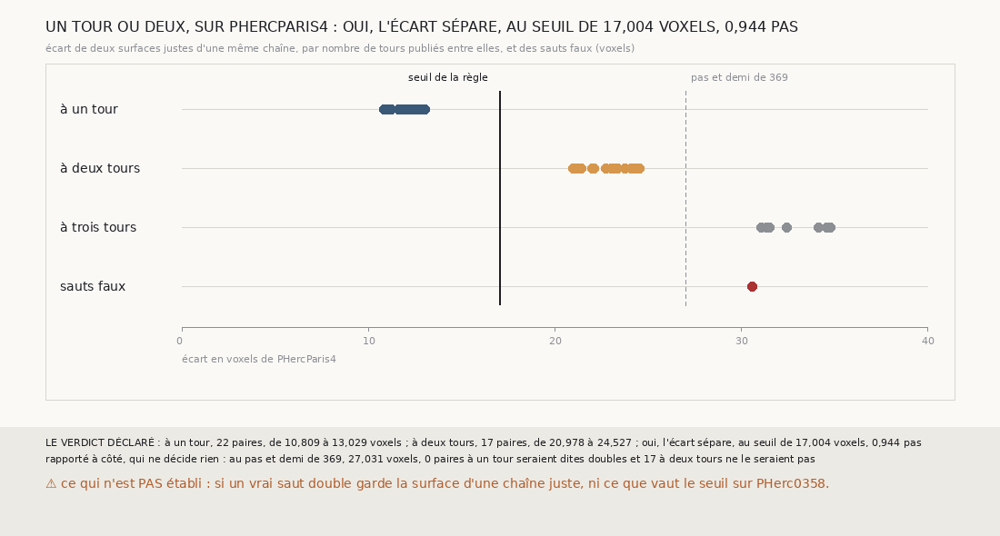

# `370` — Sur PHercParis4, l'écart d'un saut sépare-t-il un tour de deux ? Oui : de 10,809 à 13,029 voxels à un tour, de 20,978 à 24,527 à deux tours, au seuil de 17,004

*`369` a compté un saut double au-delà d'un pas et demi sans étalon, et a trouvé sur PHerc0358 un glissement tombé sur un saut que ce
seuil ne voyait pas. Sur PHercParis4, où les tours publiés sont connus, cette tranche compare deux surfaces justes d'une même chaîne, à un,
deux ou trois tours l'une de l'autre. Les écarts à un tour et à deux tours ne se recouvrent pas : la règle les sépare au seuil de 17,004
voxels, 0,944 pas. Au pas et demi de `369`, aucune des 17 paires à deux tours n'aurait été dite double.*

## 0. Pourquoi cette tranche

C'est `R4-P167`, et c'est `#5`. Le seuil d'un pas et demi de `369` a été posé sans étalon ; là où le tour est connu, l'écart entre deux
surfaces à un tour et à deux tours dit à quel seuil une chaîne seule peut voir un saut double.

## 1. Ce qui a été vu avant d'écrire

Tout ce que `296` à `369` publient, dont `R4-F555` et `R4-F553`. ⚠ Sous ses sauts jugés des graines 4 à 8, côtés moins, la chaîne d'une
maille ne fait sur PHercParis4 qu'un saut faux (`R4-F551`) : il n'y a pas assez de sauts doubles pour étalonner. Deux surfaces justes
d'une même chaîne, à deux tours l'une de l'autre, sont ce qu'un saut double aurait à franchir.

## 2. Ce qui est fait

- **Les chaînes** : la chaîne d'une maille de `365` sur PHercParis4, rejouée comme `367` la rejoue ; ses 27 surfaces justes, avec leur
  tour publié, redonnent celles que `367` publie.
- **Les paires** : deux surfaces justes d'une même chaîne, graines 4 à 8, côtés moins, à un, deux ou trois tours publiés l'une de l'autre.
  **L'écart** est celui de `369`, de la plus lointaine à la plus proche, à la portée latérale de `345` et à trois pas au plus ; une paire
  compte avec au moins 50 points en face.
- **Rapporté à la chaîne** : l'écart d'une paire divisé par la médiane des écarts à un tour de sa chaîne.

`m7` a été lu en 13661 chunks, sans panne.

## 3. Ce que disent les écarts

| tours publiés entre les deux surfaces | paires | écarts, en voxels | médiane | rapportés à la chaîne |
|---|---|---|---|---|
| un | 22 | 10,809 à 13,029 | 11,849 | 0,9023 à 1,1633 |
| deux | 17 | 20,978 à 24,527 | 23,196 | 1,7655 à 2,1899 |
| trois | 12 | 31,091 à 34,759 | 33,297 | 2,6201 à 3,0883 |

⭐⭐⭐⭐⭐ **Sur PHercParis4, l'écart d'une surface à une autre compte les tours entre elles** (`R4-F556`). Les écarts à un, deux et trois
tours ne se recouvrent pas, et leurs médianes croissent de dix à onze voxels par tour. Le plus grand écart à un tour, 13,029 voxels, est
sous le plus petit à deux tours, 20,978 : la règle les sépare au seuil de 17,004 voxels, 0,944 pas. Rapportés à la médiane des écarts à un
tour de leur chaîne, ils se séparent aussi, au seuil de 1,4644 fois cette médiane.

⚠ Au pas et demi de `369`, 27,031 voxels sur PHercParis4, aucune des 17 paires à deux tours n'aurait été dite double ; au quart de pas,
aucune paire à un tour n'aurait été dite nulle. Le seuil d'un pas et demi ne voit que trois tours et plus.

Rapporté à côté : le seul saut faux de la chaîne, le sixième de la graine 7, côté moins, franchit 3 tours, et s'écarte de 30,595 voxels
de la surface d'où il part, sur 132 points en face.

## 4. Le verdict

**UN TOUR OU DEUX, SUR PHERCPARIS4 : OUI, L'ÉCART SÉPARE, AU SEUIL DE 17,004 VOXELS, 0,944 PAS**

`R4-P167` est répondue : oui. Là où le tour est connu, une surface à deux tours de la précédente s'en écarte deux fois plus qu'une surface
à un tour, et le seuil d'un pas et demi de `369` était trop haut pour le voir.

## 5. Ce que cette tranche ne dit pas

- ⚠⚠ Si un vrai saut double garde la surface qu'une chaîne juste garde deux tours plus loin : les paires à deux tours n'en sont que
  l'image.
- ⚠ Ce que le seuil vaut sur PHerc0358, où les tours ne sont pas publiés et où les sauts simples s'écartent de 15,667 voxels en médiane.

## 6. Les sondes

Une batterie de **10** contrôles et une figure de **19**. Seize règles cassées exprès ont fait échouer la batterie : les paires de
deux chaînes, le sens inversé, le minimum en face ôté, la moyenne à la place de la médiane, une séparation qui accepte l'égalité, le seuil
au plus petit écart à deux tours, le rapport jamais tenté, un minimum de neuf paires, la portée d'un pas et demi, la portée de PHerc0358,
les tours d'un saut faux lus au saut précédent, sa surface comparée au saut suivant, la redite de `367` ôtée, un double au pas et demi
compris, un nul au quart de pas strict et les sauts faux de toutes les graines. Deux sondes passaient d'abord, la moyenne et le double
compris, et chacune a reçu son contrôle. Sept sondes de la figure l'ont fait échouer ; deux de ses contrôles, l'axe qui va jusqu'au pas et
demi et le seuil tracé seulement s'il sépare, ont été écrits avant de sonder, parce que la mesure seule ne pouvait pas voir ces règles.

## 7. Ce qui reste

`R4-P168` s'ouvre : sur PHerc0358, un saut compté en tours au seuil que `370` étalonne, rapporté aux sauts de sa chaîne, fait-il voir
dans la chaîne seule le glissement que l'accord révèle ? `R4-P151`, l'encre, reste en attente de l'auteur.
