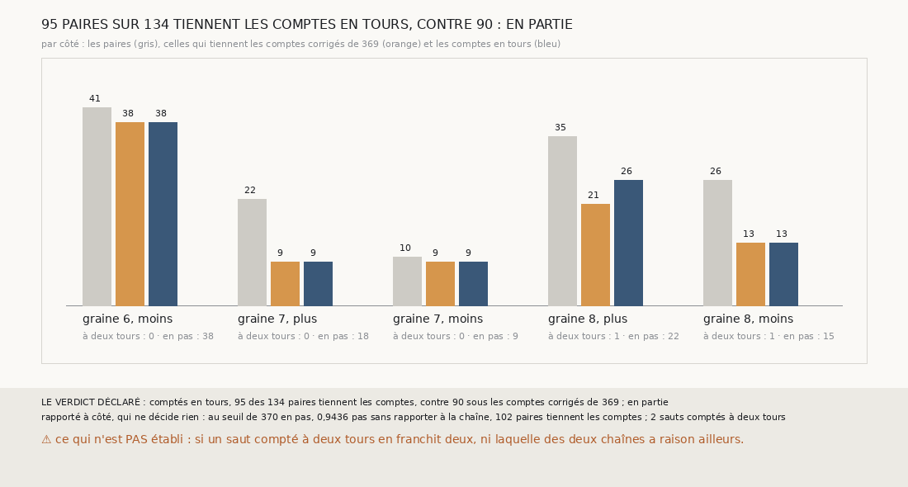

# `371` — Sur PHerc0358, compter les sauts en tours fait-il voir le glissement dans la chaîne seule ? En partie : 95 paires sur 134 tiennent les comptes, contre 90

*`370` a étalonné sur PHercParis4 l'écart qui sépare un saut d'un tour d'un saut de deux : rapporté à la médiane des sauts d'un tour de sa
chaîne, 1,4644. Cette tranche recompte en tours, à ce seuil, les sauts que `369` publie sur PHerc0358, sans relire `m7`. Comptés en tours,
95 des 134 paires d'une chaîne suivie et de sa compagne tiennent les comptes, contre 90 sous les comptes corrigés de `369` : par la règle
déclarée, en partie. Le saut où tombe le glissement de la graine 7, côté plus, reste sous le seuil, à 1,4484 fois la médiane de sa chaîne.*

## 0. Pourquoi cette tranche

C'est `R4-P168`, et c'est `#5`. Le seuil d'un pas et demi de `369` était trop haut ; rapporté aux sauts de sa propre chaîne, le seuil que
`370` étalonne ne dépend plus du pas de chaque rouleau.

## 1. Ce qui a été vu avant d'écrire

Tout ce que `296` à `370` publient, dont `R4-F555` et `R4-F556`, et en particulier les écarts de chaque saut que `369` publie. ⚠ La règle
a donc été écrite en connaissant ces écarts : le saut de la graine 7, côté plus, à 23,438 voxels, était connu.

## 2. Ce qui est fait

- **La référence d'une chaîne** : la médiane des écarts de ses sauts qui ont 50 points en face et ne sont pas nuls.
- **Les tours d'un saut** : 0 s'il est nul, au quart de pas ; 1 sans 50 points en face ; sinon, rapporté à la référence de sa chaîne, 1
  au plus à 1,4644, le seuil de `370` entre un et deux tours, 2 au plus à 2,405, le milieu de `370` entre deux et trois tours, 3 au-delà.
- **Le compte** d'une surface : la somme des tours de ses sauts, jusqu'à elle. Une paire tient les comptes si « même feuille » et « même
  compte » disent la même chose ; les comptes corrigés de `369` sont redonnés.

## 3. Ce que disent les comptes en tours

| côté | paires | comptes corrigés de `369` | comptes en tours | sauts à deux tours | au seuil en pas |
|---|---|---|---|---|---|
| graine 6, moins | 41 | 38 | 38 | 0 | 38 |
| graine 7, plus | 22 | 9 | 9 | 0 | 18 |
| graine 7, moins | 10 | 9 | 9 | 0 | 9 |
| graine 8, plus | 35 | 21 | 26 | 1 | 22 |
| graine 8, moins | 26 | 13 | 13 | 1 | 15 |

⭐⭐⭐⭐⭐ **Compté en tours, le glissement ne se voit toujours qu'en partie dans la chaîne seule** (`R4-F557`). 95 des 134 paires
tiennent les comptes, contre 90 sous les comptes corrigés de `369` et 77 sans correction. Deux sauts sont comptés à deux tours, tous deux
de compagnes : le cinquième de la graine 8, côté plus, à 1,8919 fois la médiane de sa chaîne, qui fait passer ce côté de 21 à 26 paires,
et le huitième de la graine 8, côté moins, à 2,0458.

⚠ Le deuxième saut de la suivie de la graine 7, côté plus, où tombe le glissement de ce côté, s'écarte de 1,4484 fois la médiane de sa
chaîne, sous le seuil de 1,4644. Sur PHerc0358, les 71 sauts lisibles comptés à un tour s'écartent de 0,6223 à 1,4484 fois la médiane
de leur chaîne, contre 0,9023 à 1,1633 sur PHercParis4 : les feuilles y sont trop inégalement espacées pour que le rapport sépare.

Rapporté à côté : au seuil de `370` en pas, 0,9436 pas sans rapporter à la chaîne, 102 paires tiennent les comptes, et la graine 7, côté
plus, passe de 9 à 18 paires sur 22.

## 4. Le verdict

**95 PAIRES SUR 134 TIENNENT LES COMPTES EN TOURS, CONTRE 90 : EN PARTIE**

`R4-P168` est répondue : en partie. Compter les sauts en tours rattrape deux sauts doubles que le pas et demi ne voyait pas, mais sur
PHerc0358 un saut simple peut s'écarter presque autant qu'un saut que l'accord désigne ; la chaîne seule ne tranche pas.

## 5. Ce que cette tranche ne dit pas

- ⚠⚠ Si un saut compté à deux tours en franchit vraiment deux, ni laquelle des deux chaînes a raison là où elles ne tiennent toujours pas
  les comptes.
- ⚠ Si le seuil en pas, qui fait mieux ici, ferait mieux ailleurs : il n'a pas été déclaré comme règle.

## 6. Les sondes

Une batterie de **10** contrôles et une figure de **18**. Douze règles cassées exprès ont fait échouer la batterie : la référence en
moyenne, la référence avec les sauts nuls, la référence avec les sauts illisibles, un saut illisible compté nul, le seuil de deux tours
strict, jamais trois tours, le seuil de trois tours au plus petit rapport à trois tours, les comptes corrigés de `369` à la place des
tours, le seuil en pas rapporté à la chaîne, la redite de `369` ôtée, « en partie » à gain nul et un nul au quart de pas strict. Sept sondes
de la figure l'ont fait échouer.

## 7. Ce qui reste

`R4-P169` s'ouvre : sur PHerc0358, là où une chaîne suivie et sa compagne ne tiennent pas les comptes, une troisième chaîne, partie d'une
autre graine compagne, dit-elle par la majorité laquelle des deux a glissé ? `R4-P151`, l'encre, reste en attente de l'auteur.
