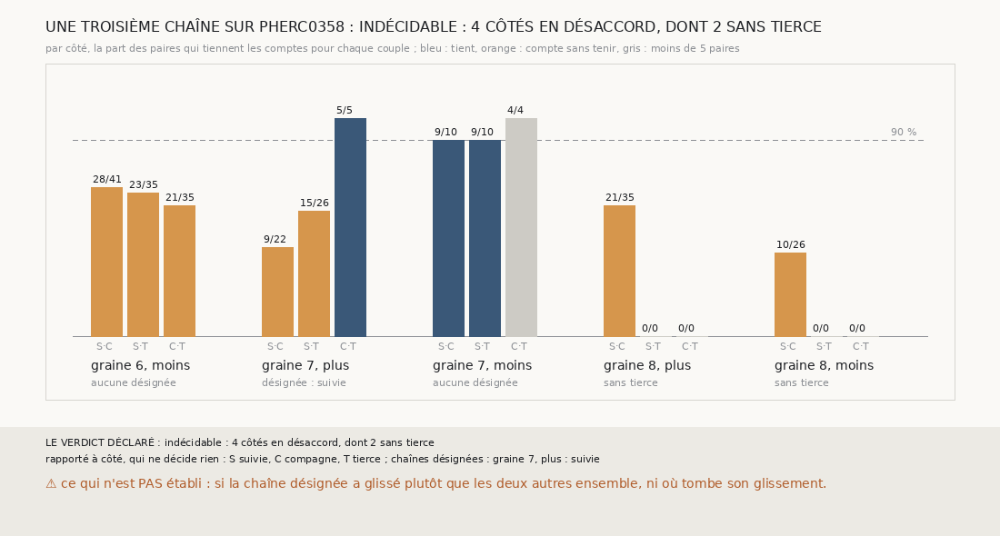

# `372` — Sur PHerc0358, une troisième chaîne dit-elle laquelle a glissé ? Indécidable : 4 côtés en désaccord, dont 2 sans tierce ; sur la graine 7, côté plus, le vote désigne la suivie

*`368` a montré qu'une chaîne suivie et sa compagne ne comptent pas les mêmes tours sur PHerc0358, sans dire laquelle glisse, et `371` que
la chaîne seule ne le tranche pas. Cette tranche fait partir une troisième chaîne, la tierce, d'une graine posée à l'opposé de la
compagne, et fait voter les trois : le seul couple qui tient les comptes désigne la chaîne qui n'en est pas. Mais la nappe de départ de la
graine 8 n'offre pas de place à une tierce : sur ses deux côtés, tous deux en désaccord, rien n'est lancé, et la règle déclarée rend
indécidable. Là où il y a une tierce et un désaccord à trancher, la graine 7, côté plus, le vote désigne la chaîne suivie.*

## 0. Pourquoi cette tranche

C'est `R4-P169`, et c'est `#5`. Deux chaînes qui glissent indépendamment glissent rarement au même saut : deux chaînes qui tiennent les
comptes entre elles, contre une troisième qui ne les tient avec aucune, désignent celle qui a glissé, sans tracé.

## 1. Ce qui a été vu avant d'écrire

Tout ce que `296` à `371` publient, dont `R4-F554` et `R4-F557`.

## 2. Ce qui est fait

- **Les chaînes** : la suivie et la compagne de `368`, rejouées, dont les paires redonnent celles de `368` ; et la **tierce**, la même
  chaîne d'une maille partie d'une graine posée à 15 mailles du centre de la nappe de départ, à l'opposé de la compagne, ou sinon dans la
  première autre direction où la nappe a une normale.
- **Les couples** : suivie et compagne, suivie et tierce, compagne et tierce. Un couple **tient** si au moins 90 % de ses paires tiennent
  les comptes ; il compte s'il a au moins 5 paires.
- **Le vote** : si un seul couple tient et que les deux autres comptent sans tenir, la chaîne hors de ce couple a glissé.

`m7` a été lu en 10223 chunks, sans panne.

## 3. Ce que dit le vote

| côté | suivie et compagne | suivie et tierce | compagne et tierce | chaîne désignée |
|---|---|---|---|---|
| graine 6, moins | 28 / 41 | 23 / 35 | 21 / 35 | aucune |
| graine 7, plus | 9 / 22 | 15 / 26 | 5 / 5 | la suivie |
| graine 7, moins | 9 / 10 | 9 / 10 | 4 / 4 | aucune |
| graine 8, plus | 21 / 35 | sans tierce | sans tierce | aucune |
| graine 8, moins | 10 / 26 | sans tierce | sans tierce | aucune |

⭐⭐⭐⭐ **Une troisième chaîne ne tranche pas encore, faute de tierce sur la graine 8** (`R4-F558`). Sur 4 côtés où la suivie et la
compagne ne tiennent pas les comptes, 2 n'ont pas de tierce : à 15 mailles de son centre, la nappe de départ de la graine 8 n'a de point
à normale connue que dans la direction de la compagne. Par la règle déclarée, indécidable.

⭐⭐⭐⭐ Sur la graine 7, côté plus, la compagne et la tierce tiennent les comptes sous leurs 5 paires, et chacune tient mal avec la suivie :
le vote désigne la suivie. Dans les paires de la suivie et de la tierce, la deuxième surface de la suivie est sur la même feuille que la
troisième de la tierce, comme elle l'était de la troisième de la compagne : c'est le saut de 23,438 voxels que `369` et `371` montrent.

⚠ Sur la graine 6, côté moins, aucun couple ne tient les comptes bruts : les sauts nuls que `369` voit dans la suivie et la compagne
décalent les comptes des trois couples. Sur la graine 7, côté moins, la suivie tient les comptes avec la compagne et avec la tierce.

## 4. Le verdict

**UNE TROISIÈME CHAÎNE SUR PHERC0358 : INDÉCIDABLE : 4 CÔTÉS EN DÉSACCORD, DONT 2 SANS TIERCE**

`R4-P169` n'est pas tranchée par la règle. Là où le vote peut se tenir, il désigne une chaîne, sans tracé, et c'est celle que les écarts
de ses sauts faisaient soupçonner.

## 5. Ce que cette tranche ne dit pas

- ⚠⚠ Si la chaîne désignée a glissé plutôt que les deux autres ensemble, ni où tombe son glissement : le vote ne regarde que des comptes.
- ⚠ Ce que le vote dirait sur la graine 8, et sur la graine 6 sous les comptes corrigés des sauts nuls.

## 6. Les sondes

Une batterie de **8** contrôles et une figure de **17**. Dix règles cassées exprès ont fait échouer la batterie : la tierce posée sur la
compagne, l'opposé pas essayé d'abord, une part de 90 % stricte, le minimum de paires ôté, les deux autres couples admis sans compter,
une tierce désignée comptée comme la suivie ou la compagne, tous les côtés comptés en désaccord, un côté sans tierce admis, la redite de
`368` ôtée et « oui » à la moitié des côtés. Une onzième, qui acceptait deux couples qui tiennent, passait parce qu'elle ne change rien :
l'autre condition du vote les écarte déjà. Six sondes de la figure l'ont fait échouer ; l'une passait d'abord, l'ordre des couples, que le
contrôle relisait dans la constante du dessin, et il porte désormais l'ordre écrit.

## 7. Ce qui reste

`R4-P170` s'ouvre : sur PHerc0358, avec une graine tierce posée ailleurs là où la nappe n'a pas d'autre direction à 15 mailles, et les
comptes corrigés des sauts nuls de `369`, le vote désigne-t-il sur chaque côté en désaccord celle qui a glissé ? `R4-P151`, l'encre, reste
en attente de l'auteur.
