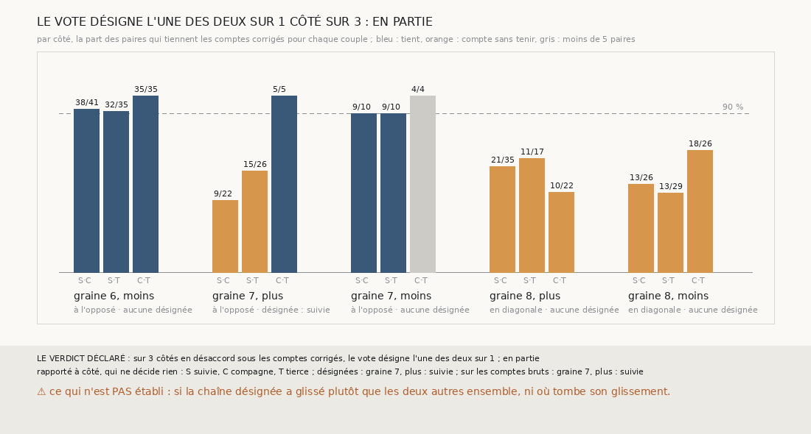

# `373` — Sur PHerc0358, trois chaînes aux comptes corrigés désignent-elles celle qui a glissé ? En partie : sur 3 côtés en désaccord, le vote en désigne une sur 1

*`372` n'a pu faire voter trois chaînes que sur un côté : la nappe de la graine 8 n'avait pas de place pour une tierce à 15 mailles, et
les sauts nuls rompaient les comptes bruts de la graine 6. Cette tranche pose la tierce de la graine 8 en diagonale, à 11 mailles, et
compte les sauts des trois chaînes comme `369` les corrige. Sur la graine 6, côté moins, les trois chaînes tiennent alors les comptes
deux à deux : ce côté n'est plus en désaccord. Sur les 3 côtés qui le restent, le vote ne désigne une chaîne que sur la graine 7, côté
plus, la suivie : par la règle déclarée, en partie. Sur la graine 8, les trois chaînes ne tiennent les comptes par aucun couple.*

## 0. Pourquoi cette tranche

C'est `R4-P170`, et c'est `#5`. Le vote de `372` ne s'est tenu que sur un côté : il manquait une tierce sur la graine 8, et des comptes
que les sauts nuls ne rompent pas sur la graine 6.

## 1. Ce qui a été vu avant d'écrire

Tout ce que `296` à `372` publient, dont `R4-F555` et `R4-F558`.

## 2. Ce qui est fait

- **Les chaînes** : la suivie et la compagne de `369`, rejouées, dont les paires redonnent celles de `368` et les sauts ceux de `369`.
- **La tierce** : celle de `372` là où elle existe, sur les graines 6 et 7 ; sinon à 11 mailles du centre en diagonale, la plus opposée
  à la compagne d'abord, ou à 10 mailles sur un autre axe. Sur la graine 8, elle est posée en diagonale.
- **Les comptes** : chaque saut des trois chaînes compté comme dans `369`, 0 s'il est nul, 2 s'il est double, 1 sinon. Les couples et le
  vote sont ceux de `372`, sur ces comptes ; un côté est en désaccord si la suivie et la compagne n'y tiennent pas les comptes corrigés.

`m7` a été lu en 11767 chunks, sans panne.

## 3. Ce que dit le vote

| côté | suivie et compagne | suivie et tierce | compagne et tierce | chaîne désignée |
|---|---|---|---|---|
| graine 6, moins | 38 / 41 | 32 / 35 | 35 / 35 | aucune |
| graine 7, plus | 9 / 22 | 15 / 26 | 5 / 5 | la suivie |
| graine 7, moins | 9 / 10 | 9 / 10 | 4 / 4 | aucune |
| graine 8, plus | 21 / 35 | 11 / 17 | 10 / 22 | aucune |
| graine 8, moins | 13 / 26 | 13 / 29 | 18 / 26 | aucune |

⭐⭐⭐⭐ **Trois chaînes aux comptes corrigés ne désignent celle qui a glissé qu'en partie** (`R4-F559`). Sur 3 côtés en désaccord sous
les comptes corrigés, le vote désigne l'une des deux sur 1 : la suivie de la graine 7, côté plus, comme dans `372`. Sur les comptes
bruts, il désigne la même chaîne, et elle seule.

⭐⭐⭐⭐ Sur la graine 6, côté moins, les comptes corrigés font tenir les trois couples : 38 paires sur 41, 32 sur 35 et 35 sur 35, contre
28, 23 et 21 sur les comptes bruts. Le désaccord de ce côté n'était fait que de sauts nuls ; la tierce, elle, compte son huitième saut
double, à 30,021 voxels.

⚠ Sur la graine 8, aucun couple ne tient. Des paires y mettent sur la même feuille des surfaces à plusieurs sauts l'une de l'autre : côté
plus, la sixième surface de la suivie et la première de la tierce. Ce n'est plus un glissement d'un saut, et le vote de trois chaînes n'a
rien à en dire.

## 4. Le verdict

**LE VOTE DÉSIGNE L'UNE DES DEUX SUR 1 CÔTÉ SUR 3 : EN PARTIE**

`R4-P170` est répondue : en partie. Trois chaînes, sans tracé, s'accordent sur les graines 6, côté moins, et 7, côté moins, et désignent
la chaîne qui a glissé sur la graine 7, côté plus ; sur la graine 8, elles ne s'accordent sur rien.

## 5. Ce que cette tranche ne dit pas

- ⚠⚠ Si la chaîne désignée a glissé plutôt que les deux autres ensemble, ni où tombe son glissement.
- ⚠ Ce qui, sur la graine 8, met sur la même feuille des surfaces à plusieurs sauts l'une de l'autre : des feuilles qui se touchent, un
  pli, ou des chaînes qui dérivent.

## 6. Les sondes

Une batterie de **8** contrôles et une figure de **17**. Dix règles cassées exprès ont fait échouer la batterie : aucun repli après la
tierce de `372`, les diagonales dans l'ordre de la table, l'axe de la compagne admis, la diagonale à 15 mailles, les comptes bruts à la
place des corrigés, tous les côtés comptés en désaccord, une tierce désignée comptée comme la suivie ou la compagne, un côté sans tierce
admis, la redite de `368`, `369` et `372` ôtée, et « oui » à la moitié des côtés. Huit sondes de la figure l'ont fait échouer. La
mesure a été jouée deux fois : la première ne publiait pas la part de 90 % dont la figure trace le trait ; la seconde redonne la première,
constantes à part.

## 7. Ce qui reste

`R4-P171` s'ouvre : sur PHerc0358, quelles surfaces l'accord de trois chaînes valide-t-il, sur la même feuille et au même compte corrigé
que des surfaces des deux autres chaînes, et jusqu'à combien de sauts de la nappe de départ ? `R4-P151`, l'encre, reste en attente de
l'auteur.
