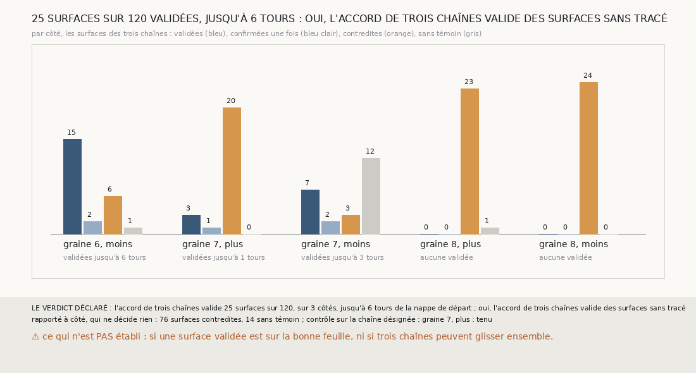

# `374` — Sur PHerc0358, quelles surfaces l'accord de trois chaînes valide-t-il ? 25 surfaces sur 120, sur 3 côtés, jusqu'à 6 tours de la nappe de départ

*`373` a fait voter trois chaînes aux comptes corrigés, parties de trois graines d'une même nappe de départ. Cette tranche relit leurs
paires pour dire, surface par surface, ce que les deux autres chaînes en disent : une surface est validée quand chacune des deux autres
a une surface sur la même feuille au même compte corrigé et qu'aucune ne la contredit. Sur les 120 surfaces des trois chaînes, 25 sont
validées, sur 3 côtés, jusqu'à 6 tours de la nappe de départ, sans tracé : par la règle déclarée, oui. Sur la graine 8, aucune.*

## 0. Pourquoi cette tranche

C'est `R4-P171`, et c'est `#5`. Sur un rouleau sans tracé, une surface que trois chaînes parties de trois graines mettent sur la même
feuille au même compte est ce qui validerait une première surface.

## 1. Ce qui a été vu avant d'écrire

Tout ce que `296` à `373` publient, dont `R4-F559`, et les paires de `368` et de `373`. ⚠ Cette tranche ne lit pas `m7` : elle relit les
paires, les sauts et les comptes que `368`, `369` et `373` publient.

## 2. Ce qui est fait

- **Les surfaces** : les 8 surfaces gardées de chacune des trois chaînes de `373`, sur les cinq côtés, avec leur compte corrigé.
- **Les témoins** : une autre chaîne **confirme** une surface si l'une de ses surfaces est sur la même feuille au même compte corrigé ; elle
  la **contredit** si l'une est sur la même feuille à un autre compte, ou au même compte sur une autre feuille.
- **Validée** : confirmée par les deux autres chaînes, contredite par aucune ; son compte est le nombre de tours qui la sépare de la nappe.
- **Le contrôle** : là où `373` désigne une chaîne qui a glissé, elle a une surface contredite par les deux autres, et aucune de ses
  surfaces n'est validée à partir de la première qui l'est.

## 3. Ce que dit l'accord

| côté | validées | confirmées une fois | contredites | sans témoin | validées jusqu'à |
|---|---|---|---|---|---|
| graine 6, moins | 15 | 2 | 6 | 1 | 6 tours |
| graine 7, plus | 3 | 1 | 20 | 0 | 1 tour |
| graine 7, moins | 7 | 2 | 3 | 12 | 3 tours |
| graine 8, plus | 0 | 0 | 23 | 1 | aucune |
| graine 8, moins | 0 | 0 | 24 | 0 | aucune |

⭐⭐⭐⭐⭐ **L'accord de trois chaînes valide des surfaces de PHerc0358 sans tracé** (`R4-F560`). 25 des 120 surfaces sont validées, sur
3 côtés. Sur la graine 6, côté moins, les trois chaînes ont chacune une surface validée à 6 tours de la nappe de départ : la huitième de la
suivie, la septième de la compagne et la sixième de la tierce, trois surfaces que trois chaînes indépendantes mettent sur la même feuille
au même compte.

⚠ Sur ce côté, les surfaces à 2 tours sont contredites dans les trois chaînes, et celles à 3 tours aussi, sauf la cinquième de la
suivie : l'accord ne reprend pleinement qu'à 4 tours. Sur la graine 7, côté plus, la compagne et la tierce s'accordent entre elles, mais
la suivie, qui a glissé, les contredit partout : seules les trois premières surfaces sont validées. Le contrôle tient : la suivie y est
contredite par les deux autres dès sa deuxième surface, et rien n'est validé au-delà. Sur la graine 8, 47 des 48 surfaces sont
contredites.

## 4. Le verdict

**25 SURFACES SUR 120 VALIDÉES, JUSQU'À 6 TOURS : OUI, L'ACCORD DE TROIS CHAÎNES VALIDE DES SURFACES SANS TRACÉ**

`R4-P171` est répondue : oui. C'est ce que `#5` demandait, sous une forme qui ne demande aucun tracé : trois chaînes parties de trois
graines d'une même nappe, qui s'accordent sur une feuille et sur le nombre de tours qui la sépare de la nappe.

## 5. Ce que cette tranche ne dit pas

- ⚠⚠ Si une surface validée est sur la bonne feuille : trois chaînes peuvent glisser ensemble, et le juge de feuille de `367`, étalonné
  sur PHercParis4, n'a pas été éprouvé là où des feuilles se touchent.
- ⚠ Pourquoi rien ne s'accorde sur la graine 8.

## 6. Les sondes

Une batterie de **7** contrôles et une figure de **18**. Dix règles cassées exprès ont fait échouer la batterie : les paires dans un seul
sens, une autre feuille au même compte admise, une surface validée par une seule chaîne, une surface validée malgré une contradiction, le
contrôle sur une seule contradiction, un contrôle vide accepté, le contrôle ignoré, la redite de `373` ôtée, « oui » à un seul côté et le
plus loin compté en sauts. Le contrôle vide faisait d'abord lever la batterie hors d'un contrôle ; ce contrôle l'enveloppe désormais. Six
sondes de la figure l'ont fait échouer.

## 7. Ce qui reste

`R4-P172` s'ouvre : sur PHerc0358, les paires « même feuille » de la graine 8, à plusieurs sauts d'écart, sont-elles deux feuilles qui se
touchent, une part de leurs points à moins d'un quart de pas et le reste à un tour ? `R4-P151`, l'encre, reste en attente de l'auteur.
