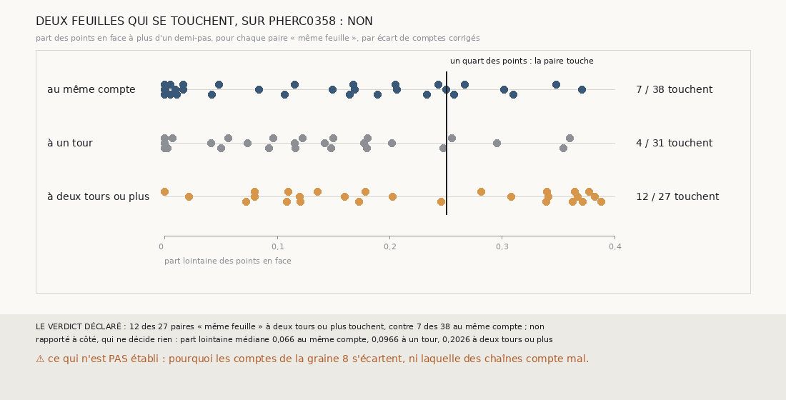

# `375` — Sur PHerc0358, les paires « même feuille » à plusieurs tours d'écart sont-elles deux feuilles qui se touchent ? Non : 12 sur 27, contre 7 sur 38 au même compte

*`374` a validé 25 surfaces par l'accord de trois chaînes, et aucune sur la graine 8, où le juge de feuille de `367` met sur la même
feuille des surfaces que les comptes disent à deux tours ou plus l'une de l'autre. Le juge décide par la médiane des écarts : deux
feuilles qui se touchent sur une partie de la surface pourraient le tromper. Cette tranche relit les points en face de chaque paire
« même feuille » et compte la part de ceux qui sont à plus d'un demi-pas. 12 des 27 paires à deux tours ou plus en ont au moins un quart,
contre 7 des 38 au même compte : par la règle déclarée, non. Pour les 15 autres, plus des trois quarts des points en face sont à moins
d'un demi-pas : c'est la même feuille, et ce sont les comptes qui s'écartent.*

## 0. Pourquoi cette tranche

C'est `R4-P172`, et c'est `#5`. L'accord de trois chaînes valide des surfaces sans tracé (`R4-F560`), mais il repose sur un juge de
feuille étalonné sur PHercParis4 ; si des feuilles qui se touchent le trompent, une surface validée peut être sur la mauvaise feuille.

## 1. Ce qui a été vu avant d'écrire

Tout ce que `296` à `374` publient, dont `R4-F560`. Et, compté sur les paires que `368` et `373` publient : sous les comptes corrigés,
38 paires « même feuille » au même compte, 31 à un tour d'écart et 27 à deux tours ou plus, toutes les 27 sur la graine 8.

## 2. Ce qui est fait

- **Les chaînes** : les trois chaînes de `373`, rejouées ; leurs paires et leurs comptes corrigés redonnent ceux que `368`, `369` et
  `373` publient, sur les cinq côtés.
- **La part lointaine** d'une paire « même feuille » : parmi ses points en face, à la portée et au latéral de `368`, la part de ceux qui
  sont à plus d'un demi-pas, 10 voxels. La paire **touche** si cette part atteint un quart.
- **La règle** : oui si au moins 90 % des paires à deux tours ou plus touchent et au plus 10 % de celles au même compte ; non si moins de
  la moitié des paires à deux tours ou plus touchent ; en partie sinon.

`m7` a été lu en 11767 chunks, sans panne, en 89,2 secondes.

## 3. Ce que disent les points en face

| écart des comptes corrigés | paires | touchent | part lointaine médiane |
|---|---|---|---|
| même compte | 38 | 7 | 0,066 |
| un tour | 31 | 4 | 0,0966 |
| deux tours ou plus | 27 | 12 | 0,2026 |

⭐⭐⭐⭐ **Les paires « même feuille » à plusieurs tours d'écart ne sont pas, pour la plupart, deux feuilles qui se touchent** (`R4-F561`).
12 des 27 touchent, soit moins de la moitié. Aucune n'a la majorité de ses points en face au loin : la plus grande part lointaine est
0,3882, et l'écart médian le plus grand du groupe 4,139 voxels.

⚠ Elles touchent plus souvent que les paires au même compte, 12 sur 27 contre 7 sur 38, et leur part lointaine médiane est trois fois
plus grande. Mais un quart des points au loin arrive aussi à 7 paires au même compte : ce seuil ne sépare pas des feuilles qui se
touchent de l'étalement ordinaire d'une paire.

⭐⭐⭐⭐ Pour les 15 autres paires à deux tours ou plus, plus des trois quarts des points en face sont à moins d'un demi-pas. Les deux
surfaces sont sur la même feuille ; ce ne sont pas des feuilles qui trompent le juge, ce sont les comptes des deux chaînes qui s'écartent :
9 de ces paires à 2 tours, 5 à 3 et 1 à 5. Les 4 paires à 4 tours, elles, touchent toutes.

## 4. Le verdict

**12 DES 27 PAIRES À DEUX TOURS OU PLUS TOUCHENT, CONTRE 7 DES 38 AU MÊME COMPTE : NON**

`R4-P172` est répondue : non. Sur la graine 8, le juge de feuille n'est pas, pour l'essentiel, trompé par des feuilles qui se touchent :
c'est le compte des sauts qui fait s'écarter les chaînes.

## 5. Ce que cette tranche ne dit pas

- ⚠⚠ Pourquoi les comptes de la graine 8 s'écartent, ni laquelle des chaînes compte mal.
- ⚠ Où, sur la surface, les 12 paires qui touchent ont leurs points au loin, ni si ce sont des feuilles qui se touchent ou l'étalement
  ordinaire d'une paire.
- ⚠ Si les 25 surfaces validées par `374` sont sur la bonne feuille : cette tranche éprouve le juge sur la graine 8, pas sur elles.

## 6. Les sondes

Une batterie de **9** contrôles et une figure de **20**. Dix règles cassées exprès ont fait échouer la batterie : le lointain pris au sens
large, la portée de PHerc0358, les paires à un tour comptées parmi les plus lointaines, le quart strict, les paires au même compte
ignorées, « non » à la moitié, le minimum ôté, la redite de `373` ôtée, le demi-pas remplacé par le quart, et la moyenne à la place de la
médiane. Onze sondes de la figure l'ont fait échouer ; une douzième, la part médiane à un tour mal écrite dans la bande, passait d'abord :
ce contrôle la lit désormais.

## 7. Ce qui reste

`R4-P173` s'ouvre : sur PHerc0358, graine 8, les deux surfaces d'une paire « même feuille » à deux tours ou plus d'écart sont-elles à la
même distance de la nappe, la somme des écarts de leurs sauts, l'une atteinte en plus de sauts que l'autre ? `R4-P151`, l'encre, reste en
attente de l'auteur.
