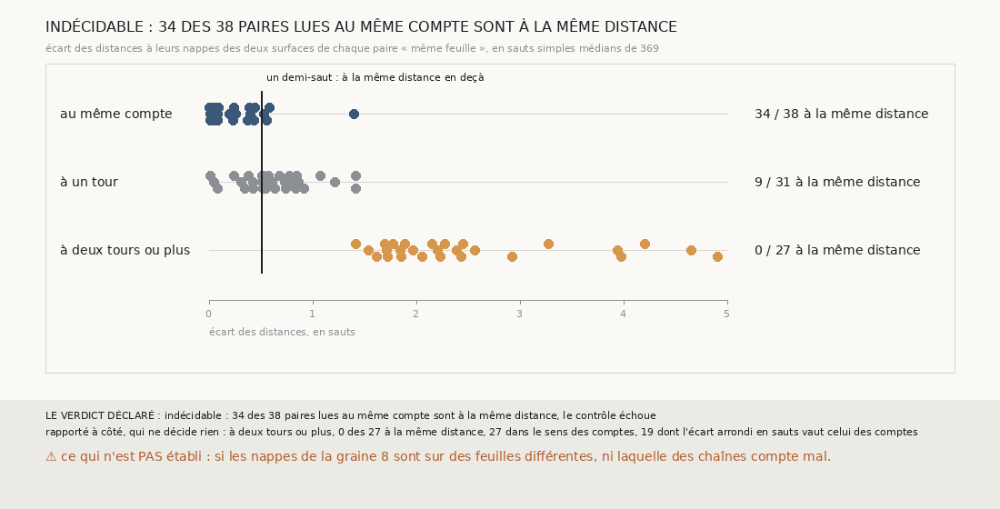

# `376` — Sur PHerc0358, les deux surfaces d'une paire « même feuille » à plusieurs tours sont-elles à la même distance de la nappe ? Indécidable : le contrôle échoue, et aucune des 27 ne l'est

*`375` a montré que, sur la graine 8, les paires « même feuille » à deux tours ou plus sont pour la plupart une même feuille, et que ce
sont les comptes des chaînes qui s'écartent. Deux lectures restaient : une chaîne a compté un tour pour un saut qui n'en franchissait pas,
et les deux surfaces sont à la même distance de leurs nappes ; ou les distances s'écartent autant que les comptes. Cette tranche somme les
écarts publiés des sauts, de chaque nappe jusqu'à chaque surface. Le contrôle échoue de peu : 34 des 38 paires au même compte sont à la
même distance, il en fallait 35. Par la règle déclarée, indécidable. Rapporté à côté : aucune des 27 paires à deux tours ou plus n'est à
la même distance, et les 27 s'écartent dans le sens de leurs comptes.*

## 0. Pourquoi cette tranche

C'est `R4-P173`, et c'est `#5`. Pour valider des surfaces sur la graine 8, il faut savoir si les chaînes y comptent mal leurs sauts ou si
elles ne partent pas de la même feuille.

## 1. Ce qui a été vu avant d'écrire

Tout ce que `296` à `375` publient, dont `R4-F561`. Et, lu dans les paires de `375` : sur la graine 8, côté moins, les paires de la suivie
et de la compagne vont de saut en saut avec un saut d'écart, celles de la suivie et de la tierce aussi, celles de la compagne et de la
tierce avec deux. Les sauts publiés de la graine 8 s'écartent de 11 à 27 voxels. ⚠ Cette tranche ne lit pas `m7` : elle relit les paires
de `375` et les sauts que `369` et `373` publient.

## 2. Ce qui est fait

- **La distance** d'une surface à sa nappe : la somme des écarts médians de ses sauts, de la nappe jusqu'à elle.
- **Chaque paire « même feuille »** de `375` : l'écart signé des distances de ses deux surfaces, rapporté au saut simple médian de `369`,
  15,667 voxels. Elle est **à la même distance** sous un demi-saut.
- **Le contrôle** : au moins 90 % des paires au même compte à la même distance ; sinon, la distance sommée ne dit rien des comptes.
- **La règle** : oui si au moins 90 % des paires à deux tours ou plus sont à la même distance ; non si moins de la moitié ; en partie sinon.

Les comptes des sauts redonnent l'écart de comptes de chacune des 96 paires de `375`.

## 3. Ce que disent les distances

| écart des comptes corrigés | paires lues | à la même distance | dans le sens des comptes | écart arrondi égal aux comptes | écart médian |
|---|---|---|---|---|---|
| même compte | 38 | 34 | — | 34 | 0,0535 saut |
| un tour | 31 | 9 | 27 | 22 | 0,574 saut |
| deux tours ou plus | 27 | 0 | 27 | 19 | 2,205 sauts |

⭐⭐⭐ **Indécidable : le contrôle échoue de peu** (`R4-F562`). 34 des 38 paires au même compte sont à la même distance, il en fallait 35.
Trois des quatre autres sont sur la graine 6, côté moins, à 0,526, 0,552 et 0,582 saut ; la quatrième, à 1,394 saut, est la huitième
surface de la suivie de la graine 7, côté plus, la chaîne que `373` désigne comme ayant glissé.

⭐⭐⭐⭐ Rapporté à côté, qui ne décide rien : aucune des 27 paires à deux tours ou plus n'est à la même distance, la plus proche à 1,409
saut. Les 27 s'écartent dans le sens de leurs comptes : la surface que sa chaîne compte plus loin est plus loin de sa nappe. Pour 19 des
27, l'écart arrondi en sauts vaut l'écart des comptes. Sur ces 27 paires, rien ne montre une chaîne qui aurait compté un tour pour un
saut qui n'en franchissait pas.

⚠ Sur la graine 8, côté moins, la suivie et la compagne : à (2, 1), un tour d'écart et 1,066 saut ; de (3, 2) à (8, 7), deux tours et de
1,533 à 1,84 saut, pour un seul saut d'écart. Entre les deux, la compagne fait un saut nul, de 0,751 voxel, que `369` compte pour zéro, et
la suivie un saut de 12,878 voxels : la deuxième et la troisième surface de la suivie sont toutes deux sur la même feuille que la première
de la compagne.

## 4. Le verdict

**INDÉCIDABLE : 34 DES 38 PAIRES LUES AU MÊME COMPTE SONT À LA MÊME DISTANCE, LE CONTRÔLE ÉCHOUE**

`R4-P173` est répondue : indécidable. La somme des sauts ne tient pas tout à fait le même compte ; là où les comptes s'écartent, elle
s'écarte avec eux, toujours dans leur sens.

## 5. Ce que cette tranche ne dit pas

- ⚠⚠ Si les nappes de départ des chaînes de la graine 8 sont sur des feuilles différentes, ni laquelle des chaînes compte mal.
- ⚠ Si la somme des écarts médians des sauts mesure une distance le long d'une même normale : les chaînes partent de graines à 11 ou
  15 mailles l'une de l'autre.
- ⚠ Si une surface de la graine 8 est à cheval sur deux feuilles, en face de l'une ici et de l'autre là.

## 6. Les sondes

Une batterie de **12** contrôles et une figure de **22**. Quinze règles cassées exprès ont fait échouer la batterie, dont le demi-saut
large, le dernier saut oublié, un saut manquant compté zéro, l'écart pris absolu, le contrôle à 80 %, un contrôle vide, « non » à la
moitié, « oui » à 80 %, le minimum et la redite ôtés, et les paires non lues comptées. Deux passaient d'abord, les comptes pris sans signe
et les tours lus sur les sauts bruts : deux contrôles les lisent désormais. Les paires non lues comptées faisaient lever la batterie hors
d'un contrôle ; il l'enveloppe désormais. Douze sondes de la figure l'ont fait échouer, dont quatre après l'ajout de leur contrôle.

## 7. Ce qui reste

`R4-P174` s'ouvre : sur PHerc0358, graine 8, les nappes de départ des trois chaînes sont-elles sur des feuilles différentes, à autant de
tours que l'écart de leurs comptes au premier saut ? `R4-P151`, l'encre, reste en attente de l'auteur.
