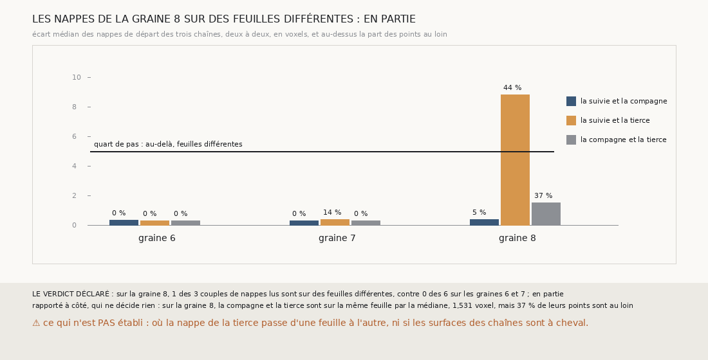

# `377` — Sur PHerc0358, graine 8, les nappes de départ des trois chaînes sont-elles sur des feuilles différentes ? En partie : 1 couple sur 3, et la nappe de la tierce est à cheval

*`376` a montré que, là où les comptes des chaînes de la graine 8 s'écartent, la distance à leurs nappes s'écarte avec eux. La graine
compagne et la graine tierce sont des points de la nappe de la suivie, mais leurs nappes sont regrandies depuis ces points : l'une a pu
glisser sur une autre feuille en grandissant. Cette tranche compare les trois nappes de départ deux à deux. Sur la graine 8, la suivie et
la tierce sont sur des feuilles différentes, 1 couple sur 3, contre aucun des 6 sur les graines 6 et 7 : par la règle déclarée, en
partie. La nappe de la tierce n'est pas sur une autre feuille : elle est à cheval, 44 % des points de la suivie en face d'elle au loin.*

## 0. Pourquoi cette tranche

C'est `R4-P174`, et c'est `#5`. Si une chaîne part d'une nappe posée sur une autre feuille, elle compte ses tours depuis une autre feuille,
sans qu'aucun de ses sauts ne soit faux ; valider ses surfaces demande alors de corriger son départ, pas ses sauts.

## 1. Ce qui a été vu avant d'écrire

Tout ce que `296` à `376` publient, dont `R4-F562`, et les graines compagne et tierce que `368` et `373` publient, les mêmes pour les deux
côtés d'une graine.

## 2. Ce qui est fait

- **Les nappes** : celles des trois chaînes de `373`, rejouées ; les graines et les comptes corrigés de la tierce redonnent `368` et
  `373`, et les deux côtés d'une graine partent des mêmes nappes.
- **Chaque couple de nappes** : les points de la première qui ont la seconde en face, à trois pas au plus ; la médiane de leurs écarts
  et la part de ceux à plus d'un demi-pas. **Sur des feuilles différentes** si la médiane dépasse le quart de pas, 5 voxels.
- **Le contrôle** : sur les graines 6 et 7, chaque couple lu est sur la même feuille.
- **La règle** : oui si au moins 2 des 3 couples de la graine 8 sont sur des feuilles différentes ; en partie si 1 ; non si aucun.

`m7` a été lu en 11767 chunks, sans panne, en 137,5 secondes.

## 3. Ce que disent les nappes

| graine | la suivie et la compagne | la suivie et la tierce | la compagne et la tierce |
|---|---|---|---|
| 6 | 0,346 voxel, 0 % au loin | 0,305 voxel, 0 % au loin | 0,309 voxel, 0 % au loin |
| 7 | 0,296 voxel, 0 % au loin | 0,398 voxel, 14 % au loin | 0,289 voxel, 0 % au loin |
| 8 | 0,401 voxel, 5 % au loin | 8,83 voxels, 44 % au loin | 1,531 voxel, 37 % au loin |

⭐⭐⭐⭐ **Sur la graine 8, une nappe de départ sur trois ne part pas de la feuille de la suivie** (`R4-F563`). La nappe de la tierce est à
8,83 voxels de celle de la suivie en médiane, au-delà du quart de pas ; sur les graines 6 et 7, les six couples sont à moins de
0,4 voxel. Le contrôle tient.

⭐⭐⭐⭐ Ce n'est pas une nappe posée sur une autre feuille : 8,83 voxels, c'est 0,564 saut simple, et 44 % des points de la suivie en face
de la tierce sont au loin, les autres non. La nappe de la tierce est à cheval, en partie sur la feuille de la suivie et en partie ailleurs.
Face à la compagne, sa médiane reste sur la même feuille, 1,531 voxel, mais 37 % des points sont au loin.

⚠ La suivie et la compagne de la graine 8 partent de la même feuille, 0,401 voxel en médiane et 5 % au loin : côté moins, leur première
paire « même feuille » est pourtant à un tour d'écart, la deuxième surface de la suivie en face de la première de la compagne. Leur
écart de comptes ne vient pas de leurs nappes.

## 4. Le verdict

**SUR LA GRAINE 8, 1 DES 3 COUPLES DE NAPPES LUS SONT SUR DES FEUILLES DIFFÉRENTES, CONTRE 0 DES 6 SUR LES GRAINES 6 ET 7 : EN PARTIE**

`R4-P174` est répondue : en partie. Une nappe de départ de la graine 8 est à cheval sur deux feuilles, et pas à autant de tours que
l'écart des comptes : la tierce et la suivie sont à 0,564 saut, quand leur première paire « même feuille » est à 2 tours côté plus.

## 5. Ce que cette tranche ne dit pas

- ⚠⚠ Où la nappe de la tierce passe d'une feuille à l'autre, ni pourquoi la regrandir depuis sa graine l'a mise à cheval.
- ⚠ Si les surfaces des chaînes, regrandies à chaque saut, sont à cheval elles aussi, ce qui ferait s'écarter les comptes de la suivie et
  de la compagne.

## 6. Les sondes

Une batterie de **10** contrôles et une figure de **20**. Quatorze règles cassées exprès ont fait échouer la batterie : le quart de pas
large, la portée d'un pas et demi, la moyenne à la place de la médiane, le demi-pas remplacé par le quart, le minimum de points ôté, un
couple oublié, la première paire choisie par la suivie seule, le contrôle sans lecture, les témoins sans la graine 7, « oui » à un seul
couple, le minimum de couples, la redite des nappes et celle de `368` et `373` ôtées, et les couples non lus comptés. Le demi-pas remplacé
par le quart passait d'abord, et les couples non lus faisaient lever la batterie hors d'un contrôle : un contrôle lit le premier, un autre
enveloppe le second. Onze sondes de la figure l'ont fait échouer, dont deux après l'ajout de leur contrôle : la graine lue sur son dernier
côté et la part tronquée au lieu d'arrondie.

## 7. Ce qui reste

`R4-P175` s'ouvre : sur PHerc0358, les sauts des chaînes de la graine 8 sont-ils à cheval, un quart au moins de leurs points à plus d'un
demi-pas de l'écart médian du saut, plus souvent que ceux des graines 6 et 7 ? `R4-P151`, l'encre, reste en attente de l'auteur.
