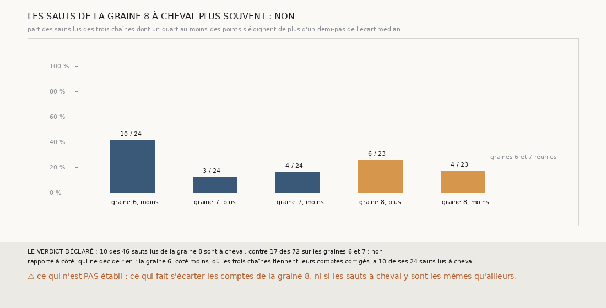

# `378` — Sur PHerc0358, les sauts des chaînes de la graine 8 sont-ils à cheval plus souvent que ceux des graines 6 et 7 ? Non : 10 sur 46, contre 17 sur 72

*`377` a trouvé la nappe de départ de la tierce de la graine 8 à cheval sur deux feuilles, et la suivie et la compagne parties de la même
feuille avec des comptes qui s'écartent quand même. Chaque surface d'une chaîne est regrandie à chaque saut : une surface aussi peut se
mettre à cheval. Cette tranche juge chaque saut des trois chaînes : à cheval si un quart au moins de ses points s'éloignent de plus d'un
demi-pas de son écart médian. Sur la graine 8, 10 des 46 sauts lus le sont, contre 17 des 72 sur les graines 6 et 7 : par la règle
déclarée, non. La graine 6, côté moins, où les trois chaînes tiennent leurs comptes, en a le plus, 10 sur 24.*

## 0. Pourquoi cette tranche

C'est `R4-P175`, et c'est `#5`. Si les surfaces de la graine 8 étaient plus souvent à cheval, le compte de ses sauts, lu sur leur médiane,
serait ce qui fait s'écarter ses chaînes.

## 1. Ce qui a été vu avant d'écrire

Tout ce que `296` à `377` publient, dont `R4-F563`, et les écarts médians des sauts que `369` publie.

## 2. Ce qui est fait

- **Les chaînes** : les trois chaînes de `373`, rejouées ; l'écart médian de chacun de leurs sauts redonne celui que `369` et `373`
  publient.
- **Chaque saut** : les points de sa surface en face de la surface d'où il part, à trois pas au plus ; lu si 50 points au moins sont en
  face ; **à cheval** si un quart au moins de ces points s'éloignent de plus d'un demi-pas, 10 voxels, de l'écart médian du saut.
- **La règle** : oui si au moins la moitié des sauts lus de la graine 8 sont à cheval et au plus 10 % de ceux des graines 6 et 7 ; non si
  la part de la graine 8 ne dépasse pas celle des graines 6 et 7 ; en partie sinon.

`m7` a été lu en 11767 chunks, sans panne, en 132,1 secondes.

## 3. Ce que disent les sauts

| côté | sauts lus | à cheval |
|---|---|---|
| graine 6, moins | 24 | 10 |
| graine 7, plus | 24 | 3 |
| graine 7, moins | 24 | 4 |
| graine 8, plus | 23 | 6 |
| graine 8, moins | 23 | 4 |

⭐⭐⭐⭐ **Les sauts de la graine 8 ne sont pas plus souvent à cheval que ceux des graines 6 et 7** (`R4-F564`). 10 des 46 sauts lus de la
graine 8 le sont, contre 17 des 72 sur les graines 6 et 7, une part un peu plus petite.

⚠ Le côté qui en a le plus est la graine 6, côté moins, 10 sur 24, celui où les trois chaînes tiennent leurs comptes corrigés deux à
deux. Un saut à cheval ne suffit pas à faire glisser une chaîne.

## 4. Le verdict

**10 DES 46 SAUTS LUS DE LA GRAINE 8 SONT À CHEVAL, CONTRE 17 DES 72 SUR LES GRAINES 6 ET 7 : NON**

`R4-P175` est répondue : non. Ni les nappes de la suivie et de la compagne (`377`), ni des sauts à cheval plus fréquents n'expliquent que
les comptes de la graine 8 s'écartent.

## 5. Ce que cette tranche ne dit pas

- ⚠⚠ Ce qui fait s'écarter les comptes de la graine 8.
- ⚠ Si les sauts à cheval de la graine 8 tombent là où ses paires cessent de tenir les comptes.

## 6. Les sondes

Une batterie de **8** contrôles et une figure de **16**. Treize règles cassées exprès ont fait échouer la batterie : l'écart mesuré au zéro
au lieu de la médiane, le quart de pas au lieu du demi-pas, le quart strict, la portée d'un pas et demi, la moyenne, le minimum de points
ôté, le départ figé sur la nappe, les sauts non lus comptés, la graine 8 parmi les témoins, « oui » sans regarder les témoins, « non »
strict, le minimum d'un groupe ôté et la redite ôtée. Les sauts non lus comptés faisaient d'abord lever la batterie hors d'un contrôle ;
ce contrôle l'enveloppe désormais. Huit sondes de la figure l'ont fait échouer.

## 7. Ce qui reste

`R4-P176` s'ouvre : sur PHerc0358, l'accord de trois chaînes valide-t-il des surfaces sur les côtés de graine que `324` n'a pas retenus,
là où son saut ne pose pas au pas ? `R4-P151`, l'encre, reste en attente de l'auteur.
