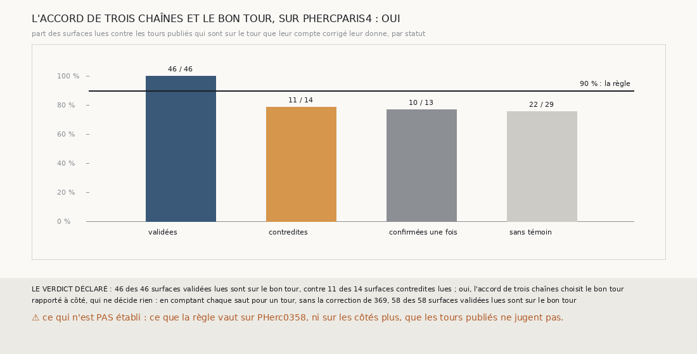

# `379` — Sur PHercParis4, une surface que l'accord de trois chaînes valide est-elle sur le bon tour publié ? Oui : 46 sur 46, contre 11 sur 14 contredites

*`374` a validé 25 surfaces de PHerc0358 par l'accord de trois chaînes, mais PHerc0358 n'a aucun tracé : rien n'y dit si ces surfaces sont
sur le bon tour. Cette tranche rejoue la règle de `374`, telle quelle, sur PHercParis4, dont les tours publiés `5753_0` à `5753_-7` donnent
une vérité. Sur les 109 surfaces que la règle valide, 46 sont lues contre les tours publiés, et les 46 sont sur le tour que leur compte
corrigé leur donne, jusqu'à 6 tours de leur référence. Les surfaces contredites lues ne le sont que 11 fois sur 14 : par la règle déclarée,
oui, l'accord de trois chaînes choisit le bon tour.*

## 0. Pourquoi cette tranche

C'est `R4-P177`, ouverte et répondue ici, et c'est l'issue #19. L'accord de trois chaînes est un juge sans tracé ; avant que le logiciel
ne s'appuie sur lui, il faut savoir s'il choisit le bon tour là où une vérité existe.

## 1. Ce qui a été vu avant d'écrire

Tout ce que `296` à `378` publient, dont `R4-F560`, `R4-F553` et `R4-F556` : la règle des sauts doubles de `369` ne voit pas un saut de
deux tours sur PHercParis4.

## 2. Ce qui est fait

- **Les chaînes** : sur les seize côtés de graine de PHercParis4, la chaîne d'une maille de `365` depuis la nappe de la graine, depuis la
  graine compagne de `368` et depuis la graine tierce de `373`. La suivie redonne la justesse que `365` publie saut par saut, sur les
  seize côtés, et la lecture de ses surfaces contre les tours publiés redonne celle de `331`.
- **Les comptes corrigés et les paires** : ceux de `369` et de `367`, au pas de PHercParis4, 18,02 voxels.
- **La validation** : celle de `374`, sans changement.
- **La vérité** : la référence d'une chaîne est la première de sa nappe et de ses surfaces qui retrouve un seul tour publié ; une surface
  après elle est **lue** si elle retrouve un seul tour, et **sur le bon tour** si ce tour s'écarte de celui de la référence d'autant que
  son compte corrigé s'écarte du sien.
- **La règle** : oui si au moins 90 % des surfaces validées lues sont sur le bon tour, et plus souvent que les contredites lues.

`m7` a été lu en 35964 chunks, sans panne, en 529,3 secondes.

## 3. Ce que disent les tours publiés

| statut | surfaces | lues | sur le bon tour |
|---|---|---|---|
| validée | 109 | 46 | 46 |
| contredite | 152 | 14 | 11 |
| confirmée une fois | 41 | 13 | 10 |
| sans témoin | 76 | 29 | 22 |

⭐⭐⭐⭐⭐ **Sur PHercParis4, une surface que l'accord de trois chaînes valide est sur le bon tour publié** (`R4-F565`). Les 46 surfaces
validées lues sont sur le tour que leur compte corrigé leur donne, de `5753_-1` à `5753_-6`, jusqu'à 6 tours de leur référence. Elles
viennent des côtés moins des graines 6 (18), 5 (15), 4 (8) et 1 (5).

⚠ La règle est prudente plutôt que juste partout : 11 des 14 surfaces contredites lues sont aussi sur le bon tour. Les 3 qui ne le sont
pas sont des surfaces de suivies dont un saut a été compté double par `369`, sur les graines 1 et 3, côtés moins. Sur la graine 1, la
suivie compte son cinquième saut double : sa huitième surface est sur le mauvais tour, contredite par les deux autres, et elle contredit à
son tour sept surfaces de la compagne et de la tierce qui sont, elles, sur leur tour.

⚠ Seuls les côtés moins sont lus : les tours publiés vont vers l'intérieur, et les côtés plus n'ont pas de tour attendu. 102 des
378 surfaces des trois chaînes sont lues.

Rapporté à côté, qui ne décide rien : en comptant chaque saut pour un tour, sans la correction de `369`, 58 des 58 surfaces validées lues
sont sur le bon tour.

## 4. Le verdict

**46 DES 46 SURFACES VALIDÉES LUES SONT SUR LE BON TOUR, CONTRE 11 DES 14 SURFACES CONTREDITES LUES : OUI**

`R4-P177` est répondue : oui. Là où une vérité existe, l'accord de trois chaînes ne valide que des surfaces sur le bon tour. C'est ce qui
manquait à `374` pour devenir un juge sur lequel le logiciel puisse s'appuyer.

## 5. Ce que cette tranche ne dit pas

- ⚠⚠ Ce que la règle vaut sur PHerc0358, dont les feuilles sont plus inégalement espacées, et où la graine 8 ne valide rien.
- ⚠ Ce qu'elle vaut sur les côtés plus, que les tours publiés ne jugent pas.
- ⚠ Si une règle des sauts doubles juste changerait quelque chose : sur PHercParis4, les comptes bruts donnent le même verdict.

## 6. Les sondes

Une batterie de **12** contrôles et une figure de **18**. Seize règles cassées exprès ont fait échouer la batterie : le quart de pas de
PHerc0358, le double au pas, le nul strict, un saut non lu compté nul, le départ figé sur la nappe, la portée des sauts pour les paires, le
minimum de points ôté, une référence à deux tours, le sens du côté ignoré, la référence comptée comme lue, une surface à deux tours lue,
les surfaces non lues comptées, « oui » sans regarder les contredites, « non » à la moitié, le minimum de surfaces et la redite ôtés. Le
nul strict, le départ figé et le sens ignoré passaient d'abord : trois contrôles les lisent désormais. Neuf sondes de la figure l'ont fait
échouer.

## 7. Ce qui reste

`R4-P176`, ouverte par `378`, reste ouverte : l'accord de trois chaînes valide-t-il des surfaces sur les côtés de graine que `324` n'a pas
retenus ? `R4-P151`, l'encre, reste en attente de l'auteur.
