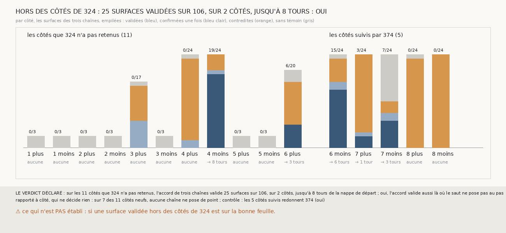

# `380` — Sur PHerc0358, l'accord de trois chaînes valide-t-il des surfaces sur les côtés que `324` n'a pas retenus ? Oui : 25 sur 106, sur 2 côtés, jusqu'à 8 tours

*`374` a validé 25 surfaces de PHerc0358 sur les cinq côtés de graine que `324` suivait parce que son saut y pose au pas. Cette tranche
lance les mêmes trois chaînes sur les seize côtés des huit graines et lit les onze autres avec la même règle. Sur ces onze côtés, 25 des
106 surfaces sont validées, sur la graine 4, côté moins, jusqu'à 8 tours de la nappe de départ, et sur la graine 6, côté plus, jusqu'à 3
tours : par la règle déclarée, oui. Partout où l'accord valide, le premier saut des trois chaînes tombe entre 1,67 et 1,93 pas et est
compté double.*

> ⚠⚠⚠⚠ **PRÉCISÉ PAR `384`, LE 2026-10-01.** Ce document compte les tours comme `369` : un saut de plus d'un pas et demi compte double.
> `384` compte les feuilles de `m7` que chaque saut franchit : les premiers sauts des graines 4, côté moins, et 6, côté plus, comptés
> doubles ici, n'en franchissent qu'une. **Les surfaces validées y sont donc à un tour de moins** : jusqu'à 7 tours sur la graine 4, côté
> moins, et 2 sur la graine 6, côté plus, au lieu de 8 et 3. ⭐ Les statuts et les paires de cette tranche sont intacts ; aux comptes de
> `m7`, la graine 4, côté plus, valide aussi 21 surfaces.

## 0. Pourquoi cette tranche

C'est `R4-P176`, ouverte par `378`, et c'est `#5`. Sur les cinq côtés suivis, l'accord de trois chaînes valide des surfaces sans tracé
(`R4-F560`), et sur PHercParis4 il ne valide que des surfaces sur le bon tour (`R4-F565`). Savoir s'il valide aussi sur les côtés que `324`
a écartés dit s'il tient comme méthode, ou seulement là où `324` l'a mis.

## 1. Ce qui a été vu avant d'écrire

Tout ce que `296` à `379` publient, dont `R4-F560`, `R4-F565`, et la table des côtés de `324` : sur les onze côtés non retenus, la part du
plan va de 0 à 0,19 et le pas médian, là où il existe, de 1,7 à 2,85 pas ; les graines 1, 2 et 5 n'ont aucune part du plan, sauf 0,0002
sur la graine 1, côté plus.

## 2. Ce qui est fait

- **Les chaînes** : les trois chaînes de `373`, la suivie, la compagne et la tierce, lancées sur les seize côtés au lieu des cinq. Pour
  cela, `les_chaines_de_0358` de `331` prend désormais les côtés à chaîner ; sans eux, elle chaîne les cinq côtés de toujours.
- **Les comptes et les témoins** : ceux de `369` et de `374`, inchangés. Un saut compte 0 s'il est nul (au plus un quart de pas), 2 s'il
  est double (plus d'un pas et demi), 1 sinon, au pas de PHerc0358, 20 voxels.
- **Le contrôle** : sur les cinq côtés suivis, les surfaces, leurs comptes et leurs statuts redonnent exactement ceux de `374`. Il tient.
- **La règle**, sur les onze côtés neufs : des surfaces validées sur au moins deux côtés, oui ; sur un seul, en partie ; sur aucun, non.

`m7` a été lu en 21324 chunks, dont 215 absents du dépôt, sans panne, en 131,8 secondes.

## 3. Ce que dit l'accord sur les côtés neufs

| côté | validées | confirmées une fois | contredites | sans témoin | premier saut des trois chaînes, en pas |
|---|---|---|---|---|---|
| graine 3, plus | 0 | 7 | 9 | 1 | 2,51 ; aucun point ; 1,99 |
| graine 4, plus | 0 | 2 | 21 | 1 | 1,40 ; 1,67 ; 1,76 |
| graine 4, moins | 19 | 1 | 4 | 0 | 1,84 ; 1,67 ; 1,81 |
| graine 6, plus | 6 | 0 | 11 | 3 | 1,76 ; 1,93 ; 1,67 |
| graines 1, 2 et 5, et graine 3, moins | 0 | 0 | 0 | 21 | aucun point |

⭐⭐⭐⭐⭐ **L'accord de trois chaînes valide aussi des surfaces sur les côtés que `324` n'a pas retenus** (`R4-F566`). Sur la graine 4,
côté moins, les trois couples tiennent leurs comptes, 28 paires sur 29, 32 sur 33 et 34 sur 34, et 19 des 24 surfaces sont validées,
jusqu'à 8 tours de la nappe de départ. Sur la graine 6, côté plus, 6 sont validées, à 2 et 3 tours, avant que la compagne ne perde ses
points : sa troisième surface en a 2, sa quatrième aucun.

⭐⭐⭐⭐ **Ce qui fait valider ces côtés, c'est le premier saut.** Le saut de `324` n'y pose pas au pas : il pose à deux pas. Les premiers
sauts des trois chaînes y font de 1,67 à 1,93 pas, et la règle des sauts doubles de `369` les compte 2 dans les trois chaînes : les comptes
corrigés absorbent ce que `324` écartait. Les surfaces validées commencent donc à 2 tours.

⚠ Sur la graine 4, côté plus, le premier saut de la suivie fait 1,40 pas, sous le seuil du double, quand ceux de la compagne et de la
tierce font 1,67 et 1,76 pas. La suivie compte un tour de moins que les deux autres dès sa première surface : la compagne et la tierce
tiennent leurs comptes entre elles, 27 paires sur 27, le vote désigne la suivie, et la suivie les contredit partout. Rien n'y est validé.

⚠ Sur sept des onze côtés, les graines 1, 2 et 5 et la graine 3, côté moins, aucune des trois chaînes ne pose un seul point : leur
première surface est vide, et l'accord n'a rien à juger. Ce sont les côtés où `324` ne trouvait pas de plan, au plus 0,0009. Sur la graine
3, côté plus, la compagne ne pose aucun point ; la suivie et la tierce tiennent 42 paires sur 48, sans troisième témoin.

## 4. Le verdict

**25 SURFACES VALIDÉES SUR 106, SUR 2 DES 11 CÔTÉS QUE `324` N'A PAS RETENUS, JUSQU'À 8 TOURS : OUI**

`R4-P176` est répondue : oui. L'accord de trois chaînes n'a pas besoin que le saut de `324` pose au pas : il lui suffit que les trois
chaînes comptent leur premier saut de la même façon. Sur PHerc0358, il valide désormais des surfaces sur cinq côtés, 50 en tout.

## 5. Ce que cette tranche ne dit pas

- ⚠⚠ Si les surfaces validées sur les côtés neufs sont sur la bonne feuille : PHerc0358 n'a pas de vérité, et la vérité de `379`, sur
  PHercParis4, ne jugeait pas de premier saut double. Un premier saut qui franchirait trois feuilles, compté double dans les trois chaînes,
  passerait aussi.
- ⚠ Si la suivie de la graine 4, côté plus, a glissé, ou si son premier saut à 1,40 pas a franchi deux feuilles comme les deux autres.

## 6. Les sondes

Une batterie de **8** contrôles et une figure de **21**. Sept règles cassées exprès ont fait échouer la batterie : le bilan sur les seize
côtés, un contrôle toujours vrai, un contrôle limité aux côtés présents, un contrôle sans les comptes, « oui » dès un côté, les paires de la
tierce ôtées, et tous les côtés pris pour suivis. Le contrôle sans les comptes passait d'abord : un contrôle les lit désormais. Cinq sondes
de la figure l'ont fait échouer ; deux passaient d'abord, l'ordre et les couleurs des statuts permutés ensemble, et les côtés suivis comptés
parmi les côtés sans point : deux contrôles les lisent désormais.

## 7. Ce qui reste

`R4-P178`, ouverte ici : sur la graine 4, côté plus, la suivie tient-elle les comptes avec les deux autres si son premier saut est compté
double comme les leurs ? `R4-P151`, l'encre, reste en attente de l'auteur.
