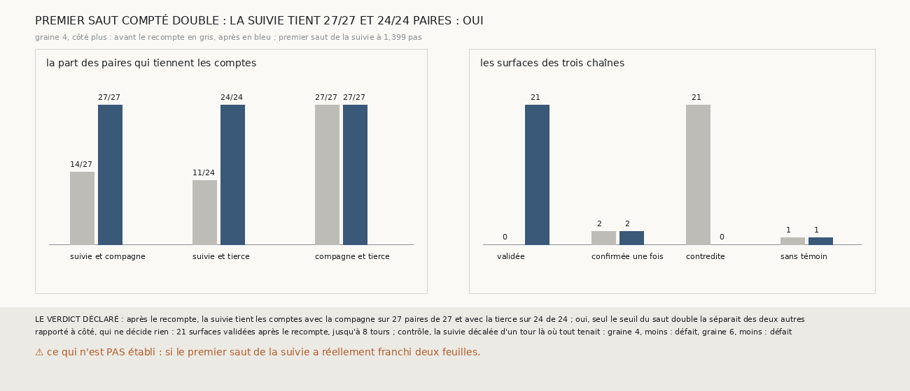

# `381` — Sur la graine 4, côté plus, de PHerc0358, la suivie tient-elle les comptes si son premier saut est compté double ? Oui : 27 paires sur 27 et 24 sur 24

*`380` a trouvé sur la graine 4, côté plus, une suivie que le vote désigne : son premier saut fait 1,40 pas et compte 1, quand ceux de la
compagne et de la tierce font 1,67 et 1,76 pas et comptent 2. Cette tranche recompte ce seul saut double, sans rien changer d'autre. La
suivie tient alors les comptes avec la compagne sur 27 paires de 27 et avec la tierce sur 24 de 24, et 21 surfaces sont validées jusqu'à 8
tours, aucune contredite : par la règle déclarée, oui, seul le seuil du saut double la séparait des deux autres.*

> ⚠⚠⚠⚠ **CORRIGÉ PAR `383`, LE 2026-10-01.** Ce document conclut que la suivie « comptait un tour de moins à son premier saut ».
> `383` compte les feuilles de `m7` que les premiers sauts franchissent : les trois en franchissent une, la suivie à 1,40 pas comme la
> compagne et la tierce à 1,67 et 1,76 pas, et les trois nappes sont sur la même feuille. **Ce sont la compagne et la tierce qui comptaient
> un tour de trop**, par la règle des sauts doubles de `369`. Le recompte fait bien tenir les paires, mais dans le sens de leur erreur : les
> 21 surfaces validées sont à 1 à 7 tours de la nappe, non à 2 à 8. ⭐ La mesure de cette tranche est intacte, et la suivie n'avait pas
> glissé.

## 0. Pourquoi cette tranche

C'est `R4-P178`, ouverte par `380`. Le vote de `372` désigne une chaîne qui a glissé, et l'accord de `374` la rejette. Si la chaîne
désignée n'a pas glissé, mais compte un tour de moins parce qu'un saut est tombé sous le seuil du double, l'accord peut corriger son compte
au lieu de la rejeter.

## 1. Ce qui a été vu avant d'écrire

Tout ce que `296` à `380` publient, dont `R4-F566` : sur la graine 4, côté plus, la compagne et la tierce tiennent leurs comptes entre
elles, 27 paires sur 27, et la suivie les tient avec elles sur 14 paires de 27 et 11 de 24. ⚠ Cette tranche ne lit pas `m7` : elle relit
les paires et les sauts que `380` publie.

## 2. Ce qui est fait

- **Le recompte** : le premier saut de la suivie, à 27,976 voxels d'écart médian, compté double ; ses autres sauts inchangés, ses comptes
  corrigés relevés d'un tour. Les paires, et ce que « même feuille » y dit, ne changent pas.
- **Les couples, le vote et les statuts** : ceux de `372`, `373` et `374`, lus comme `380` les lit. La relecture redonne les statuts et
  les couples que `380` publie sur ce côté.
- **Le contrôle** : sur les côtés de `380` où les trois couples tiennent, la graine 4, côté moins, et la graine 6, côté moins, décaler
  d'un tour les comptes de la suivie défait ses deux couples. Il tient : un couple ne tient pas à un tour près.
- **La règle** : les deux couples de la suivie tiennent après le recompte, oui ; aucun, non ; un seul, en partie.

## 3. Ce que dit le recompte

| couple | avant | après |
|---|---|---|
| suivie et compagne | 14 sur 27 | 27 sur 27 |
| suivie et tierce | 11 sur 24 | 24 sur 24 |
| compagne et tierce | 27 sur 27 | 27 sur 27 |

⭐⭐⭐⭐⭐ **Un saut recompté suffit à faire tenir la suivie avec les deux autres** (`R4-F567`). Après le recompte, toutes les paires des
trois couples tiennent les comptes, le vote ne désigne plus aucune chaîne, et 21 des 24 surfaces sont validées, les sept premières de
chaque chaîne, jusqu'à 8 tours de la nappe de départ. Avant, aucune ne l'était et 21 étaient contredites ; après, aucune ne l'est.

⚠ Les huitièmes surfaces, à 9 tours, ne sont pas validées : celle de la suivie n'a pas de témoin, celles de la compagne et de la tierce ne
sont confirmées qu'une fois.

⭐⭐⭐⭐ **Ce que le contrôle dit** : là où les trois chaînes s'accordent, décaler la suivie d'un tour défait ses deux couples. L'accord des
paires ne pardonne donc pas un tour d'écart, et un recompte qui le rétablit partout n'est pas un accord trouvé par hasard.

## 4. Le verdict

**APRÈS LE RECOMPTE, LA SUIVIE TIENT LES COMPTES SUR 27 PAIRES DE 27 ET 24 DE 24 : OUI**

`R4-P178` est répondue : oui, seul le seuil du saut double séparait la suivie des deux autres. La chaîne que le vote désignait n'avait pas
glissé : elle comptait un tour de moins à son premier saut.

## 5. Ce que cette tranche ne dit pas

- ⚠⚠ Si le premier saut de la suivie a réellement franchi deux feuilles : le recompte fait tenir les paires, mais seul `m7` dirait ce qu'il
  y a entre la nappe et la première surface.
- ⚠⚠ Ce que vaudrait une règle : ici, le saut à recompter a été choisi parce que `380` l'avait nommé. Une règle qui chercherait seule le
  saut à recompter devrait être éprouvée là où une vérité existe.

## 6. Les sondes

Une batterie de **8** contrôles et une figure de **19**. Neuf règles cassées exprès ont fait échouer la batterie : un recompte sans cumul,
un recompte de tous les sauts, un nul décalé en nul, le contrôle sur tous les côtés, « oui » dès un couple, le contrôle ignoré, une
relecture non comparée, sans les couples, ou toujours vraie. La relecture non comparée passait d'abord : un contrôle la lit désormais.
Cinq sondes de la figure l'ont fait échouer ; le contrôle toujours dit défait passait d'abord, un contrôle le lit désormais.

## 7. Ce qui reste

`R4-P179`, ouverte ici : sur PHercParis4, où les tours publiés donnent une vérité, là où le vote désigne une chaîne, recompter d'un tour le
seul saut qui fait tenir ses deux couples met-il ses surfaces sur le bon tour publié ? `R4-P151`, l'encre, reste en attente de l'auteur.
