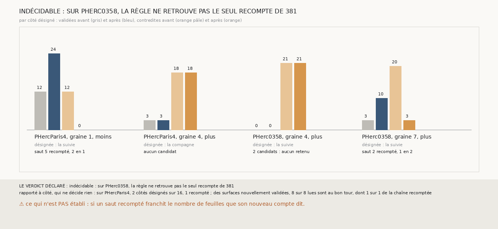

# `382` — Recompter le saut de la chaîne que le vote désigne la met-il sur le bon tour de PHercParis4 ? Indécidable : deux candidats sur la graine 4 de PHerc0358

*`381` a recompté à la main le premier saut de la suivie de la graine 4, côté plus, de PHerc0358, parce que `380` l'avait nommé. Cette
tranche écrit une règle qui cherche seule le saut à recompter : là où le vote désigne une chaîne, le seul saut qui, compté un tour de plus
ou de moins, fait tenir ses deux couples. Le contrôle échoue : sur la graine 4, côté plus, deux sauts de la suivie la font tenir, et la
règle n'en retient aucun. Par la règle déclarée, indécidable. Sur PHercParis4, le vote ne désigne une chaîne que sur 2 côtés sur 16, et le
seul recompte retenu corrige le saut que `379` accusait : les 8 surfaces qu'il fait valider et qui sont lues sont sur le bon tour.*

## 0. Pourquoi cette tranche

C'est `R4-P179`, ouverte par `381`. Un recompte choisi à la main ne vaut que pour le côté où on l'a choisi ; une règle qui cherche seule le
saut à recompter doit être éprouvée là où les tours publiés donnent une vérité.

## 1. Ce qui a été vu avant d'écrire

Tout ce que `296` à `381` publient, dont `R4-F565` et `R4-F567`. ⚠ Cette tranche ne lit pas `m7` : elle relit les paires, les comptes et les
tours retrouvés que `379` et `380` publient. Le vote sur PHercParis4 n'avait pas été calculé.

## 2. Ce qui est fait

- **Le vote** : celui de `372`, sur les couples de `373`, côté par côté, sur les seize côtés de PHercParis4 de `379` et les seize de
  PHerc0358 de `380`.
- **Les candidats** : chaque saut de la chaîne désignée compté un tour de plus ou de moins, un seul à la fois. Un candidat fait tenir la
  chaîne si ses deux couples tiennent alors ; le recompte n'est retenu que si un seul candidat la fait tenir.
- **La vérité** : celle de `379`, recalculée avec les comptes recomptés. Un recompte n'est jugeable que si la référence de sa chaîne précède
  le saut recompté : avant elle, il décale d'autant la référence et les surfaces, et les tours publiés n'en disent rien.
- **Le contrôle** : sur PHerc0358, la règle doit retrouver le recompte de `381`, et lui seul.
- **La règle** : 90 % des surfaces de la chaîne recomptée que le recompte fait valider et qui sont lues sur le bon tour, oui ; moins
  de 75 %, non. Indécidable sous 5 surfaces lues, ou si le contrôle échoue.

## 3. Ce que trouve la règle

| côté désigné | chaîne | candidats qui la font tenir | recompte retenu |
|---|---|---|---|
| PHercParis4, graine 1, moins | suivie | 1 : le saut 5, de 2 à 1 (18 paires sur 18, 20 sur 20) | le saut 5 |
| PHercParis4, graine 4, plus | compagne | aucun | aucun |
| PHerc0358, graine 4, plus | suivie | 2 : le saut 1, de 1 à 2 (27 sur 27, 24 sur 24) ; le saut 2, de 1 à 2 (26 sur 27, 23 sur 24) | aucun |
| PHerc0358, graine 7, plus | suivie | 1 : le saut 2, de 1 à 2 (22 sur 22, 24 sur 26) | le saut 2 |

⚠⚠ **Le contrôle échoue, et pour une raison qui se lit.** Sur la graine 4, côté plus, de PHerc0358, compter double le deuxième saut de la
suivie au lieu du premier laisse sa première surface à un tour d'écart des deux autres, et seulement elle : une paire sur 27 et une sur 24
ne tiennent plus. Un couple tient à 90 % de ses paires, donc les deux candidats passent, et la règle, qui veut un seul candidat, n'en
retient aucun. Le candidat de `381` est le seul qui fait tenir toutes les paires.

⭐⭐⭐⭐ **Sur PHercParis4, le seul recompte retenu corrige le saut que `379` accusait** (`R4-F568`). Sur la graine 1, côté moins, la suivie
comptait son cinquième saut double, et sa huitième surface était sur le mauvais tour. La règle le recompte simple : ses deux couples
tiennent toutes leurs paires, les 12 surfaces contredites du côté deviennent validées, et les 8 qui sont lues sont sur le bon tour publié,
dont la huitième de la suivie. Le recompte est jugeable : la référence de la suivie est sa deuxième surface.

⚠ C'est trop peu pour la règle : une seule surface lue de la chaîne recomptée, sous les 5 exigées. Sur PHercParis4, le vote ne désigne une
chaîne que sur 2 des 16 côtés, et sur la graine 4, côté plus, aucun saut recompté ne fait tenir la compagne.

⚠ Sur PHerc0358, la graine 7, côté plus, dont `374` rejetait la suivie, est recomptée : son deuxième saut, à 23,438 voxels, soit 1,17 pas,
compté double, les surfaces validées passent de 3 à 10 et les contredites de 20 à 3. PHerc0358 n'a pas de vérité pour le juger.

## 4. Le verdict

**INDÉCIDABLE : SUR PHERC0358, LA RÈGLE NE RETROUVE PAS LE SEUL RECOMPTE DE `381`**

`R4-P179` est répondue : indécidable. La règle déclarée ne sépare pas deux sauts voisins quand un couple tolère une paire sur dix, et
PHercParis4 n'offre que deux côtés désignés, un seul recompté.

## 5. Ce que cette tranche ne dit pas

- ⚠⚠ Si un saut recompté franchit le nombre de feuilles que son nouveau compte dit : seul `m7`, lu le long du saut, le dirait.
- ⚠ Ce que vaudrait une règle qui retiendrait le candidat faisant tenir le plus de paires : elle a été pensée après avoir vu la sortie, et
  n'est pas éprouvée ici.

## 6. Les sondes

Une batterie de **16** contrôles et une figure de **17**. Onze règles cassées exprès ont fait échouer la batterie : le premier candidat
retenu, un seul couple qui suffit, des candidats de deux tours, la vérité non recalculée, toutes les validées comptées nouvelles, le
contrôle sur la présence seule, « oui » à 75 %, le minimum ôté, un recompte toujours jugeable, jugeable au saut de la référence, et le bilan
sans filtre. Un seul couple qui suffit, la vérité non recalculée et les validées comptées nouvelles passaient d'abord : trois contrôles les
lisent désormais. Cinq sondes de la figure l'ont fait échouer.

## 7. Ce qui reste

`R4-P180`, ouverte ici : sur PHerc0358, les feuilles de `m7` franchies entre la nappe et la première surface des trois chaînes de la graine
4, côté plus, disent-elles que le premier saut de la suivie, à 1,40 pas, en franchit deux comme les autres ? C'est le témoin que ni l'accord
ni le recompte ne peuvent donner. `R4-P151`, l'encre, reste en attente de l'auteur.
