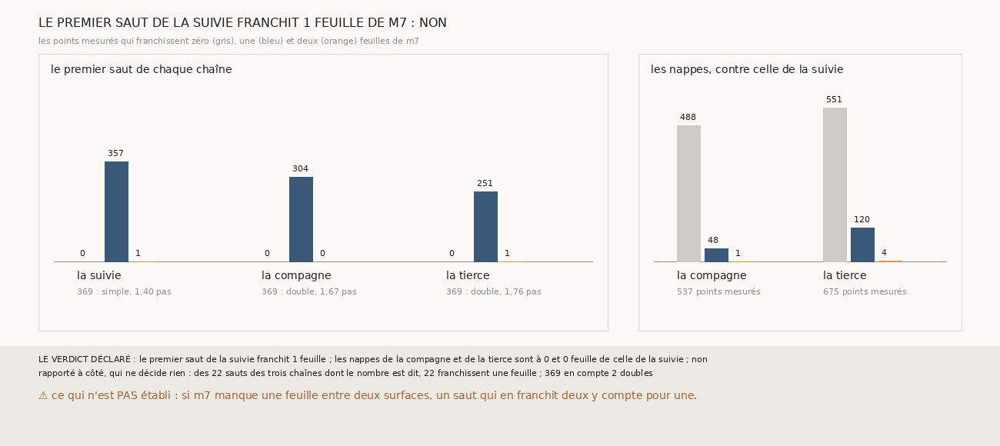

# `383` — Sur la graine 4, côté plus, de PHerc0358, `m7` dit-il que le premier saut de la suivie franchit deux feuilles ? Non : les trois premiers sauts en franchissent une

*`381` a fait tenir la suivie de la graine 4, côté plus, en comptant double son premier saut, à 1,40 pas, comme `369` compte ceux de la
compagne et de la tierce, à 1,67 et 1,76 pas. Cette tranche compte les feuilles de `m7` que ces sauts franchissent, point par point. Les
trois premiers sauts en franchissent une, la suivie 357 points sur 358, la compagne 304 sur 304, la tierce 251 sur 252, et les trois
nappes de départ sont sur la même feuille : par la règle déclarée, non. Ce n'est pas la suivie qui comptait un tour de moins, ce sont la
compagne et la tierce qui en comptaient un de trop.*

## 0. Pourquoi cette tranche

C'est `R4-P180`, ouverte par `382`. L'accord et le recompte disent qu'un saut compté double fait tenir la suivie, mais ni l'un ni l'autre ne
voit ce qu'il y a entre la nappe et la première surface. Deux explications rendaient les mêmes paires : le premier saut de la suivie
franchit deux feuilles à un écart court, ou il n'en franchit qu'une et les nappes des deux autres sont une feuille plus loin. `m7`, lu le
long du saut, est le seul témoin indépendant sur un rouleau sans tracé.

## 1. Ce qui a été vu avant d'écrire

Tout ce que `296` à `382` publient, dont `R4-F567`, `R4-F568` et `R4-F540` : sur PHerc0358, le compte des feuilles de `345` mesure les
sauts au pas de 20 voxels et à une portée latérale de 0,555 pas.

## 2. Ce qui est fait

- **Les chaînes** : les trois chaînes de `373` sur la graine 4, côté plus, rejouées ; leurs surfaces redonnent les points, et leurs sauts
  les écarts, que `380` publie.
- **Le compte** : celui de `345`, comme `354` le porte sur PHerc0358. Le nombre de feuilles d'un saut est le compte que porte le plus de
  points mesurés, s'il y en a au moins 50 et qu'aucun autre n'en porte autant.
- **La règle** : le premier saut de la suivie franchit deux feuilles et les trois nappes sont sur la même feuille, oui ; il n'en franchit
  qu'une, non ; sinon, en partie.

`m7` a été lu en 2389 chunks, sans panne, en 12,8 secondes.

## 3. Ce que dit `m7`

| | genre que `369` lui donne | écart | points mesurés | une feuille | deux feuilles |
|---|---|---|---|---|---|
| premier saut de la suivie | simple | 1,40 pas | 358 | 357 | 1 |
| premier saut de la compagne | double | 1,67 pas | 304 | 304 | 0 |
| premier saut de la tierce | double | 1,76 pas | 252 | 251 | 1 |

⭐⭐⭐⭐⭐ **Les trois premiers sauts franchissent une feuille de `m7`** (`R4-F569`). Celui de la suivie aussi, et ceux de la compagne et de
la tierce aussi, que `369` compte doubles parce qu'ils dépassent un pas et demi. Les nappes de la compagne et de la tierce sont sur la
feuille de celle de la suivie : 488 des 537 points mesurés de l'une, et 551 des 675 de l'autre, ne franchissent aucune feuille.

⭐⭐⭐⭐ **Le désaccord venait donc de la règle des sauts doubles, appliquée aux deux autres.** Sur ce côté, les feuilles sont à 1,40 à 1,76
pas l'une de l'autre au premier saut : un écart qui passe le pas et demi n'y franchit pas deux feuilles. La suivie comptait juste ; le
recompte de `381` l'a alignée sur l'erreur des deux autres, et les 21 surfaces qu'il valide sont à 1 à 7 tours de la nappe, non à 2 à 8.

Rapporté à côté : des 24 sauts des trois chaînes, 22 ont un nombre de feuilles dit, et les 22 en franchissent une ; `369` en compte 2
doubles, les deux premiers sauts ci-dessus.

## 4. Le verdict

**LE PREMIER SAUT DE LA SUIVIE FRANCHIT 1 FEUILLE, LES NAPPES SONT SUR LA MÊME FEUILLE : NON**

`R4-P180` est répondue : non. `m7` ne dit pas ce que dit le recompte de `381` ; il dit que la suivie avait le bon compte, et que la compagne
et la tierce comptaient un tour de trop. `381` est corrigé sur place par un renvoi.

## 5. Ce que cette tranche ne dit pas

- ⚠⚠ Si `m7` manque une feuille entre la nappe et la première surface : un saut qui en franchit deux y compterait pour une. Sur PHercParis4,
  le compte de `345` tenait 3 des 6 sauts faux (`R4-F531`). Ici, les trois sauts le disent ensemble, à un point près sur chacun.
- ⚠⚠ Ce que valent les premiers sauts que `369` compte doubles sur les graines 4, côté moins, et 6, côté plus, où `380` valide 25 surfaces :
  s'ils franchissent aussi une seule feuille, leurs comptes ont aussi un tour de trop.

## 6. Les sondes

Une batterie de **8** contrôles et une figure de **18**. Sept règles cassées exprès ont fait échouer la batterie : une égalité tranchée au
premier compte, le minimum de 50 points ôté, tous les sauts comptés depuis la nappe, la portée latérale de PHercParis4, « oui » sans
regarder les nappes, la redite sans les écarts, et « non » dès que ce n'est pas deux. Cinq sondes de la figure l'ont fait échouer ; le
compte des sauts d'une feuille pris sur tous passait d'abord, un contrôle le lit désormais.

## 7. Ce qui reste

`R4-P181`, ouverte ici : sur PHerc0358, les sauts que `369` compte doubles franchissent-ils deux feuilles de `m7`, et que deviennent les
comptes des surfaces que l'accord valide ? `R4-P151`, l'encre, reste en attente de l'auteur.
