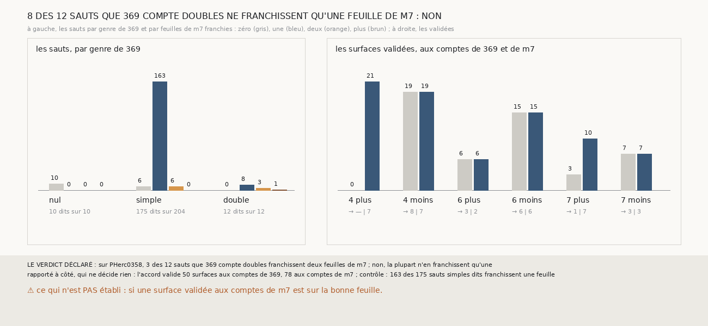

# `384` — Sur PHerc0358, les sauts que `369` compte doubles franchissent-ils deux feuilles de `m7` ? Non : 8 des 12 n'en franchissent qu'une

*`383` a trouvé sur la graine 4, côté plus, deux sauts de 1,67 et 1,76 pas que `369` compte doubles et qui ne franchissent qu'une feuille de
`m7`. Cette tranche compte les feuilles de `m7` de chaque saut des trois chaînes, sur les seize côtés de PHerc0358. Des 12 sauts que `369`
compte doubles, 8 n'en franchissent qu'une, 3 en franchissent deux et 1 trois : par la règle déclarée, non. Là où `369` est sans ambiguïté,
`m7` dit comme lui : les 10 sauts nuls ne franchissent aucune feuille, et 163 des 175 sauts simples dits une seule. Aux comptes de `m7`,
l'accord de trois chaînes valide 78 surfaces sur 6 côtés, contre 50 sur 5 aux comptes de `369`.*

## 0. Pourquoi cette tranche

C'est `R4-P181`, ouverte par `383`. Une surface validée porte un compte, le nombre de tours qui la sépare de la nappe de départ ; un saut
compté double à tort fausse d'un tour tous les comptes qui le suivent, et l'accord valide alors des surfaces sur la bonne feuille au mauvais
compte.

## 1. Ce qui a été vu avant d'écrire

Tout ce que `296` à `383` publient, dont `R4-F569`, `R4-F566`, et la liste des sauts de `380` : 12 sauts comptés doubles sur les seize
côtés, dont 10 premiers sauts.

## 2. Ce qui est fait

- **Les chaînes** : les trois chaînes de `373` sur les seize côtés, rejouées ; leurs surfaces redonnent les points et les écarts de `380`,
  et les statuts que donnent les comptes de `369` sont ceux de `380`.
- **Le compte** : celui de `383`, pour chaque saut : le nombre de feuilles de `m7` que porte le plus de points mesurés, au moins 50, sans
  égal.
- **Les comptes de `m7`** : chaque saut ajoute le nombre de feuilles qu'il franchit là où il est dit, ailleurs ce que `369` lui donne ;
  l'accord de `374` est relu avec ces comptes, sur les mêmes paires.
- **Le contrôle** : là où `369` compte un saut simple, `m7` dit une feuille sous au moins 75 % des sauts dits. Il tient : 163 sur 175, soit
  93 %.
- **La règle** : au moins 75 % des sauts doubles dits à deux feuilles, oui ; au plus 25 %, non ; sinon, en partie.

`m7` a été lu en 23960 chunks, dont 183 absents du dépôt, sans panne, en 139,2 secondes.

## 3. Ce que dit `m7`

| genre que `369` donne | sauts | dits | zéro feuille | une | deux | plus |
|---|---|---|---|---|---|---|
| nul | 10 | 10 | 10 | 0 | 0 | 0 |
| simple | 204 | 175 | 6 | 163 | 6 | 0 |
| double | 12 | 12 | 0 | 8 | 3 | 1 |

⭐⭐⭐⭐⭐ **Sur PHerc0358, la plupart des sauts que `369` compte doubles ne franchissent qu'une feuille** (`R4-F570`). Les 8 sont des premiers
sauts, entre 1,67 et 1,93 pas : ceux de la compagne et de la tierce de la graine 4, côté plus, et ceux des trois chaînes des graines 4, côté
moins, et 6, côté plus. Les 3 qui en franchissent deux sont à 1,50, 1,60 et 1,99 pas ; le seul qui en franchit trois est le premier saut de
la suivie de la graine 3, côté plus, à 2,51 pas.

⚠ Le seuil d'un pas et demi se trompe dans les deux sens : 6 sauts simples franchissent deux feuilles, dont le deuxième de la suivie de la
graine 7, côté plus, à 1,17 pas, celle que le vote de `373` désignait comme ayant glissé.

| côté | validées, comptes de `369` | jusqu'à | validées, comptes de `m7` | jusqu'à |
|---|---|---|---|---|
| graine 4, plus | 0 | — | 21 | 7 tours |
| graine 4, moins | 19 | 8 tours | 19 | 7 tours |
| graine 6, plus | 6 | 3 tours | 6 | 2 tours |
| graine 6, moins | 15 | 6 tours | 15 | 6 tours |
| graine 7, plus | 3 | 1 tour | 10 | 7 tours |
| graine 7, moins | 7 | 3 tours | 7 | 3 tours |

⭐⭐⭐⭐ **Aux comptes de `m7`, l'accord valide 78 surfaces sur 6 côtés, jusqu'à 7 tours**, contre 50 sur 5 aux comptes de `369`. Il gagne
la graine 4, côté plus, et la graine 7, côté plus, où la chaîne que le vote rejetait n'avait pas glissé ; il retire un tour aux surfaces
des graines 4, côté moins, et 6, côté plus. Sur la graine 8, il ne valide toujours rien.

## 4. Le verdict

**3 DES 12 SAUTS QUE `369` COMPTE DOUBLES FRANCHISSENT DEUX FEUILLES DE `m7` : NON**

`R4-P181` est répondue : non, la plupart n'en franchissent qu'une. Sur PHerc0358, où les feuilles s'écartent inégalement, un écart en pas
ne dit pas combien de feuilles un saut franchit ; `m7` le dit, et dit comme `369` partout où `369` est sans ambiguïté. `380` et `374` sont
précisés sur place par un renvoi.

## 5. Ce que cette tranche ne dit pas

- ⚠⚠ Si une surface validée aux comptes de `m7` est sur la bonne feuille : PHerc0358 n'a pas de vérité. PHercParis4 en a une, et l'accord
  aux comptes de `m7` n'y a pas été éprouvé.
- ⚠ Si `m7` manque une feuille entre deux surfaces : un saut qui en franchit deux y compte pour une.

## 6. Les sondes

Une batterie de **7** contrôles et une figure de **20**. Six règles cassées exprès ont fait échouer la batterie : un zéro pris pour un
nombre absent, `m7` ignoré, trois feuilles comptées deux, le contrôle à 50 %, « non » sous la moitié, et le minimum ôté. Cinq sondes de la
figure l'ont fait échouer.

## 7. Ce qui reste

`R4-P182`, ouverte ici : sur PHercParis4, l'accord de trois chaînes aux comptes de `m7` valide-t-il des surfaces sur le bon tour publié, et
autant qu'aux comptes de `369` ? `R4-P151`, l'encre, reste en attente de l'auteur.
