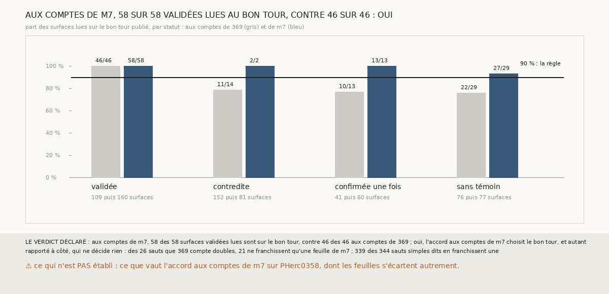

# `385` — Sur PHercParis4, l'accord de trois chaînes aux comptes de `m7` valide-t-il des surfaces sur le bon tour publié ? Oui : 58 sur 58, et 160 validées au lieu de 109

*`384` a montré que, sur PHerc0358, compter chaque saut par les feuilles de `m7` qu'il franchit change ce que l'accord de trois chaînes
valide, mais PHerc0358 n'a pas de vérité. Cette tranche rejoue l'accord de `379` sur PHercParis4, dont les tours publiés en donnent une,
aux comptes de `m7`. L'accord y valide 160 surfaces au lieu de 109 ; les 58 qui sont lues contre les tours publiés sont toutes sur le bon
tour, contre 46 sur 46 aux comptes de `369`. Par la règle déclarée, oui : l'accord aux comptes de `m7` choisit le bon tour, et sur plus de
surfaces.*

## 0. Pourquoi cette tranche

C'est `R4-P182`, ouverte par `384`. Sur PHerc0358, les comptes de `m7` font valider 78 surfaces au lieu de 50, et changent le compte de
certaines ; avant de s'y fier, il faut savoir s'ils comptent juste là où une vérité existe.

## 1. Ce qui a été vu avant d'écrire

Tout ce que `296` à `384` publient, dont `R4-F565`, `R4-F570` et `R4-F531` : sur PHercParis4, le compte des feuilles de `345` tient 95 des
104 sauts justes et 3 des 6 faux.

## 2. Ce qui est fait

- **Les chaînes, les paires et la vérité** : celles de `379`, rejouées ; aux comptes de `369`, le compte, le statut et la vérité de chaque
  surface redonnent ce que `379` publie.
- **Les comptes de `m7`** : chaque saut ajoute le nombre de feuilles de `m7` qu'il franchit, compté comme `384` au pas de PHercParis4,
  18,02 voxels ; ailleurs, ce que `369` lui donne. La vérité de `379` est recalculée avec ces comptes.
- **Le contrôle** : là où `369` compte un saut simple, `m7` dit une feuille sous au moins 75 % des sauts dits. Il tient : 339 sur 344.
- **La règle** : aux comptes de `m7`, au moins 90 % des surfaces validées lues sur le bon tour, et au moins autant de surfaces sur le bon
  tour qu'aux comptes de `369`, oui ; 90 % mais moins de surfaces, en partie ; sous 75 %, non.

`m7` a été lu en 35964 chunks, sans panne, en 510,7 secondes.

## 3. Ce que disent les tours publiés

| statut | surfaces, comptes de `369` | lues | sur le bon tour | surfaces, comptes de `m7` | lues | sur le bon tour |
|---|---|---|---|---|---|---|
| validée | 109 | 46 | 46 | 160 | 58 | 58 |
| contredite | 152 | 14 | 11 | 81 | 2 | 2 |
| confirmée une fois | 41 | 13 | 10 | 60 | 13 | 13 |
| sans témoin | 76 | 29 | 22 | 77 | 29 | 27 |

⭐⭐⭐⭐⭐ **Aux comptes de `m7`, l'accord de trois chaînes choisit le bon tour sur plus de surfaces** (`R4-F571`). Les 58 surfaces validées
lues sont toutes sur le tour que leur compte leur donne. Les contredites tombent de 152 à 81, et les deux qui restent lues sont aussi sur
le bon tour : les 3 contredites fausses de `379`, nées d'un saut compté double, ont disparu.

⭐⭐⭐⭐ **Sur PHercParis4 aussi, la plupart des sauts que `369` compte doubles ne franchissent qu'une feuille** : 21 sur 26, contre 4 qui
en franchissent deux et 1 trois. Les 3 sauts nuls ne franchissent aucune feuille. C'est ce que `370` mesurait autrement : deux tours y
font 21 à 24,5 voxels, sous le pas et demi de `369`, si bien que ses doubles sont surtout des sauts simples longs.

Rapporté à côté : compter chaque saut pour un tour, sans la correction de `369`, donnait aussi 58 sur 58 validées lues (`379`) ; les comptes
de `m7` arrivent au même compte de surfaces justes sans supposer que tous les sauts sont simples, ce que PHerc0358 dément (`R4-F570`).

## 4. Le verdict

**AUX COMPTES DE `m7`, 58 DES 58 SURFACES VALIDÉES LUES SONT SUR LE BON TOUR, CONTRE 46 DES 46 : OUI**

`R4-P182` est répondue : oui. Là où une vérité existe, compter les tours par les feuilles de `m7` que chaque saut franchit fait valider plus
de surfaces à l'accord de trois chaînes, sans en mettre une seule sur le mauvais tour. C'est la règle de compte que le logiciel peut porter.

## 5. Ce que cette tranche ne dit pas

- ⚠⚠ Ce que vaut l'accord aux comptes de `m7` sur PHerc0358, dont les feuilles s'écartent inégalement : PHercParis4 l'étalonne, il ne le
  mesure pas là-bas.
- ⚠ Si une surface validée non lue est sur le bon tour : 102 des 160 ne sont pas lues, les tours publiés ne couvrant pas toute la chaîne.

## 6. Les sondes

Une batterie de **7** contrôles et une figure de **17**. Sept règles cassées exprès ont fait échouer la batterie : `m7` ignoré, un zéro pris
pour un nombre absent, le pas de PHerc0358, « oui » sans comparer aux comptes de `369`, le contrôle à 50 %, la redite sans la vérité, et
trois feuilles comptées deux. Cinq sondes de la figure l'ont fait échouer.

## 7. Ce qui reste

`R4-P183`, ouverte ici : sur la graine 8 de PHerc0358, où l'accord aux comptes de `m7` ne valide toujours rien, les paires qui se
contredisent le font-elles dès le premier saut, ou à partir d'un saut que `m7` compte deux ? `R4-P151`, l'encre, reste en attente de
l'auteur.
