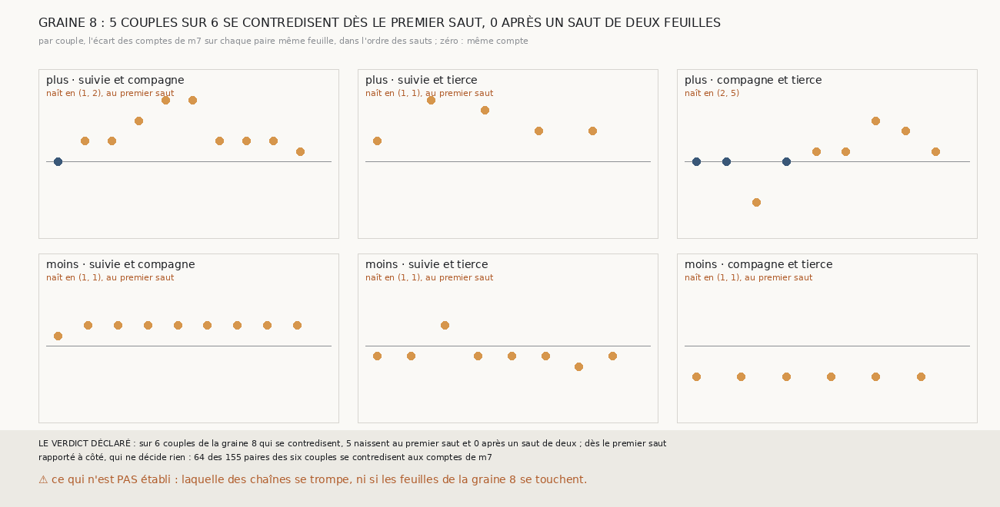

# `386` — Sur la graine 8 de PHerc0358, les contradictions naissent-elles au premier saut ou après un saut de deux feuilles ? Au premier saut : 5 couples sur 6

*`384` a montré qu'aux comptes de `m7`, l'accord de trois chaînes valide sur six côtés de PHerc0358, et toujours rien sur la graine 8. Cette
tranche relit les paires de la graine 8 aux comptes de `m7` et cherche, couple par couple, la première paire qui se contredit. Sur les 6
couples, 5 se contredisent dès leurs premières surfaces, aucun après un saut que `m7` compte deux : par la règle déclarée, dès le premier
saut. Sur le côté moins, les chaînes suivent pourtant les mêmes feuilles : leurs comptes y sont décalés d'un écart constant, et ces écarts
s'accordent entre eux.*

## 0. Pourquoi cette tranche

C'est `R4-P183`, ouverte par `385`. Une contradiction qui naît dès le premier saut dit que les chaînes partent de feuilles différentes, ou
que leur premier saut se trompe ; une contradiction qui naît après un saut de deux feuilles dit que ce saut sépare les chaînes. Les deux ne
se corrigent pas de la même façon.

## 1. Ce qui a été vu avant d'écrire

Tout ce que `296` à `385` publient, dont `R4-F570`, `R4-F561`, `R4-F563` et `R4-F564`. ⚠ Cette tranche ne lit pas `m7` : elle relit les
paires que `380` publie et les nombres de feuilles que `384` publie.

## 2. Ce qui est fait

- **Les paires et les comptes** : les paires des trois couples de la graine 8, des deux côtés, avec les comptes de `m7` de `384`.
- **Une paire contredit** si « même feuille » et « même compte » ne disent pas la même chose.
- **La naissance** d'un couple : sa première paire qui contredit, dans l'ordre du plus petit des deux sauts, puis du plus grand ; au premier
  saut si l'un des deux sauts est le premier, après un saut de deux si un saut des chemins qui y mènent franchit deux feuilles ou plus.
- **La règle** : deux tiers des couples au premier saut, dès le premier saut ; deux tiers après un saut de deux, à partir d'un saut de deux
  ; les deux, ou ni l'un ni l'autre partout.

## 3. Ce que disent les paires

| côté | couple | paires | contredisent | naissance |
|---|---|---|---|---|
| plus | suivie et compagne | 35 | 12 | (1, 2), au premier saut |
| plus | suivie et tierce | 17 | 6 | (1, 1), au premier saut |
| plus | compagne et tierce | 22 | 8 | (2, 5) |
| moins | suivie et compagne | 26 | 13 | (1, 1), au premier saut |
| moins | suivie et tierce | 29 | 17 | (1, 1), au premier saut |
| moins | compagne et tierce | 26 | 8 | (1, 1), au premier saut |

⭐⭐⭐⭐ **Sur la graine 8, les contradictions naissent au premier saut** (`R4-F572`). Dans 4 des 5 couples qui naissent là, la paire de
naissance est celle des deux premières surfaces, au même compte et sur deux feuilles différentes : les trois chaînes ne posent pas leur
première surface sur la même feuille. Aucune naissance ne suit un saut que `m7` compte deux.

⭐⭐⭐⭐ **Sur le côté moins, les trois chaînes suivent les mêmes feuilles à un écart de comptes constant.** Sur les paires même feuille, la
suivie compte 2 de plus que la compagne sur 8 paires de 9, 1 de moins que la tierce sur 6 de 8, et la compagne 3 de moins que la tierce sur
6 de 6 ; les trois écarts s'accordent, 2 et 1 font 3. La compagne pose sa première surface deux feuilles plus loin que la suivie, la tierce
une feuille en deçà.

⚠ Rapporté à côté : le premier saut de la compagne, côté moins, n'a que 32 points mesurés, sous les 50 qui font un nombre de feuilles, dont
16 en franchissent deux ; et `377` avait trouvé la nappe de la tierce à cheval sur deux feuilles. Sur le côté plus, l'écart varie de 0 à 6
le long des paires : là, les chaînes ne suivent pas les mêmes feuilles à un décalage près.

## 4. Le verdict

**5 COUPLES SUR 6 SE CONTREDISENT DÈS LE PREMIER SAUT, AUCUN APRÈS UN SAUT DE DEUX : DÈS LE PREMIER SAUT**

`R4-P183` est répondue : dès le premier saut. Sur la graine 8, ce qui empêche l'accord n'est pas un saut que `m7` compte mal en route, c'est
le départ : les premières surfaces des trois chaînes ne sont pas sur la même feuille.

## 5. Ce que cette tranche ne dit pas

- ⚠⚠ Laquelle des chaînes se trompe : un écart constant dit que les comptes partent d'origines différentes, pas laquelle est la bonne.
- ⚠ Si les feuilles de la graine 8, côté plus, se touchent : l'écart y varie, ce que cette tranche ne sait pas expliquer.

## 6. Les sondes

Une batterie de **11** contrôles et une figure de **18**. Sept règles cassées exprès ont fait échouer la batterie : une contradiction
réduite à la même feuille, l'ordre par le premier saut seul, les chemins entiers au lieu de ceux qui mènent à la paire, les sauts de deux
exactement, le premier saut des deux chaînes à la fois, la règle à la moitié, et le minimum ôté. L'ordre par le premier saut seul passait
d'abord : un contrôle le lit désormais. Cinq sondes de la figure l'ont fait échouer.

## 7. Ce qui reste

`R4-P184`, ouverte ici : là où deux chaînes ne posent pas leur première surface sur la même feuille, aligner leurs comptes sur leur première
paire même feuille fait-il valider des surfaces sur le bon tour de PHercParis4, et que donne-t-il sur la graine 8 ? `R4-P151`, l'encre,
reste en attente de l'auteur.
