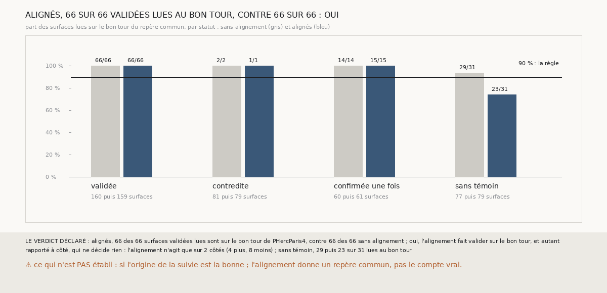

# `387` — Aligner les comptes de deux chaînes sur leur première paire même feuille fait-il valider sur le bon tour ? Oui par la règle, non en substance

*`386` a montré que, sur la graine 8 de PHerc0358, les trois chaînes suivent les mêmes feuilles à des écarts de comptes constants. Cette
tranche aligne les comptes de la compagne et de la tierce sur ceux de la suivie, par leur première paire même feuille, et juge l'accord sur
PHercParis4 dans un seul repère pour les trois chaînes. Alignés, 66 des 66 surfaces validées lues sont sur le bon tour, autant que sans
alignement : par la règle déclarée, oui. Mais l'alignement n'agit que sur deux côtés de PHercParis4, et sur celui que les tours publiés
jugent, il fait perdre leur tour à 6 surfaces lues de la tierce, sur la foi d'une seule paire même feuille, fausse. Sur la graine 8, il ne
valide qu'une surface.*

## 0. Pourquoi cette tranche

C'est `R4-P184`, ouverte par `386`. Compter chaque chaîne depuis sa propre nappe suppose que les trois partent de la même feuille ; là où ce
n'est pas le cas, une paire même feuille dit de combien leurs comptes diffèrent.

## 1. Ce qui a été vu avant d'écrire

Tout ce que `296` à `386` publient, dont `R4-F572` et `R4-F571`. ⚠ Cette tranche ne lit pas `m7` : elle relit les paires et les tours
retrouvés que `379` et `380` publient, et les comptes de `m7` de `384` et `385`.

## 2. Ce qui est fait

- **L'alignement** : sur chaque côté, la suivie sert de référence ; la première paire même feuille avec elle, dans l'ordre du plus petit
  des deux sauts puis du plus grand, décale les comptes de la compagne et de la tierce. Sans paire même feuille, rien n'est décalé.
- **La vérité, absolue** : la première surface qui retrouve un seul tour publié fixe le tour du compte zéro dans le repère commun ; toute
  autre surface qui retrouve un seul tour est sur le bon tour si ce tour est celui du compte zéro décalé de son compte. Contrairement à la
  vérité de `379`, elle juge les trois chaînes dans un seul repère, donc un alignement faux s'y voit.
- **La règle** : alignés, au moins 90 % des surfaces validées lues sur le bon tour, et au moins autant que sans alignement, oui.

## 3. Ce que disent les tours publiés

| statut | sans alignement : surfaces | lues | sur le bon tour | alignés : surfaces | lues | sur le bon tour |
|---|---|---|---|---|---|---|
| validée | 160 | 66 | 66 | 159 | 66 | 66 |
| contredite | 81 | 2 | 2 | 79 | 1 | 1 |
| confirmée une fois | 60 | 14 | 14 | 61 | 15 | 15 |
| sans témoin | 77 | 31 | 29 | 79 | 31 | 23 |

⭐⭐⭐⭐ **Dans un seul repère pour les trois chaînes, l'accord aux comptes de `m7` reste juste** (`R4-F573`) : sans aucun alignement, les
66 surfaces validées lues sont sur le tour que leur compte leur donne dans le repère de la suivie. C'est plus exigeant que la vérité de
`379`, qui jugeait chaque chaîne dans son propre repère.

⚠⚠ **L'alignement sur une seule paire est fragile.** Sur PHercParis4, il n'agit que sur la graine 4, côté plus, que les tours publiés ne
jugent pas, et sur la graine 8, côté moins. Là, les trois chaînes retrouvent pourtant les mêmes tours publiés aux mêmes comptes ; la seule
paire même feuille de la suivie et de la tierce, sa troisième surface et la cinquième de la tierce, à 81 points en face, est fausse, et
l'alignement décale la tierce de 2 : ses 6 surfaces lues quittent leur tour. Sur PHerc0358, il ne change que la graine 8, côté moins, où il
valide une surface.

## 4. Le verdict

**ALIGNÉS, 66 DES 66 SURFACES VALIDÉES LUES SONT SUR LE BON TOUR, CONTRE 66 DES 66 SANS ALIGNEMENT : OUI**

`R4-P184` est répondue : oui par la règle, non en substance. La règle ne regardait que les surfaces validées, et la graine 8, côté
moins, n'en a ni avant ni après ; elle ne voyait pas les surfaces que l'alignement déplace. Un écart pris sur une seule paire peut venir
d'une paire fausse, et le juge de `367` en laisse passer.

## 5. Ce que cette tranche ne dit pas

- ⚠⚠ Ce que vaudrait un écart pris sur plusieurs paires qui s'accordent, comme les écarts constants de la graine 8, côté moins, de
  PHerc0358 : cette idée vient de la sortie de cette tranche, elle n'y est pas éprouvée.
- ⚠ Si l'origine de la suivie est la bonne : l'alignement donne un repère commun, pas le compte vrai depuis la nappe.

## 6. Les sondes

Une batterie de **9** contrôles et une figure de **17**. Sept règles cassées exprès ont fait échouer la batterie : l'écart pris par le
premier saut seul, l'écart de signe inverse, le repère absent, la lecture qui fixe le repère comptée lue, le sens du côté ignoré, « oui »
sans comparer, et le minimum ôté. Trois sondes de la figure l'ont fait échouer.

## 7. Ce qui reste

`R4-P185`, ouverte ici : un écart pris sur au moins cinq paires même feuille qui s'accordent aligne-t-il les comptes sans mettre une surface
lue de PHercParis4 hors de son tour, et que valide-t-il sur la graine 8 de PHerc0358 ? `R4-P151`, l'encre, reste en attente de l'auteur.
