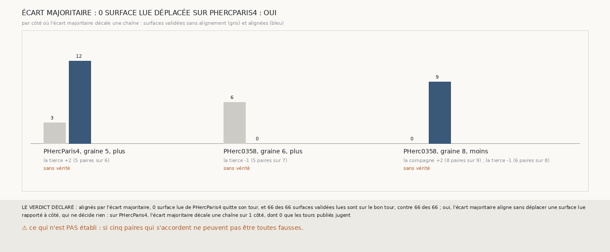

# `388` — Un écart pris sur cinq paires qui s'accordent aligne-t-il les comptes sans déplacer une surface lue ? Oui par la règle, sans que les tours publiés aient rien à juger

*`387` a montré qu'aligner deux chaînes sur une seule paire même feuille peut venir d'une paire fausse. Cette tranche ne retient un écart
que s'il est porté par au moins 5 paires même feuille et par les deux tiers d'entre elles. Sur PHercParis4, aucune surface lue ne quitte son
tour et les 66 surfaces validées lues restent sur le bon tour : par la règle déclarée, oui. Mais l'écart majoritaire n'y décale une chaîne
que sur un côté plus, que les tours publiés ne lisent pas : la vérité n'a rien eu à juger. Sur PHerc0358, il fait valider 9 surfaces à la
graine 8, côté moins, et en retire 6 à la graine 6, côté plus.*

## 0. Pourquoi cette tranche

C'est `R4-P185`, ouverte par `387`. Une paire même feuille fausse ne doit pas suffire à décaler une chaîne ; plusieurs paires qui disent le
même écart sont un témoignage plus sûr. ⚠ L'idée vient de la sortie de `387`, et cette tranche est écrite après elle.

## 1. Ce qui a été vu avant d'écrire

Tout ce que `296` à `387` publient, dont `R4-F573` et `R4-F572`. ⚠ Cette tranche ne lit pas `m7` : elle relit ce que `379`, `380`, `384` et
`385` publient.

## 2. Ce qui est fait

- **L'écart majoritaire** : pour la compagne et pour la tierce, l'écart le plus fréquent de leurs comptes de `m7` avec la suivie sur les
  paires même feuille, retenu s'il est porté par au moins 5 paires et par les deux tiers d'entre elles ; sinon, rien n'est décalé.
- **L'accord et la vérité** : ceux de `387`, dans le repère commun ; une surface est **déplacée** si elle est lue sur le bon tour sans
  alignement et hors de son tour une fois alignée.
- **La règle** : aucune surface déplacée, et au moins 90 % des validées lues sur le bon tour, autant que sans alignement, oui ; une surface
  déplacée au moins, non.

## 3. Ce que fait l'écart majoritaire

| côté | chaîne décalée | écart | paires qui le portent | validées sans alignement | alignées | vérité |
|---|---|---|---|---|---|---|
| PHercParis4, graine 5, plus | tierce | +2 | 5 sur 6 | 3 | 12 | aucune |
| PHerc0358, graine 6, plus | tierce | −1 | 5 sur 7 | 6 | 0 | aucune |
| PHerc0358, graine 8, moins | compagne, tierce | +2, −1 | 8 sur 9, 6 sur 8 | 0 | 9 | aucune |

⭐⭐⭐ **Sur PHercParis4, l'écart majoritaire ne décale rien que les tours publiés jugent** (`R4-F574`). Sur les côtés moins, les chaînes qui
ont au moins 5 paires même feuille avec la suivie y sont toutes à un écart nul : elles partent de la même feuille. Il ne déplace donc aucune
surface lue parce qu'il n'en touche aucune, et les 66 validées lues restent sur le bon tour.

⭐⭐⭐ **Sur PHerc0358, il fait les deux.** À la graine 8, côté moins, où `386` voyait des écarts constants, il fait valider 9 surfaces,
jusqu'à 6 tours. À la graine 6, côté plus, la tierce est à −1 de la suivie sur 5 de ses 7 paires même feuille, et à 0 sur les premières :
décalée, elle perd les 6 surfaces que l'accord validait. Un écart qui change le long de la chaîne n'est pas un décalage d'origine, et
l'aligner défait ce qui tenait.

## 4. Le verdict

**ALIGNÉS PAR L'ÉCART MAJORITAIRE, AUCUNE SURFACE LUE NE QUITTE SON TOUR, 66 DES 66 VALIDÉES LUES SUR LE BON TOUR : OUI**

`R4-P185` est répondue : oui par la règle, mais la vérité n'a rien eu à juger. PHercParis4 ne peut pas éprouver un alignement : ses chaînes
partent toutes de la même feuille là où les tours publiés les lisent. La piste de l'alignement s'arrête là, faute de vérité pour la juger.

## 5. Ce que cette tranche ne dit pas

- ⚠⚠ Si l'alignement par écart majoritaire met des surfaces sur le bon tour : aucun côté que les tours publiés jugent ne l'exerce.
- ⚠ Si les 9 surfaces qu'il fait valider à la graine 8, côté moins, de PHerc0358 sont sur la bonne feuille.

## 6. Les sondes

Une batterie de **9** contrôles et une figure de **17**. Cinq règles cassées exprès ont fait échouer la batterie : le minimum à une paire,
la part des deux tiers ôtée, toutes les paires comptées même feuille, les déplacées sans regarder l'avant, et les déplacées ignorées par la
règle. Une sixième, l'égalité de deux écarts tranchée au premier, passait : une part des deux tiers ne laisse jamais deux écarts à égalité,
et la condition a été retirée du code. Quatre sondes de la figure l'ont fait échouer.

## 7. Ce qui reste

`R4-P186`, ouverte ici : sur PHerc0358, aux comptes de `m7`, l'accord de trois chaînes valide-t-il encore des surfaces quand les chaînes
sont lancées à seize sauts au lieu de huit ? `R4-P151`, l'encre, reste en attente de l'auteur.
